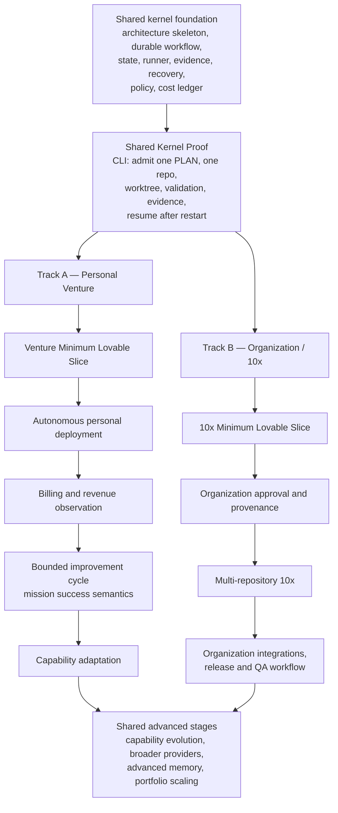
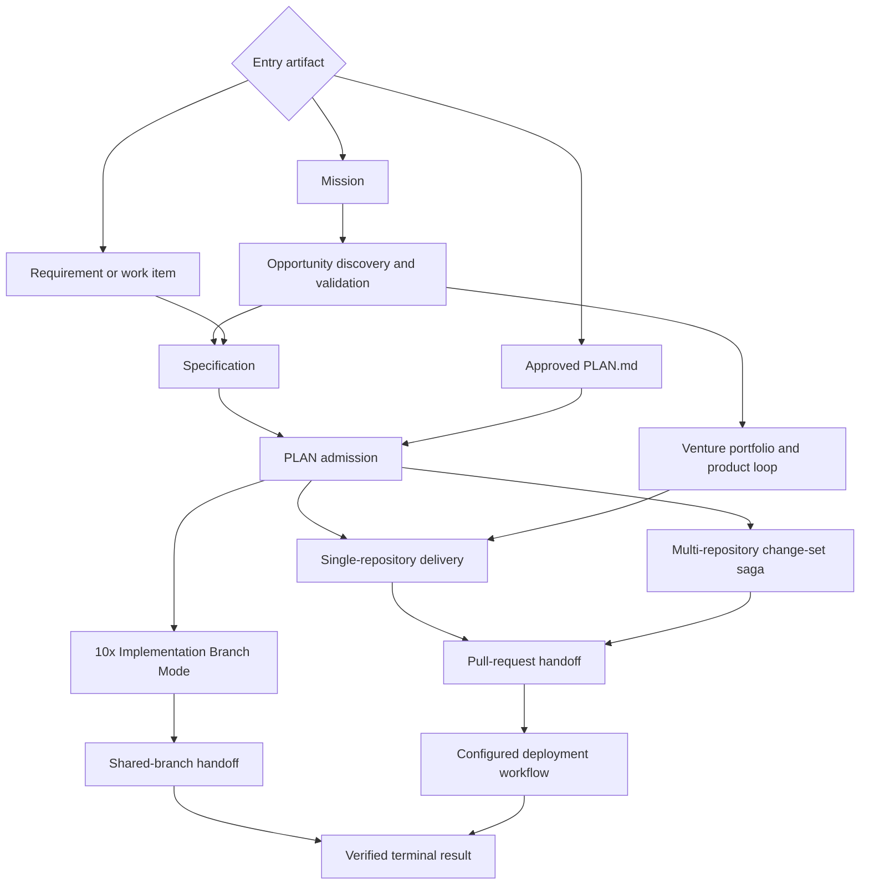

# Delivery Foundry

**Document version:** 12.0
**Status:** Master architecture and index
**Updated:** 2026-07-19

Delivery Foundry is a governed control plane for loop-engineered software delivery: durable, resumable, evidence-verified execution of admitted plans by AI agents, with autonomy granted through explicit policy envelopes rather than implicit trust.

## Two product tracks, one kernel

```text
                              ┌─→ Track A — Personal Autonomous Venture Foundry
Shared Foundry kernel ────────┤
                              └─→ Track B — Organization / 10x Engineering Foundry
```

**Track A — Personal Autonomous Venture Foundry.** Accepts a mission, mockup, requirement, specification, or PLAN.md. Discovers, validates, builds, deploys, observes, improves, and grows a product with minimal human touch. Self-prompts (generates its own improvement plans, which still pass deterministic admission), self-heals, and safely self-adapts inside an explicit autonomy envelope. Example mission: reach at least USD 100 in verified net monthly recurring revenue — see [`docs/autonomy/mission-contract.md`](docs/autonomy/mission-contract.md).

**Track B — Organization / 10x Engineering Foundry.** Accepts an approved PLAN.md; operates across one or many repositories; supports the real 10x process; may push verified atomic groups directly to shared 10x branches; may stop without PR, merge, or deployment (`result_code: TEN_X_BRANCH_HANDOFF_READY`); uses stricter organization policy, provenance, and human governance.

The two tracks progress **in parallel** after the shared kernel exists. Venture autonomy is never serialized behind organization milestones.

## Start here — reading path

1. **Orientation:** this file, top to bottom → [`V12_REVIEW_REPORT.md`](V12_REVIEW_REPORT.md) → [`docs/MIGRATION_MAP_V11_TO_V12.md`](docs/MIGRATION_MAP_V11_TO_V12.md) (only when hunting where a V11 section went).
2. **Core mechanics:** [state model](docs/architecture/state-model.md) → [authority model (kernel vs PEC)](docs/architecture/authority-model.md) → [plan provenance and approval](docs/security/approval-and-provenance.md).
3. **Autonomy chain (Track A), in order:** [admission tiers](docs/autonomy/admission-tiers.md) → [personal venture profile](docs/autonomy/personal-venture-profile.md) → [mission setup ceremony](docs/autonomy/mission-setup-ceremony.md) → [mission contract](docs/autonomy/mission-contract.md) → [drift governance](docs/autonomy/cumulative-drift-governance.md) → [human touchpoints](docs/autonomy/human-touchpoints.md).
4. **Per-track workflows:** Track A — [venture loop](docs/workflows/venture-loop.md), [mockup → delivery](docs/workflows/mockup-to-delivery.md); Track B — [10x shared branch](docs/workflows/ten-x-branch.md), [direct PLAN](docs/workflows/direct-plan.md).

When feeding this documentation to an implementation agent: include this file plus only the contracts relevant to the task, and **never include [`docs/legacy/`](docs/legacy/)** — it is banner-marked superseded history.

## Canonical contracts (normative index)

| Contract | Document |
|---|---|
| State model: 6 statuses + typed phase/reason/result_code; registries; historical mapping | [`docs/architecture/state-model.md`](docs/architecture/state-model.md) |
| Authority: kernel owns state and side effects; Plan Execution Coordinator (PEC) proposes | [`docs/architecture/authority-model.md`](docs/architecture/authority-model.md) |
| Domain model | [`docs/architecture/domain-model.md`](docs/architecture/domain-model.md) |
| Configuration, non-weakening precedence, deployment defaults | [`docs/architecture/configuration-and-policy.md`](docs/architecture/configuration-and-policy.md) |
| External operations, sagas, reconciliation | [`docs/architecture/external-operations.md`](docs/architecture/external-operations.md) |
| Temporal/PostgreSQL consistency contract | [`docs/architecture/data-consistency.md`](docs/architecture/data-consistency.md) |
| Plan provenance and approval (ApprovedPlan) | [`docs/security/approval-and-provenance.md`](docs/security/approval-and-provenance.md) |
| Deterministic admission classifier and tiers A0/A1/A2/H; billing policy; synthetic verification | [`docs/autonomy/admission-tiers.md`](docs/autonomy/admission-tiers.md) |
| Personal autonomous venture profile (explicit production-auto grant) | [`docs/autonomy/personal-venture-profile.md`](docs/autonomy/personal-venture-profile.md) |
| Mission contract, result codes, loop-exit semantics | [`docs/autonomy/mission-contract.md`](docs/autonomy/mission-contract.md) |
| Mission setup ceremony (front-loaded human gates) | [`docs/autonomy/mission-setup-ceremony.md`](docs/autonomy/mission-setup-ceremony.md) |
| Cumulative drift governance, L0–L4 promotion, weekly veto digest | [`docs/autonomy/cumulative-drift-governance.md`](docs/autonomy/cumulative-drift-governance.md) |
| Human-touchpoint inventory and autonomy metrics | [`docs/autonomy/human-touchpoints.md`](docs/autonomy/human-touchpoints.md) |
| Reviewer independence R0–R4 | [`docs/security/reviewer-independence.md`](docs/security/reviewer-independence.md) |
| Authorization, TCB, prompt-injection defense, sandboxing | [`docs/security/authorization-model.md`](docs/security/authorization-model.md) |
| Supply chain | [`docs/security/supply-chain.md`](docs/security/supply-chain.md) |
| Retention, privacy, PII (UU PDP) | [`docs/security/data-retention-and-privacy.md`](docs/security/data-retention-and-privacy.md) |
| Cost accounting and mission economics | [`docs/operations/cost-accounting.md`](docs/operations/cost-accounting.md) |
| Control-plane self-protection | [`docs/operations/control-plane-protection.md`](docs/operations/control-plane-protection.md) |
| Observability, SLOs, alerts, payload limits | [`docs/operations/observability-and-alerts.md`](docs/operations/observability-and-alerts.md) |
| Capacity and provider awareness | [`docs/operations/capacity.md`](docs/operations/capacity.md) |
| Checkpoint/restart, liveness, disaster recovery | [`docs/operations/disaster-recovery.md`](docs/operations/disaster-recovery.md) |
| Notifications and Telegram engine | [`docs/operations/telegram.md`](docs/operations/telegram.md) |
| Build-versus-buy | [`docs/architecture/adr/ADR-000-build-vs-buy.md`](docs/architecture/adr/ADR-000-build-vs-buy.md) |

## Workflow index

| Entry / workflow | Document |
|---|---|
| Direct PLAN.md execution | [`docs/workflows/direct-plan.md`](docs/workflows/direct-plan.md) |
| **Mockup → delivery (first-class entry)** | [`docs/workflows/mockup-to-delivery.md`](docs/workflows/mockup-to-delivery.md) |
| Multi-repository orchestration | [`docs/workflows/multi-repository.md`](docs/workflows/multi-repository.md) |
| 10x shared-branch direct push | [`docs/workflows/ten-x-branch.md`](docs/workflows/ten-x-branch.md) |
| Venture loop (Track A) | [`docs/workflows/venture-loop.md`](docs/workflows/venture-loop.md) |
| Capability evolution | [`docs/workflows/capability-evolution.md`](docs/workflows/capability-evolution.md) |
| Recovery, retry, honest completion | [`docs/workflows/recovery.md`](docs/workflows/recovery.md) |

Entry types: mission; requirement; **mockup**; specification; approved PLAN.md. All entries converge on deterministic admission, then the standard delivery loop.

## D-29 — Dual-track roadmap



Tracks share the kernel, have independent acceptance gates, and do not block each other.

### Two Minimum Lovable Slices

**Shared Kernel Proof (precedes both):** local CLI → admit one PLAN → one local Git repository → fake or one approved executor → isolated worktree → one deterministic validation → evidence bundle → **resume after process restart**. This falsifies the core bet at minimum cost.

**Venture MLS (Track A):** mission supplied → one preselected opportunity → mockup/requirement to spec → generate one small deployable product → synthetic verification → auto-deploy under the personal profile → test-mode or real billing connection → observe activation/payment → generate one bounded improvement → auto-admit only inside the envelope.

**10x MLS (Track B):** human-approved PLAN.md → one repository → verify provenance → isolated worktree → one atomic group → deterministic checks → PEC recommendation → kernel Branch Integrator → direct push to an existing 10x branch → `TEN_X_BRANCH_HANDOFF_READY` → no PR, merge, or deployment.

Sizing, assumptions, and estimates: [`docs/architecture/overview.md`](docs/architecture/overview.md) (Implementation sizing). The superseded serialized M0–M7 roadmap is preserved in `docs/legacy/`.

## Documentation map

- **This file** — master index (normative)
- [`CHANGELOG.md`](CHANGELOG.md) — document history
- [`V12_REVIEW_REPORT.md`](V12_REVIEW_REPORT.md) — what changed in V12, validation results, open decisions
- [`docs/MIGRATION_MAP_V11_TO_V12.md`](docs/MIGRATION_MAP_V11_TO_V12.md) — where every V11 section went
- Folders: [architecture](docs/architecture/) · [workflows](docs/workflows/) · [autonomy](docs/autonomy/) · [security](docs/security/) · [operations](docs/operations/) · [providers](docs/providers/) · [governance](docs/governance/) · [legacy](docs/legacy/) *(quarantined history — never feed to implementation agents)*

Rules for this documentation set, CI lint gates, and the supersession map: [`docs/governance/documentation-rules.md`](docs/governance/documentation-rules.md). Feature maturity: [`docs/governance/capability-maturity.md`](docs/governance/capability-maturity.md). Quality rubric and definition of done: [`docs/governance/quality-rubric.md`](docs/governance/quality-rubric.md).

The remainder of this file is normative: reading rules, the nested loop model, and the reference workflow catalog.


---

<!-- Relocated from V11: N0 How to read this specification (lines 38-115) -->

## N0. How to read this specification

The document uses four maturity labels:

| Label | Meaning |
|---|---|
| **Normative Core** | Required for conformance and the reference implementation |
| **Supported Profile** | Implemented through the core but optional per deployment |
| **Experimental** | Preserved, evaluated, and isolated from critical paths |
| **Deferred** | Retained from brainstorming but not scheduled until prerequisites exist |

Requirements use **MUST**, **SHOULD**, and **MAY** in their conventional architectural sense.

A prose architecture cannot honestly earn a permanent 10/10 score by declaration. The target is a 10/10-quality design, but the score is earned only when the implementation passes the fitness functions, fault-injection tests, security evaluations, and operational SLOs in this specification.

### N0.1 Diagram standard

Every workflow, stateful process, security boundary, recovery path, and external side-effect process MUST have at least one Mermaid diagram.

Use:

| Process type | Required Mermaid form |
|---|---|
| Workflow and orchestration | `flowchart` |
| State lifecycle | `stateDiagram-v2` |
| Cross-service interaction | `sequenceDiagram` |
| Data ownership | `erDiagram` or `flowchart` |
| Policy/configuration precedence | `flowchart` |
| Delivery/recovery decision | `flowchart` |
| Implementation timeline | `flowchart` |

Diagram rules:

1. Diagram IDs remain stable once referenced.
2. A diagram is explanatory, not the source of truth; schemas and contracts remain authoritative.
3. Diagrams must use the canonical vocabulary from Part I.
4. A diagram must not introduce a second state model, extension model, or policy hierarchy.
5. Every new workflow document under `docs/workflows/` must include:
   - happy path;
   - wait/retry path;
   - failure or rollback path;
   - terminal outcome.
6. CI validates Mermaid fences and checks that every registered workflow links to a diagram.

### N0.2 Diagram coverage map

| Diagram | Covers |
|---|---|
| D-01 | System context and control-plane boundary |
| D-02 | Nested Loop Engineering model |
| D-03 | Reference runtime components |
| D-04 | Canonical domain relationships |
| D-05 | Workflow lifecycle and waiting |
| D-06 | Configuration compilation and precedence |
| D-07 | Extension lifecycle |
| D-08 | Tool authorization and prompt-injection boundary |
| D-09 | External-operation saga and reconciliation |
| D-10 | Repository mirrors, worktrees, and branch delivery |
| D-11 | Provider capacity, retry, rollover, and failover |
| D-12 | Operator/API interaction |
| D-13 | Deployment modes |
| D-14 | Data, artifacts, audit, and memory |
| D-15 | Liveness, recovery, and disaster recovery |
| D-16 | Verification and evidence pipeline |
| D-17 | Reference workflow family |
| D-18 | Capability maturity progression |
| D-19 | Implementation roadmap |
| D-20 | Documentation architecture |
| D-21 | ADR governance |
| D-22 | Solidity feedback loop |
| D-23 | Direct PLAN multi-repository execution |
| D-24 | 10x Implementation Branch Mode |
| D-25 | Telegram notification batching and flood control |
| D-26 | Capability evolution, learning, and memory |
| D-27 | Venture portfolio and product loop |

---


---

<!-- Relocated from V11: §20.5 Nested Loop Engineering model (lines 11985-12028) -->

## 20.5 Nested Loop Engineering model

Delivery Foundry runs several loops:

```text
Portfolio Loop
What work or product deserves investment?
        ↓
Delivery Loop
Spec → plan → build → review → verify → ship
        ↓
Recovery Loop
Can a bounded failure be safely repaired or rolled back?
        ↓
Capability Loop
What agent or skill is missing or weak?
        ↓
Learning Loop
What proven lesson should change future behavior?
        ↓
Memory Loop
What evidence and knowledge should be retained?
        ↓
Security Loop
Is every action still authorized and trustworthy?
```

The loops share evidence but not authority.

A genuine Loop Engineering system has:

```text
persistent objective
durable state
bounded actions
objective verification
exception handling
feedback
measured adaptation
rollback
memory with provenance
security enforcement outside the model
```


---

<!-- Relocated from V11: N17 Reference workflows (lines 1612-1718) -->

## N17. Reference workflows

### D-17 — Reference workflow family



### N17.1 MVP: direct PLAN, one repository, pull request

```text
PLAN admission
→ repository mirror/worktree
→ one bounded implementation task
→ deterministic tests
→ independent review
→ PR creation
→ CI observation
→ handoff
```

This is the first production vertical slice.

### N17.2 Organization single-repository

Adds:

```text
Jira/Confluence read adapters
organization policy
Bitbucket/GitLab/GitHub binding
organization notification channel
```

### N17.3 Multi-repository

Adds only after single-repository recovery is proven:

```text
contract freeze
parallel isolated tasks
change-set saga
environment revision provenance
ordered merge/deploy
```

### N17.4 10x Implementation Branch Mode

```text
approved PLAN
→ existing shared initiative branches
→ local isolated worktrees
→ atomic-group branch integration
→ branch CI/review
→ TEN_X_BRANCH_HANDOFF_READY
```

No PR, merge, or deployment occurs in this workflow.

### N17.5 Venture and capability-evolution workflows

Preserved as later workflows. They reuse the same kernel and may not introduce a second scheduler, state model, registry, or policy system.

---


**V12 addition:** entry types now include `specification` and `mockup` (diagram D-28, [`docs/workflows/mockup-to-delivery.md`](docs/workflows/mockup-to-delivery.md)). Existing entry paths are unchanged; all entries converge on the deterministic admission classifier (D-31).
