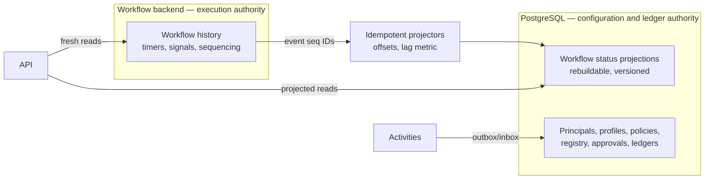
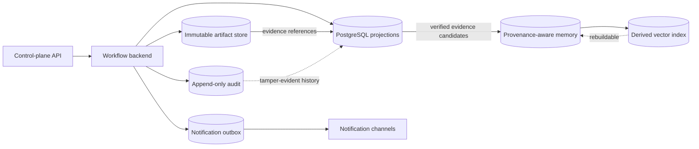

# Data Consistency: Temporal and PostgreSQL Contract

[← Back to Delivery Foundry master index](../../delivery_foundry.md) · [Migration map](../../docs/MIGRATION_MAP_V11_TO_V12.md)

Normative status: **Normative.** Two stores, one authority per fact. Split-brain is designed out, not patched later.

## 1. Authority split

**The workflow backend (Temporal) is authoritative for:** workflow execution history; timers; signals; durable sequencing; activity completion; the workflow lifecycle itself.

**PostgreSQL is authoritative for:** principals; organizations; profiles; policies; the extension registry; approval records; the cost ledger; the external-operation ledger; retention metadata; audit projections where designated.

**PostgreSQL workflow-status tables are rebuildable read projections — never execution authority.** No component makes a control decision from a projection when the decision requires execution truth; such decisions read the workflow backend or are made inside the workflow.

## 2. Projection contract

- every workflow event carries a monotonic event sequence ID;
- projectors store per-workflow projection offsets; writes are idempotent (upsert keyed by workflow_id + sequence);
- projection lag is a first-class metric with an alert threshold;
- stale reads are labeled: the API returns `consistency: projected | fresh` and clients may request strongly fresh status, which reads through to the workflow backend;
- projections are rebuildable from workflow history at any time; rebuild is a routine, tested operation with a versioned projector (projector version recorded per row);
- projector schema migrations: deploy new projector version alongside, backfill, cut over, then retire — never in-place mutation of live projection semantics;
- **no distributed transactions.** Cross-store effects use idempotent activities and the outbox/inbox pattern via the external-operation ledger.

## 3. Outage behavior

- Workflow backend outage: PostgreSQL keeps serving projected reads labeled stale; no new workflow decisions occur; recovery resumes from history.
- PostgreSQL outage: workflows continue executing; projections and ledgers catch up from offsets; policy reads fail closed (cached ResolvedPolicy with digest may be used within its validity window).

## D-30 — Projection boundary



The preserved data architecture and durable memory design follow.


---

<!-- Relocated from V11: N14 Data architecture (lines 1365-1449) -->

## N14. Data architecture

### N14.1 PostgreSQL projections

Reference tables:

```text
principals
organizations
profiles
resolved_policies
workflow_definitions
workflow_versions
workflow_runs
step_runs
attempts
wait_conditions
extension_packages
extension_versions
bindings
repository_refs
workspaces
capacity_reservations
external_operations
approvals
notification_outbox
notification_receipts
memory_records
audit_events
```

### D-14 — Data, artifacts, audit, and memory



### N14.2 Artifact store

Artifacts are immutable and digest-addressed:

```text
plans
compiled workflows
task packets
patches
test reports
review reports
checkpoints
logs
SBOMs
screenshots
deployment manifests
```

Database rows store metadata and digests, not large payloads.

### N14.3 Audit integrity

Audit events are append-only. Organization deployments SHOULD use tamper-evident chaining or immutable retention.

---


---

<!-- Relocated from V11: §20.1 Durable memory architecture (lines 11625-11756) -->

## 20.1 Durable memory architecture

Delivery Foundry needs memory, but memory is an attack surface. Store evidence first and promote knowledge later.

Use six memory layers:

| Layer | Purpose | Lifetime | Write authority |
|---|---|---|---|
| Working | Current task context | Task | Orchestrator |
| Episodic | What happened in a workflow | Retention policy | Event store |
| Semantic | Stable facts and relationships | Versioned | Memory curator |
| Procedural | Proven agent and skill improvements | Versioned | Promotion workflow |
| Product | Decisions, contracts, metrics, user feedback | Product lifetime | Product workflow |
| Policy | Permissions and immutable rules | Long-lived | Operator/admin only |

### 20.1.1 Event sourcing before summarization

First store append-only events:

```json
{
  "event_id": "evt-123",
  "profile": "personal-github",
  "workflow_id": "flow-456",
  "task_id": "TASK-014",
  "type": "verification.failed",
  "source": "verification-agent",
  "trust": "generated-unverified",
  "payload_reference": "artifact://...",
  "occurred_at": "2026-07-18T12:00:00Z",
  "checksum": "sha256:..."
}
```

Derived summaries never replace raw evidence.

### 20.1.2 Memory record

```yaml
memory_id: mem-789
namespace: personal-github/product/api-changelog-assistant
type: procedural
statement: >
  API and MCP contracts require a compatibility check before release.
sources:
  - workflow: flow-456
    event: evt-123
  - workflow: flow-512
    event: evt-991
trust: verified
confidence: 0.93
created_by: memory-curator
reviewed_by: verification-agent
created_at: 2026-07-18T12:00:00Z
expires_at: null
supersedes: null
status: active
```

### 20.1.3 Memory promotion

```text
raw event
→ candidate lesson
→ source and contradiction check
→ redaction
→ evaluation across multiple runs
→ memory review
→ promote into scoped memory
```

One agent statement is not enough to create global memory.

Promotion thresholds:

```yaml
memory_promotion:
  minimum_independent_sources: 2
  minimum_successful_repetitions: 3
  security_sensitive_human_approval: true
  global_procedural_human_approval: true
```

### 20.1.4 Memory poisoning defense

Rules:

- external content cannot write durable memory directly;
- memory retains source and trust labels;
- inferred memory must cite raw events;
- untrusted text is never promoted as policy;
- cross-profile memory is denied by default;
- security rules cannot be learned or overwritten;
- contradictory memories trigger review;
- low-confidence memories expire;
- sensitive data is redacted before indexing;
- secrets are never embedded;
- deleted source data triggers derived-memory review;
- capability-generated lessons are quarantined until verified.

### 20.1.5 Retrieval

Memory retrieval is filtered by:

```text
profile
repository or product
workflow type
data classification
task relevance
trust
recency
supersession status
```

The agent receives a small memory brief with citations, not the entire historical database.

### 20.1.6 Memory storage

Start with:

```text
PostgreSQL
├── append-only events
├── structured memory records
├── provenance
├── promotion history
└── retention jobs
```

Add vector retrieval only for relevant semantic search. The vector index is derived and rebuildable, never the source of truth.


---

<!-- Relocated from V11: §20.6 Memory Curator (lines 12029-12058) -->

## 20.6 Memory Curator

Add:

```text
agents/memory-curator.md
```

Responsibilities:

- propose episodic-to-semantic summaries;
- detect contradictory memories;
- apply retention and redaction;
- attach provenance;
- score confidence;
- prepare procedural-memory candidates;
- invalidate superseded records;
- rebuild derived indexes.

It cannot:

- write policy memory;
- store secrets;
- move knowledge across profiles;
- promote security-sensitive lessons alone;
- delete audit events;
- hide contradictory evidence.


