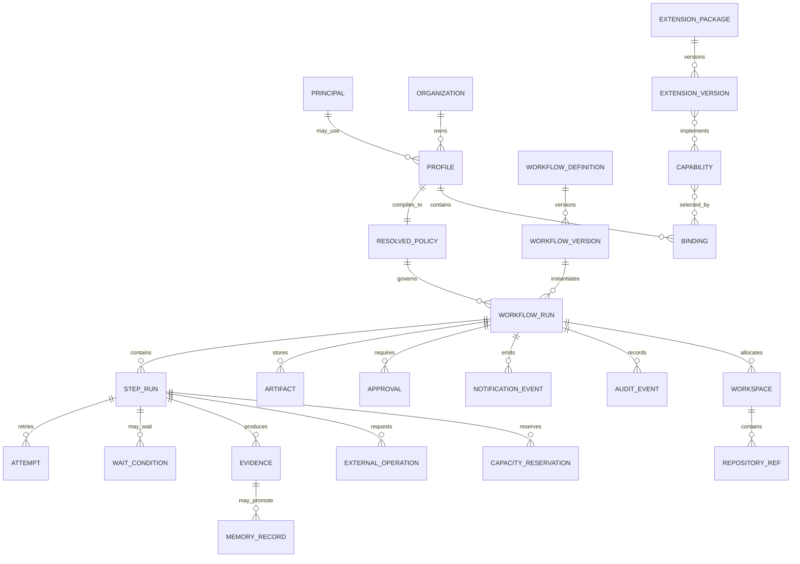

# Canonical Domain Model

[← Back to Delivery Foundry master index](../../delivery_foundry.md) · [Migration map](../../docs/MIGRATION_MAP_V11_TO_V12.md)

Normative status: **Normative.**


---

<!-- Relocated from V11: N4 Canonical domain model (lines 440-535) -->

## N4. Canonical domain model

The following entities are the sole canonical domain vocabulary.

```text
Principal
Organization
Profile
ResolvedPolicy
WorkflowDefinition
WorkflowVersion
WorkflowRun
StepDefinition
StepRun
Attempt
WaitCondition
Artifact
Evidence
ExtensionPackage
ExtensionVersion
Capability
Binding
Workspace
RepositoryRef
ExternalOperation
CapacityReservation
Approval
NotificationEvent
MemoryRecord
AuditEvent
```

### D-04 — Canonical domain relationships



### N4.1 Key ownership

| Entity | Source of truth |
|---|---|
| Workflow and step status | Durable workflow backend plus application projection |
| Profile and policy versions | PostgreSQL, signed/hash-addressed |
| Artifacts and checkpoints | Object store with immutable digest |
| External operation state | PostgreSQL operation ledger |
| Notifications | Transactional outbox and delivery receipts |
| Memory | PostgreSQL records with provenance; vector index is derived |
| SCM contents | SCM provider |
| Provider capacity | Observed provider data with confidence and expiry |

### N4.2 Identity

Every action is attributed to one principal:

```text
HumanPrincipal
ServicePrincipal
AgentPrincipal
ExtensionPrincipal
RunnerPrincipal
```

Agents do not inherit the operator’s full identity. They receive scoped capability tokens for one task, repository, path set, tool set, and expiration window.

---

