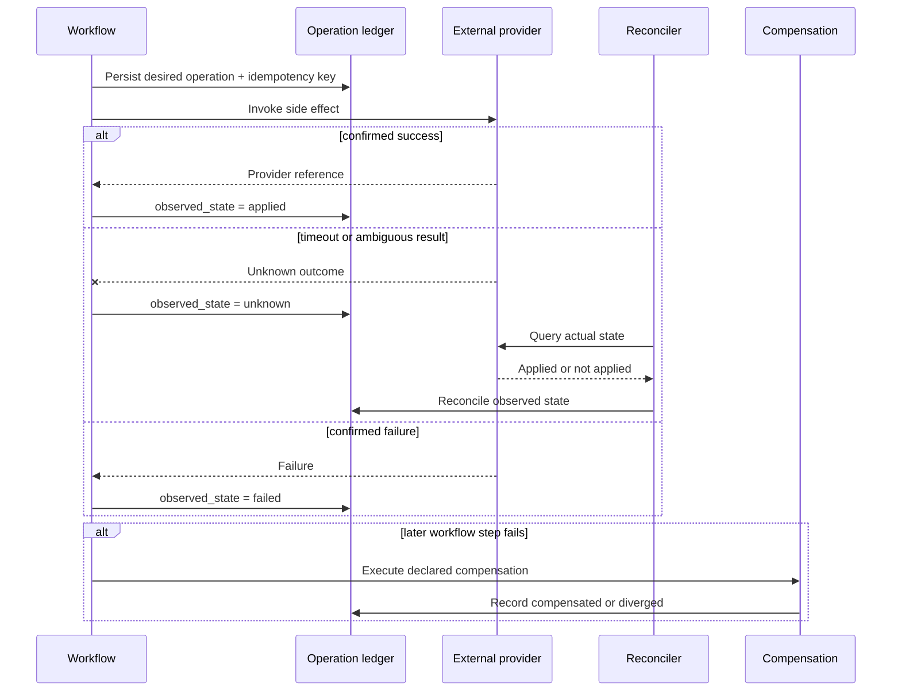
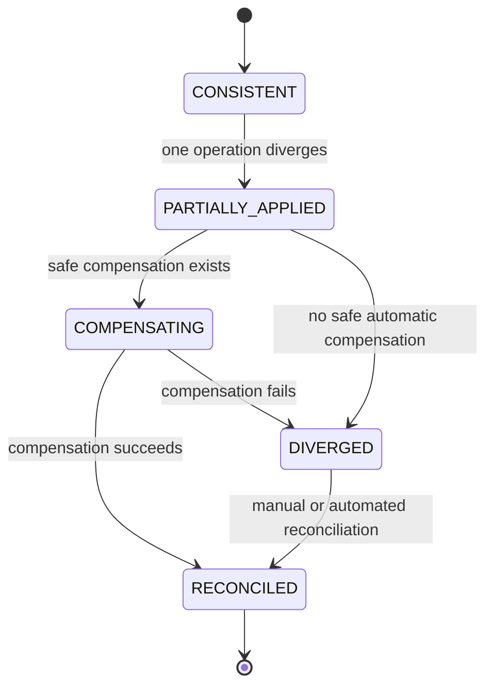

# External Operations, Sagas, and Reconciliation

[← Back to Delivery Foundry master index](../../delivery_foundry.md) · [Migration map](../../docs/MIGRATION_MAP_V11_TO_V12.md)

Normative status: **Normative.**


---

<!-- Relocated from V11: N9 External operations, sagas, reconciliation (lines 966-1062) -->

## N9. External operations, sagas, and reconciliation

Multi-repository and deployment work cannot be atomic. Delivery Foundry therefore uses an operation ledger and saga semantics.

### N9.1 External operation record

```yaml
operation_id: op-123
workflow_id: flow-456
step_id: push-api
type: scm.push
idempotency_key: flow-456:api:commit-abc
desired_state: applied
observed_state: applied
provider_reference: request-or-commit-id
compensation: revert-commit
reconciliation_status: clean
```

### D-09 — External-operation saga and reconciliation





### N9.2 Rules

1. Persist desired operation before invoking the provider.
2. Invoke with an idempotency key where supported.
3. Persist provider request IDs and observed state.
4. Reconcile ambiguous timeouts before retry.
5. Never assume a timeout means no side effect.
6. Compensation is explicit and may itself fail.
7. Divergence remains operator-visible until reconciled.

### N9.3 Cross-repository saga

```text
prepare all repositories
→ apply independently reversible changes
→ verify contracts
→ apply ordered irreversible changes last
→ compensate in reverse order where safe
```

A change set reports:

```text
CONSISTENT
PARTIALLY_APPLIED
COMPENSATING
DIVERGED
RECONCILED
```

It never claims atomicity across SCMs or deployments.

---

