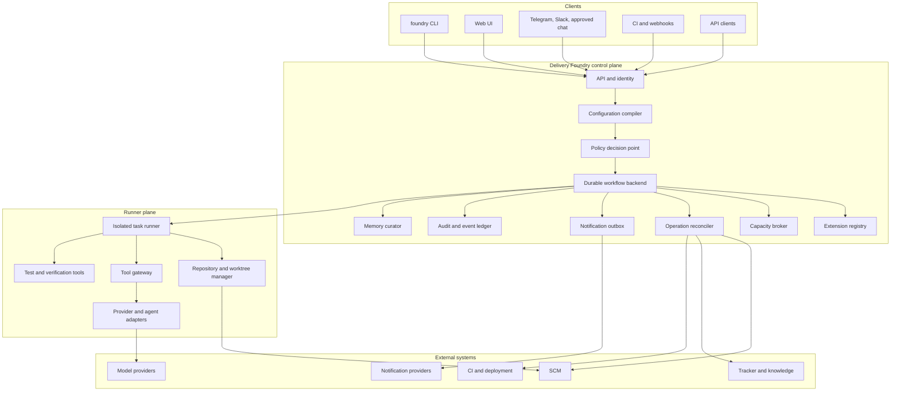
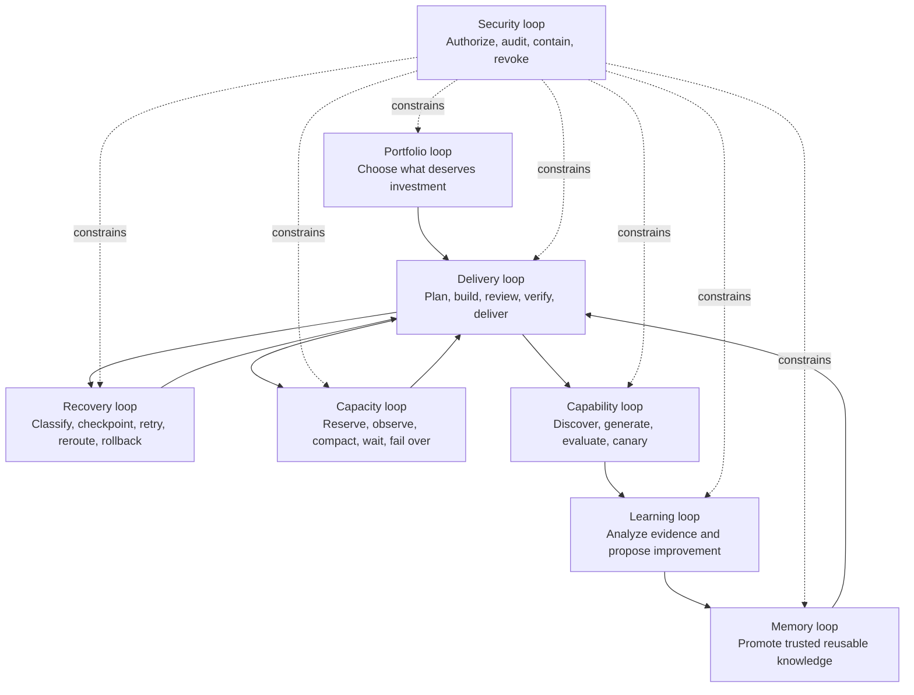
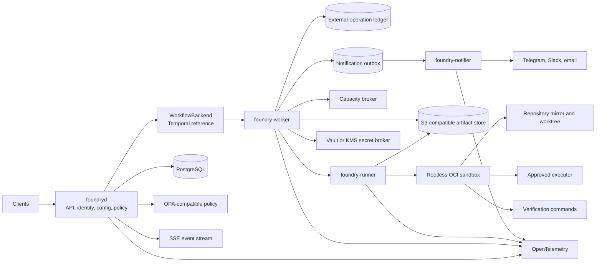
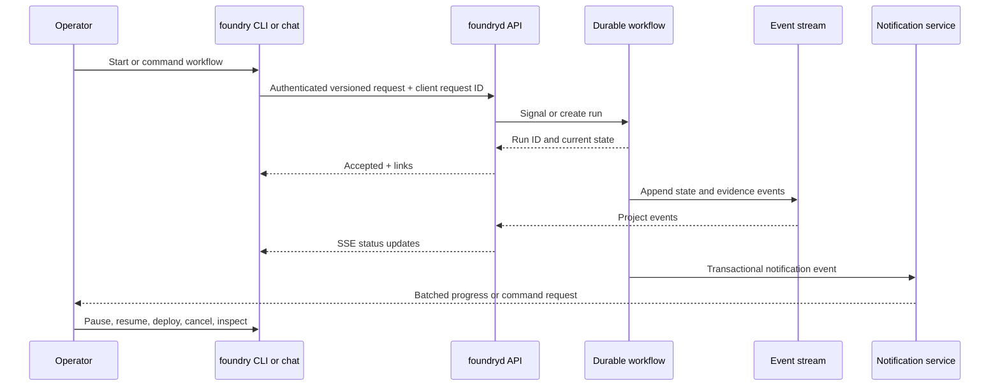
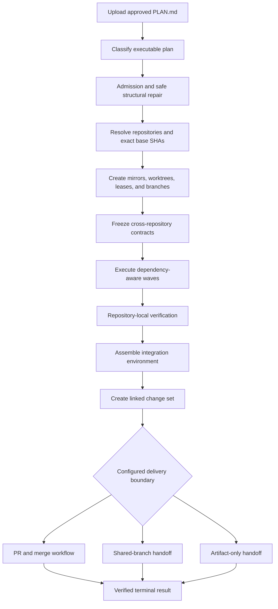
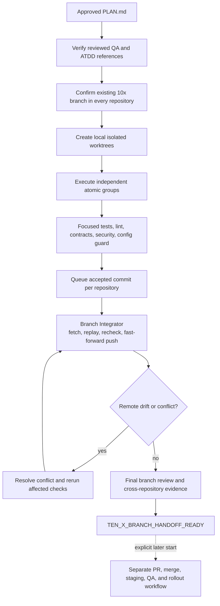
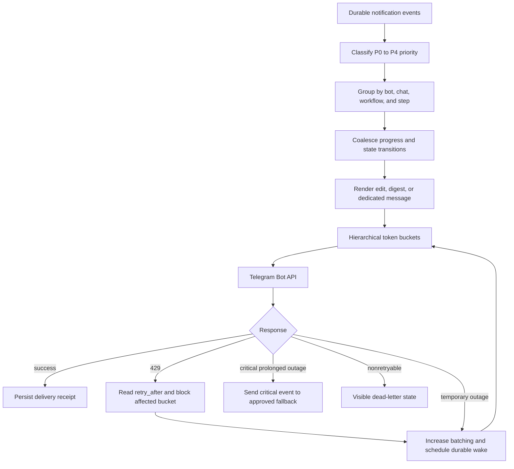
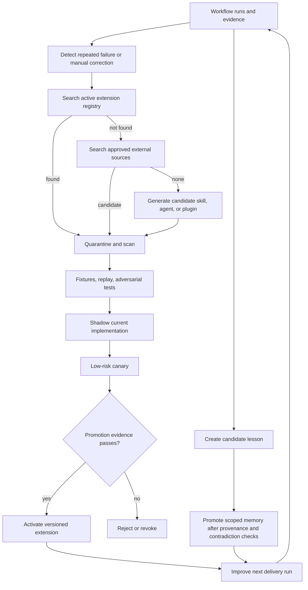
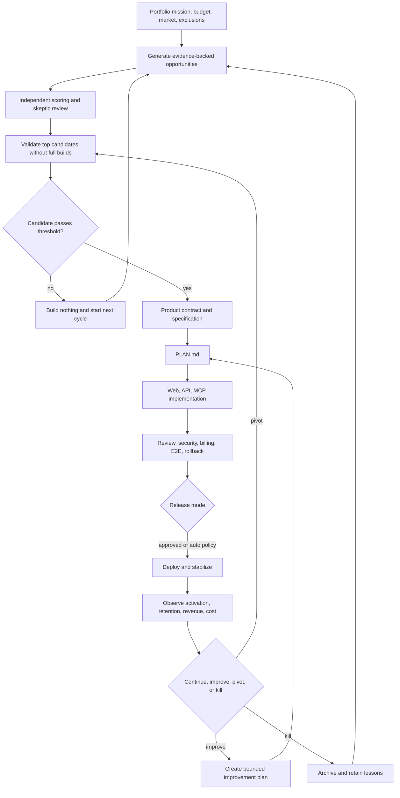

# Architecture Overview

[← Back to Delivery Foundry master index](../../delivery_foundry.md) · [Migration map](../../docs/MIGRATION_MAP_V11_TO_V12.md)

Normative status: Normative for the sections marked as such; relocated V11 material retains its original normative weight.

## V12 additions in this document set

New diagrams: D-28 (mockup entry, `workflows/mockup-to-delivery.md`), D-29 (dual-track roadmap, root), D-30 (Temporal/PostgreSQL projection boundary, `data-consistency.md`), D-31 (admission classification, `autonomy/admission-tiers.md`). The diagram atlas (P0) is preserved below and extended by these IDs.

## Implementation sizing (normative honesty rule)

Every roadmap consumer MUST state its builder assumption. Estimates are ranges with confidence, never false precision. The dual-track roadmap **increases total scope** relative to a single track; this is stated, not hidden.

System grades — estimates differ per grade: proof of architecture; development-grade system; personal production system; organization production system; regulated/high-availability deployment.

| Stage | Solo senior + AI agents (elapsed, part-time) | 2–3 engineers | 5–6 platform team | Highest uncertainty | Confidence |
|---|---|---|---|---|---|
| Shared kernel foundation | 4–8 weeks | 2–4 weeks | 1–2 weeks | Temporal + policy learning curve | Medium |
| Shared Kernel Proof | 2–4 weeks | 1–2 weeks | <1 week | evidence pipeline design | High |
| Venture MLS | 6–12 weeks | 3–5 weeks | 2–3 weeks | billing + synthetic verification | Low–Medium |
| 10x MLS | 4–8 weeks | 2–4 weeks | 1–2 weeks | org provenance integration | Medium |
| Track A to mission-capable | quarters | 1–2 quarters | ~1 quarter | autonomy envelope hardening | Low |
| Track B to org-production | quarters | 1–2 quarters | ~1 quarter | integration surface (Jira/Bitbucket/QA) | Low |
| Shared advanced stages | not schedulable until both MLS ship | — | — | speculative | — |

Build-versus-buy dependencies per stage are in ADR-000. Operational burden (running Temporal, runners, observability) is real and continuous from the first deployment onward; a solo builder should prefer managed services for everything outside the kernel's differentiating logic.

If the Shared Kernel Proof takes more than a month under the declared assumption, the roadmap assumptions are wrong and MUST be revised before continuing.

The preserved architectural thesis, scope, reference implementation, interfaces, repository layout, operating model, and diagram atlas follow.


---

<!-- Relocated from V11: N1 Architectural thesis (lines 116-272) -->

## N1. Architectural thesis

Delivery Foundry is a control plane, not a universal agent framework and not a collection of shell scripts.

```text
Clients
├── foundry CLI
├── Web UI
├── Telegram / Slack / approved chat
├── CI/webhooks
└── API clients
        ↓
Foundry Control Plane
├── API and identity
├── configuration compiler
├── policy decision point
├── durable workflow backend
├── extension registry
├── capacity broker
├── operation reconciler
├── notification outbox
├── audit/event ledger
└── memory curator
        ↓
Runner Plane
├── isolated task runners
├── provider adapters
├── SCM/workspace operations
├── test and verification tools
└── deployment adapters
        ↓
External Systems
SCM • tracker • knowledge • CI • model providers • deployment • notifications
```

The kernel owns sequencing and authority. Extensions perform bounded work and return typed evidence.

### D-01 — System context



### D-02 — Nested Loop Engineering



### N1.1 Invariants

1. LLM output is never authorization.
2. External content is data unless the policy compiler explicitly grants it instruction authority.
3. Every side effect has an idempotency key and reconciliation record.
4. Every nonterminal workflow has a live lease, registered event, human/command gate, or future wake time.
5. Every machine-consumed result validates against a versioned schema.
6. Running workflows pin their workflow, policy, extension, agent, skill, and contract versions.
7. Personal and organization profiles share no secrets, workspace, state, cache, or memory namespace.
8. Completion requires evidence, not an agent claim.
9. A plugin cannot call another plugin directly; orchestration returns to the kernel.
10. A learning component can propose policy changes but cannot authorize or activate them.
11. Public core configuration contains no real organization identifiers.
12. Unsupported provider features fail explicitly; fields are never silently discarded.

---


---

<!-- Relocated from V11: N2 Scope and non-goals (lines 273-309) -->

## N2. Scope and non-goals

### N2.1 Normative product scope

The first reference product is:

```text
approved PLAN.md
→ one repository
→ isolated workspace
→ one approved executor
→ deterministic verification
→ pull request or configured direct push
→ durable notification
→ restart/resume
```

The architecture supports later multi-repository, 10x branch, venture, capability-evolution, and adaptive-provider workflows without requiring those features in the first release.

### N2.2 Non-goals for the first release

The first release does not need to:

- create businesses autonomously;
- install arbitrary internet agents automatically;
- support every SCM and CI system;
- learn global semantic memory;
- auto-promote self-generated skills;
- optimize every provider-specific LLM feature;
- deploy production automatically;
- replace existing CI/CD or source-control governance;
- provide a general-purpose distributed workflow product.

These ideas are preserved in the maturity matrix rather than deleted.

---


---

<!-- Relocated from V11: N3 Reference implementation architecture (lines 310-439) -->

## N3. Reference implementation architecture

A concrete reference implementation removes ambiguity while keeping contracts provider-neutral.

### N3.1 Control-plane services

```text
foundryd
├── public REST API
├── server-sent event stream
├── authentication and authorization
├── profile/configuration compiler
├── workflow submission and query
├── policy integration
├── extension registry
└── administrative operations

foundry-worker
├── durable workflow activities
├── external-operation reconciliation
├── capacity scheduling
├── notification dispatch
└── recovery activities

foundry-runner
├── ephemeral rootless OCI sandbox
├── repository mirror/worktree manager
├── tool gateway client
├── provider/agent execution
└── evidence uploader

foundry-notifier
├── transactional outbox reader
├── Telegram batching/rate limiting
├── fallback channels
└── delivery receipts
```

These MAY be deployed as one process for development, but their logical responsibilities remain separate.

### D-03 — Reference runtime components



### N3.2 Reference technology decisions

| Concern | Reference decision | Reason |
|---|---|---|
| Control-plane language | Go | Strong concurrency, static binaries, operational simplicity |
| Durable workflows | Temporal through a `WorkflowBackend` interface | Timers, retries, signals, durable execution, versioning |
| Application metadata | PostgreSQL | Transactions, constraints, auditability, operational familiarity |
| Temporal persistence | Supported PostgreSQL deployment | Consistent operational footprint |
| Artifact storage | S3-compatible object store | Immutable large artifacts and checkpoint payloads |
| Policy decision point | OPA-compatible policy engine | Deterministic policy outside the LLM |
| Secrets | Vault/KMS-compatible broker | Short-lived scoped credentials |
| Runner isolation | Rootless OCI containers; Kubernetes Jobs for scale | Reproducible isolation and resource controls |
| Observability | OpenTelemetry | Vendor-neutral traces, metrics, and logs |
| API | REST/JSON plus SSE; internal gRPC optional | Accessible clients and streaming status |
| CLI | `foundry` binary | Canonical operator interface |
| Makefile | Thin developer wrapper around the CLI | Convenience without runtime business logic |

Temporal is the reference, not an irrevocable dependency. Another backend may conform if it passes the same durable-timer, signal, replay, migration, and fault-recovery tests.

### N3.3 Deployment topologies

**Developer topology**

```text
Docker Compose
├── foundryd + worker
├── PostgreSQL
├── Temporal
├── local object store
└── one rootless runner
```

**Single-tenant production**

```text
2+ foundryd replicas
2+ workers
managed or HA PostgreSQL
HA Temporal
object storage
runner pool
policy and secret services
```

**Organization/regulated**

```text
separate control and runner networks
private artifact storage
approved self-hosted model/provider adapters
organization-managed identity and secret services
profile-specific runner pools
immutable audit retention
```

---


---

<!-- Relocated from V11: N12 API and operator interfaces (lines 1229-1298) -->

## N12. API and operator interfaces

### N12.1 Canonical API

Representative endpoints:

```text
POST   /v1/workflow-runs
GET    /v1/workflow-runs/{id}
POST   /v1/workflow-runs/{id}:pause
POST   /v1/workflow-runs/{id}:resume
POST   /v1/workflow-runs/{id}:cancel
POST   /v1/workflow-runs/{id}/commands
GET    /v1/workflow-runs/{id}/events
GET    /v1/workflow-runs/{id}/artifacts
POST   /v1/plans:admit
GET    /v1/extensions
POST   /v1/extensions/{id}:stage
POST   /v1/extensions/{id}:activate
```

The API is versioned and authenticated. Every mutating request has a client request ID.

### D-12 — Operator and API interaction



### N12.2 CLI

```bash
foundry plan admit --plan PLAN.md --profile personal-github
foundry workflow start --workflow direct-plan --plan PLAN.md
foundry workflow status flow-123
foundry workflow command flow-123 deploy
foundry extension test future-builder
```

### N12.3 Makefile

Make is a convenience layer:

```makefile
plan-admit:
	foundry plan admit --plan "$(PLAN)" --profile "$(PROFILE)"
```

No runtime state machine, policy decision, or provider business logic lives in Make.

---


---

<!-- Relocated from V11: §4 Architecture (lines 2537-2569) -->

## 4. Architecture

```text
                           Operator
                              │
          Telegram / Slack / approved chat / CLI / Web UI
                              │
                              ▼
┌─────────────────────────────────────────────────────────────┐
│ Delivery Foundry Core                                       │
│                                                             │
│ Profile resolver                                            │
│ Policy engine                                               │
│ Workflow state                                              │
│ Approval gates                                              │
│ Provider adapter registry                                   │
│ Notification dispatcher                                     │
└──────────────┬────────────────┬────────────────┬────────────┘
               │                │                │
               ▼                ▼                ▼
       Work systems        Agent runtime      Delivery systems
       Jira / Issues       OpenHands          GitHub Actions
       Confluence          Claude Code        GitLab CI
       Git repositories    Codex              Bitbucket Pipelines
                           Cursor             Jenkins / Bamboo
                           Copilot             Deployment target
                           OpenCode
```

The core must depend on stable interfaces, not provider-specific assumptions.

---


---

<!-- Relocated from V11: §5–5.3 Repository model (lines 2570-3145) -->

## 5. Repository model

## 5.1 `delivery-foundry`

The reusable distribution.

```text
delivery-foundry/
├── Makefile
├── README.md
├── LICENSE
├── .env.example
├── .gitignore
├── compose.yaml
├── compose.override.example.yaml
│
├── mk/
│   ├── 00-common.mk
│   ├── 10-configure.mk
│   ├── 20-bootstrap.mk
│   ├── 30-services.mk
│   ├── 40-agents.mk
│   ├── 50-adapters.mk
│   ├── 60-skills.mk
│   ├── 70-doctor.mk
│   ├── 80-workflow.mk
│   ├── 90-backup.mk
│   ├── 91-update.mk
│   └── 99-development.mk
│
├── agents/
│   ├── catalog.yaml
│   ├── pec.md
│   ├── planning.md
│   ├── implementation.md
│   ├── backend.md
│   ├── reviewer.md
│   ├── verification.md
│   ├── capability-curator.md
│   ├── recovery-manager.md
│   ├── memory-curator.md
│   ├── llm-capability-optimizer.md
│   └── capacity-analyst.md
│
├── capacity/
│   ├── registry.yaml
│   ├── scheduler.yaml
│   ├── liveness-policy.yaml
│   ├── provider-health.yaml
│   ├── task-sizing.yaml
│   ├── reservations/
│   │   └── .gitkeep
│   ├── checkpoints/
│   │   └── .gitkeep
│   ├── providers/
│   │   ├── anthropic-api.yaml
│   │   ├── claude-code-subscription.yaml
│   │   ├── openai-api.yaml
│   │   ├── codex-subscription.yaml
│   │   ├── cursor-subscription.yaml
│   │   ├── github-copilot.yaml
│   │   ├── generic-openai-compatible.yaml
│   │   └── local-runtime.yaml
│   ├── schemas/
│   │   ├── capacity-snapshot.schema.json
│   │   ├── capacity-reservation.schema.json
│   │   ├── checkpoint.schema.json
│   │   ├── retry-decision.schema.json
│   │   └── liveness-status.schema.json
│   └── migrations/
│
├── llm-capabilities/
│   ├── registry.yaml
│   ├── interaction-rules.yaml
│   ├── availability-policy.yaml
│   ├── task-profiles/
│   │   ├── trivial.yaml
│   │   ├── research.yaml
│   │   ├── architecture.yaml
│   │   ├── implementation.yaml
│   │   ├── review.yaml
│   │   ├── incident.yaml
│   │   └── batch-evaluation.yaml
│   ├── providers/
│   │   ├── anthropic.yaml
│   │   ├── openai.yaml
│   │   ├── cursor.yaml
│   │   ├── github-copilot.yaml
│   │   └── generic-openai-compatible.yaml
│   ├── experiments/
│   │   ├── replay/
│   │   ├── shadow/
│   │   └── canary/
│   └── schemas/
│       ├── provider-capability.schema.json
│       ├── execution-envelope.schema.json
│       └── optimization-result.schema.json
│
├── methodology-packs/
│   ├── catalog.yaml
│   └── superpowers/
│       ├── manifest.yaml
│       ├── upstream.lock.yaml
│       ├── skill-mappings.yaml
│       ├── conflict-policy.yaml
│       ├── provider-installation.yaml
│       └── evaluations/
│
├── plugins/
│   ├── registry.yaml
│   ├── lock.yaml
│   ├── bindings/
│   │   ├── defaults.yaml
│   │   └── profiles/
│   ├── installed/
│   │   └── .gitkeep
│   ├── quarantine/
│   │   └── .gitkeep
│   ├── staged/
│   │   └── .gitkeep
│   ├── active/
│   │   └── .gitkeep
│   ├── deprecated/
│   │   └── .gitkeep
│   ├── revoked/
│   │   └── .gitkeep
│   ├── schemas/
│   │   ├── plugin-manifest.schema.json
│   │   ├── plugin-lock.schema.json
│   │   ├── step-input.schema.json
│   │   ├── step-output.schema.json
│   │   └── conformance-result.schema.json
│   └── conformance/
│       ├── executor/
│       ├── planner/
│       ├── reviewer/
│       ├── verifier/
│       ├── notification/
│       ├── deployment/
│       ├── scm/
│       ├── tracker/
│       ├── knowledge/
│       └── memory/
│
├── capabilities/
│   ├── registry.yaml
│   ├── quarantine/
│   │   └── .gitkeep
│   ├── staged/
│   │   └── .gitkeep
│   ├── approved/
│   │   └── .gitkeep
│   ├── revoked/
│   │   └── .gitkeep
│   └── schemas/
│       ├── capability-manifest.schema.json
│       ├── evaluation-result.schema.json
│       └── provenance.schema.json
│
├── security/
│   ├── policy-kernel/
│   │   ├── immutable-rules.yaml
│   │   ├── tool-permissions.yaml
│   │   ├── egress-policy.yaml
│   │   ├── secret-policy.yaml
│   │   └── data-flow-policy.yaml
│   ├── prompt-firewall/
│   │   ├── trust-labels.yaml
│   │   ├── injection-patterns.yaml
│   │   └── context-sanitization.yaml
│   ├── supply-chain/
│   │   ├── registries.yaml
│   │   ├── package-policy.yaml
│   │   ├── action-policy.yaml
│   │   ├── license-policy.yaml
│   │   └── provenance-policy.yaml
│   ├── sandbox/
│   │   ├── profiles/
│   │   ├── seccomp/
│   │   └── apparmor/
│   └── incident-response/
│       ├── playbooks/
│       └── evidence-retention.yaml
│
├── notifications/
│   ├── policy.yaml
│   ├── routing.yaml
│   ├── telegram/
│   │   ├── limits.yaml
│   │   ├── batching.yaml
│   │   ├── retry.yaml
│   │   ├── priorities.yaml
│   │   ├── formatting.yaml
│   │   └── learned-state.yaml
│   ├── templates/
│   │   ├── telegram/
│   │   ├── slack/
│   │   ├── email/
│   │   └── generic/
│   ├── outbox/
│   │   └── .gitkeep
│   ├── batches/
│   │   └── .gitkeep
│   ├── receipts/
│   │   └── .gitkeep
│   ├── dead-letter/
│   │   └── .gitkeep
│   └── schemas/
│       ├── notification-event.schema.json
│       ├── notification-batch.schema.json
│       ├── telegram-rate-state.schema.json
│       ├── command.schema.json
│       └── delivery-receipt.schema.json
│
├── memory/
│   ├── schema/
│   │   ├── event.schema.json
│   │   ├── memory-record.schema.json
│   │   └── promotion.schema.json
│   ├── policies/
│   │   ├── retention.yaml
│   │   ├── trust.yaml
│   │   ├── redaction.yaml
│   │   ├── namespace.yaml
│   │   └── poisoning-defense.yaml
│   └── migrations/
│
├── recovery/
│   ├── policies/
│   │   ├── retry.yaml
│   │   ├── rollback.yaml
│   │   ├── circuit-breaker.yaml
│   │   ├── escalation.yaml
│   │   ├── capacity-exhaustion.yaml
│   │   ├── session-rollover.yaml
│   │   └── no-progress.yaml
│   └── playbooks/
│       ├── provider-rate-limit.md
│       ├── subscription-window-limit.md
│       ├── context-exhaustion.md
│       ├── provider-outage.md
│       ├── budget-exhaustion.md
│       └── orphaned-workflow.md
│
├── evaluations/
│   ├── capability/
│   ├── agent/
│   ├── skill/
│   ├── prompt-injection/
│   ├── supply-chain/
│   └── regression/
│
├── skills/
│   ├── catalog.yaml
│   ├── guardrails/
│   ├── stop-slop/
│   ├── principal-architect/
│   ├── implementation/
│   ├── planning/
│   ├── code-reviewer-correctness/
│   ├── code-reviewer-quality/
│   ├── code-reviewer-security/
│   ├── sonarqube-quality-gate/
│   └── testing/
│
├── contracts/
│   ├── scm.yaml
│   ├── tracker.yaml
│   ├── knowledge.yaml
│   ├── ci.yaml
│   ├── notification.yaml
│   ├── deployment.yaml
│   ├── agent-executor.yaml
│   ├── plan-intake.yaml
│   ├── plan-admission.yaml
│   ├── repository-manifest.yaml
│   ├── workspace.yaml
│   ├── branch-plan.yaml
│   ├── branch-delivery.yaml
│   ├── push-receipt.yaml
│   ├── branch-readiness.yaml
│   ├── change-set.yaml
│   ├── integration-environment.yaml
│   └── event-envelope.schema.json
│
├── adapters/
│   ├── scm/
│   │   ├── github/
│   │   ├── gitlab/
│   │   ├── bitbucket-cloud/
│   │   ├── bitbucket-datacenter/
│   │   └── azure-devops/
│   │
│   ├── tracker/
│   │   ├── jira-cloud/
│   │   ├── jira-datacenter/
│   │   ├── github-issues/
│   │   ├── gitlab-issues/
│   │   └── linear/
│   │
│   ├── knowledge/
│   │   ├── confluence-cloud/
│   │   ├── confluence-datacenter/
│   │   ├── repository/
│   │   ├── github-wiki/
│   │   ├── gitlab-wiki/
│   │   └── notion/
│   │
│   ├── ci/
│   │   ├── github-actions/
│   │   ├── gitlab-ci/
│   │   ├── bitbucket-pipelines/
│   │   ├── jenkins/
│   │   └── bamboo/
│   │
│   ├── notifications/
│   │   ├── telegram/
│   │   ├── slack/
│   │   ├── google-chat/
│   │   ├── microsoft-teams/
│   │   └── email/
│   │
│   ├── llm/
│   │   ├── anthropic/
│   │   ├── openai/
│   │   ├── cursor/
│   │   ├── github-copilot/
│   │   └── generic-openai-compatible/
│   │
│   ├── agent-runtime/
│   │   ├── claude-code/
│   │   ├── codex/
│   │   ├── cursor/
│   │   ├── github-copilot/
│   │   ├── opencode/
│   │   └── openhands/
│   │
│   └── deployment/
│       ├── none/
│       ├── vercel/
│       ├── cloudflare/
│       ├── aws/
│       ├── gcp/
│       ├── azure/
│       ├── kubernetes/
│       └── custom/
│
├── profiles/
│   ├── schema.yaml
│   ├── examples/
│   │   ├── personal-github.yaml
│   │   ├── personal-gitlab.yaml
│   │   ├── organization-bitbucket-atlassian.yaml
│   │   └── organization-gitlab.yaml
│   └── generated/
│       └── .gitkeep
│
├── policies/
│   ├── defaults/
│   │   ├── permissions.yaml
│   │   ├── approvals.yaml
│   │   ├── budgets.yaml
│   │   ├── data-classification.yaml
│   │   ├── model-routing.yaml
│   │   ├── notifications.yaml
│   │   └── autonomy.yaml
│   └── schemas/
│
├── workflows/
│   ├── registry.yaml
│   ├── schemas/
│   │   ├── workflow.schema.json
│   │   ├── step.schema.json
│   │   ├── binding.schema.json
│   │   └── manual-result.schema.json
│   ├── venture/
│   │   ├── full-product-loop.yaml
│   │   ├── discover.yaml
│   │   ├── validate.yaml
│   │   ├── build.yaml
│   │   ├── ship.yaml
│   │   └── grow.yaml
│   ├── engineering/
│   │   ├── full-delivery-loop.yaml
│   │   ├── intake.yaml
│   │   ├── context.yaml
│   │   ├── plan.yaml
│   │   ├── build.yaml
│   │   ├── review.yaml
│   │   └── deliver.yaml
│   ├── plan-execution/
│   │   ├── direct-plan-loop.yaml
│   │   ├── ten-x-direct-push.yaml
│   │   ├── ingest.yaml
│   │   ├── admission.yaml
│   │   ├── repository-resolution.yaml
│   │   ├── workspace-preparation.yaml
│   │   ├── execute-waves.yaml
│   │   ├── direct-push.yaml
│   │   ├── branch-readiness.yaml
│   │   ├── integrate.yaml
│   │   ├── open-change-set.yaml
│   │   └── deliver.yaml
│   ├── steps/
│   │   ├── discover/
│   │   ├── score/
│   │   ├── validate/
│   │   ├── plan/
│   │   ├── plan-admission/
│   │   ├── repository-resolution/
│   │   ├── workspace-preparation/
│   │   ├── implement/
│   │   ├── branch-integrator/
│   │   ├── direct-push/
│   │   ├── branch-readiness/
│   │   ├── integration/
│   │   ├── change-set/
│   │   ├── review/
│   │   ├── verify/
│   │   ├── deploy/
│   │   ├── notify/
│   │   └── remember/
│   └── packages/
│       └── .gitkeep
│
├── executors/
│   ├── definitions.yaml
│   ├── prompts/
│   │   ├── claude.md
│   │   ├── codex.md
│   │   ├── cursor.md
│   │   ├── copilot.md
│   │   └── opencode.md
│   └── schemas/
│       ├── task-result.schema.json
│       └── review-result.schema.json
│
├── domain-skills/
│   ├── venture-discovery/
│   ├── market-validation/
│   ├── engineering-intake/
│   ├── knowledge-context/
│   ├── work-item-breakdown/
│   ├── repository-analysis/
│   ├── product-selection/
│   ├── commercial-readiness/
│   └── release-verification/
│
├── templates/
│   ├── venture-program/
│   ├── engineering-program/
│   ├── product-program/
│   ├── spec/
│   ├── plan/
│   ├── repository-manifest/
│   ├── change-set/
│   ├── manual-plan-intake/
│   ├── scenarios/
│   │   ├── direct-plan-multi-repository.md
│   │   └── ten-x-direct-push-four-repositories.md
│   └── reports/
│
├── versions/
│   └── components.lock.yaml
│
├── state/
│   └── .gitkeep
├── workspaces/
│   ├── mirrors/
│   │   └── .gitkeep
│   ├── flows/
│   │   └── .gitkeep
│   ├── worktrees/
│   │   └── .gitkeep
│   └── integration/
│       └── .gitkeep
├── backups/
│   └── .gitkeep
└── cache/
    └── .gitkeep
```

No standalone shell scripts are required. Operational automation is exposed through the root Makefile and modular `.mk` files.

## 5.2 `delivery-foundry-product-template`

Used for new personal products and optionally new internal services.

```text
delivery-foundry-product-template/
├── Makefile
├── README.md
├── AGENTS.md
├── .foundry/
│   ├── agents/
│   │   └── overrides/
│   ├── skills/
│   │   ├── enabled.yaml
│   │   └── overrides/
│   ├── context/
│   └── state/
├── CLAUDE.md
├── PRODUCT_PROGRAM.md
├── SPEC.md
├── PLAN.md
├── STATE.md
├── .env.example
│
├── apps/
│   ├── web/
│   ├── api/
│   └── mcp/
│
├── packages/
│   ├── domain/
│   ├── database/
│   ├── auth/
│   ├── billing/
│   ├── analytics/
│   ├── observability/
│   └── testing/
│
├── ci/
│   ├── github/
│   ├── gitlab/
│   ├── bitbucket/
│   └── jenkins/
│
├── tests/
│   ├── unit/
│   ├── integration/
│   ├── contract/
│   └── e2e/
│
└── docs/
```

When creating a repository, Delivery Foundry selects the correct CI files for the active profile.

The template stores only enabled-package declarations and product-specific overrides. Reusable agents and skills remain in the Delivery Foundry distribution and are installed by Make/runtime adapters.

## 5.3 Environment configuration repositories

### Personal

```text
delivery-foundry-example-configs/
├── profile.yaml
├── policy-overrides/
├── repository-catalog.yaml
├── deployment-targets.yaml
└── README.md
```

Hosted in personal GitHub.

### Organization

```text
delivery-foundry-org-config/
├── profile.yaml
├── policy-overrides/
├── service-catalog.yaml
├── jira-mappings.yaml
├── confluence-mappings.yaml
├── repository-mappings.yaml
└── README.md
```

Hosted in organization-controlled Bitbucket.

Secrets are never stored in either repository.

---


---

<!-- Relocated from V11: §29 Final operating model (lines 13902-13958) -->

## 29. Final operating model

```text
One Delivery Foundry core
        │
        ├── Mission, requirement, or direct PLAN entry
        ├── PLAN admission + multi-repository Workspace Manager
        ├── Optional 10x shared-branch Branch Integrator
        ├── Stable plugin kernel + versioned contracts
        ├── Declarative workflow graph + swappable steps
        ├── Durable notification outbox + command gateway
        ├── Capacity Broker + durable scheduler
        ├── Checkpoint/restart + Liveness Supervisor
        │
        ├── Personal profile
        │   ├── GitHub
        │   ├── Telegram
        │   ├── public research
        │   ├── native subscriptions
        │   └── 9Router fallback
        │
        └── Organization profile
            ├── Bitbucket
            ├── Jira
            ├── Confluence
            ├── organization notification channel
            ├── approved models
            └── human merge/deployment gates
```

The key constraints:

```text
Share code, not state.
Share interfaces, not credentials.
Normalize provider concepts.
Keep workflows provider-neutral.
Use profiles for policy.
Use Make as the operator contract.
Treat organization data boundaries as hard constraints.
Reserve capacity before dispatch.
Checkpoint before every risky boundary.
Bind workflows to roles, not product names.
Accept an executable PLAN.md without forcing ideation or re-planning.
Support PR-based delivery and direct shared-branch delivery as separate policies.
Treat a cross-repository change set or branch change set as one orchestration unit.
Let steps be swapped, removed, manual, external, shadowed, or standalone.
Default deployment to auto, with command mode available through Telegram.
Notify every process through a durable event outbox.
Represent every event without requiring one Telegram API call per event.
Batch, edit, and rate-limit Telegram dynamically; always honor flood waits.
Never confuse unlimited workflow lifetime with unlimited immediate retries.
Guarantee non-stall; claim completion only when assumptions and evidence permit it.
```

---


---

<!-- Relocated from V11: P0 Process diagram atlas (lines 2131-2274) -->

## P0. Process diagram atlas for preserved capabilities

The following diagrams make the major preserved processes understandable without granting them normative authority.

### D-23 — Direct PLAN multi-repository execution



### D-24 — 10x Implementation Branch Mode



### D-25 — Telegram batching and flood-control recovery



### D-26 — Capability evolution, learning, and memory



### D-27 — Venture portfolio and product loop



