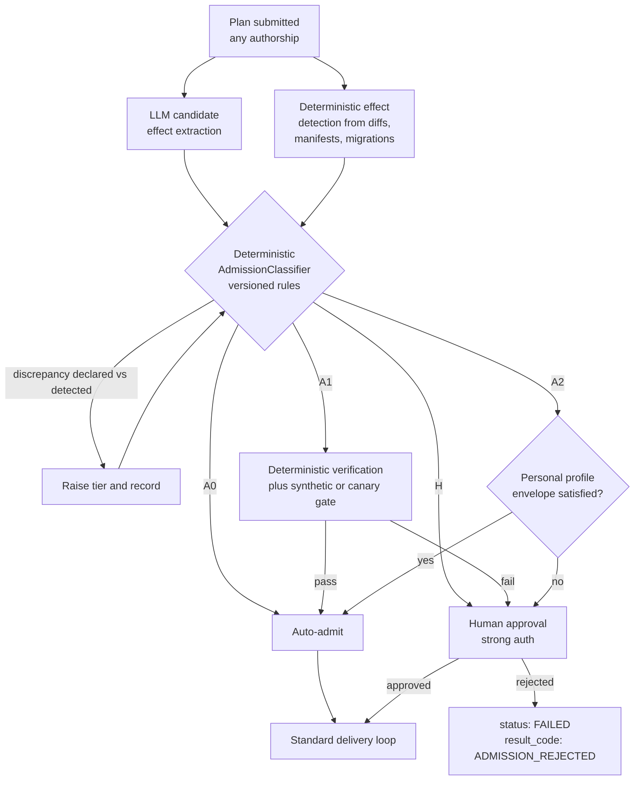

# Admission Tiers and the Deterministic Admission Classifier

[← Back to Delivery Foundry master index](../../delivery_foundry.md) · [Migration map](../../docs/MIGRATION_MAP_V11_TO_V12.md)

Normative status: **Normative.** Governs every plan regardless of authorship or entry path.

Admission always runs. Plan authorship provides provenance, never authorization. Human approval is required only when a plan exceeds its autonomy envelope.

## 1. Deterministic AdmissionClassifier

The admission tier is computed by a deterministic, versioned classifier — never by the plan, never by the LLM that wrote the plan.

Inputs:

1. **Declared effects** stated in the plan.
2. **Detected effects** derived deterministically from repositories, diffs, manifests, lockfiles, infrastructure files, migrations, API surfaces, billing code paths, permission requests, data-classification changes, and deployment targets.

An LLM MAY extract candidate effects. The final tier is computed by deterministic policy rules over the union of declared and detected effects. Discrepancies between declared and detected effects raise the tier and are recorded.

Classifier output (persisted with the AdmissionDecision):

```yaml
classifier:
  version: string          # classifier + ruleset version
  policy_digest: sha256
  rules_evaluated: [rule-id]
  declared_effects: [effect]
  detected_effects: [effect]
  discrepancies: [effect]   # declared≠detected; raises tier
  risk_score: number
  admission_tier: A0 | A1 | A2 | H
  required_controls: [control-id]
  explanation: string
```

**Fitness rule (mandatory):** any plan that declares or recommends its own admission tier is ignored for authorization purposes. If the system ever uses a plan-authored tier as authoritative, admission MUST fail closed.

## 2. Tier definitions

### A0 — fully automatic (low-risk, reversible)

Allowed examples: documentation; copy changes; test additions; analytics instrumentation inside an approved schema; non-production evaluation; reversible UI text/layout experiments; runtime parameter tuning inside an approved range.

A0 MUST NOT include: dependency or lockfile changes; any executable supply-chain modification; billing; secrets; migrations; permission changes; new network destinations; production infrastructure; destructive operations.

### A1 — automatic after deterministic verification and a synthetic/canary gate

Examples: dependency patch (immutable version, lockfile diff, provenance attestation, vulnerability scan, SBOM update, license check, rollback prepared); low-risk personal-product feature; reversible onboarding experiment; preview deployment; production change with bounded blast radius.

### A2 — automatic only inside an explicitly pre-authorized personal profile

Requirements: explicit personal-autonomous-venture profile; allowlisted deployment target; within mission budget; reversible or backward-compatible; health checks and rollback defined; no new data class; no new provider or secret scope; no legal or identity change; strong deterministic verification. See `personal-venture-profile.md`.

### H — human authorization required

Includes: security-policy change; budget-ceiling increase; new executable plugin with external authority; new provider receiving protected data; new secret scope; irreversible migration; destructive deletion; legal agreements; KYC; legal-entity creation; payment-account ownership; material privacy-policy change; regulated data; any authority expansion.

## D-31 — Admission classification flow



## 3. Billing policy and BillingMaturity

Billing changes are **Tier H until billing maturity is proven** for the product.

```yaml
billing_maturity:
  minimum_evidence:
    complete_recurring_cycles: 3
    successful_recurring_charges: 10
    unresolved_billing_incidents: 0
    unresolved_chargebacks: 0
    refund_rate_below: configured
    test_mode_suite: passing
    idempotency_and_reconciliation: proven
    subscription_state_recovery: tested
```

After maturity, A2 may cover only bounded, non-destructive, pre-authorized billing *implementation* changes. The following remain Tier H unless the mission setup explicitly pre-authorizes a bounded rule: charge amount; currency; tax treatment; refund behaviour; renewal semantics; cancellation semantics; proration; trial conversion; existing-subscriber migration; changing payment provider; collection or storage of new payment data.

## 4. CanarySignalPolicy and synthetic verification

Canary gates are meaningless below a traffic threshold. Each profile defines:

```yaml
canary_signal_policy:
  minimum_qualified_sessions: int
  minimum_transactions: int
  minimum_observation_window: duration
  target_metrics: [metric]
  error_thresholds: {metric: threshold}
  rollback_conditions: [condition]
```

When production traffic is below the signal threshold, verification uses a **synthetic substitute**: scripted user journeys; browser E2E; API contract tests; test-mode billing; webhook replay; synthetic load; synthetic error injection; database-migration rehearsal; rollback rehearsal; post-deployment smoke monitoring.

```yaml
verification_mode: real-canary | synthetic-substitute | hybrid
```

A synthetic substitute MUST NOT be recorded or described as real user validation.
