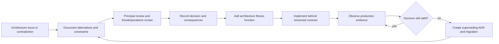

# Architecture Decision Records

[← Back to Delivery Foundry master index](../../../delivery_foundry.md) · [Migration map](../../../docs/MIGRATION_MAP_V11_TO_V12.md)

ADR-000 (build-versus-buy) and ADR-001 (OpenHands / 9Router disposition) are in this directory. Preserved V11 ADRs
follow.


---

<!-- Relocated from V11: N22 Architecture decision records (lines 2045-2086) -->

## N22. Architecture decision records

The implementation repository must begin with these ADRs:

```text
ADR-001 Durable workflow backend
ADR-002 Control-plane language and service boundaries
ADR-003 Canonical state model
ADR-004 Configuration precedence and policy compiler
ADR-005 Unified extension model
ADR-006 Runner isolation and secret delegation
ADR-007 Artifact and checkpoint storage
ADR-008 External operation reconciliation
ADR-009 Deployment default policy
ADR-010 Public/private configuration boundary
ADR-011 Multi-repository saga semantics
ADR-012 Provider execution-class policy
```

Each ADR contains context, decision, alternatives, consequences, and rollback/migration strategy.

### D-21 — ADR governance



---

