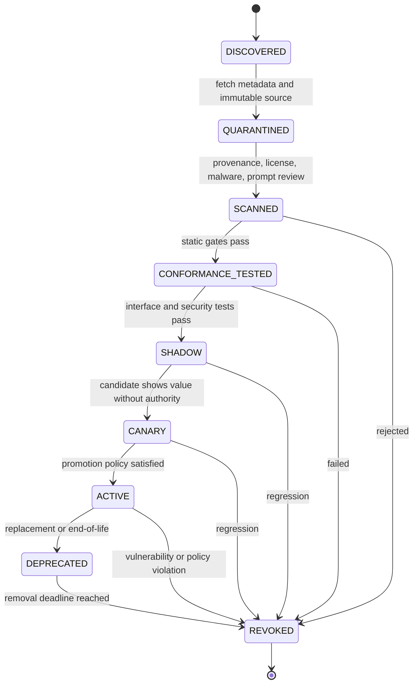
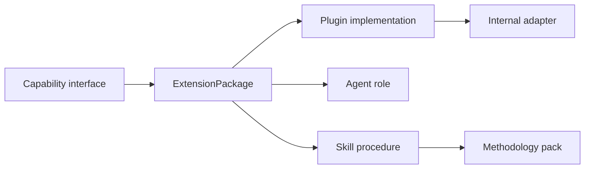

# Authority Model: Kernel and the Plan Execution Coordinator

[← Back to Delivery Foundry master index](../../delivery_foundry.md) · [Migration map](../../docs/MIGRATION_MAP_V11_TO_V12.md)

Normative status: **Normative.** One orchestrator. The kernel owns state; everything else proposes.

## 1. Naming

The agent formerly called **Forge** is renamed **Plan Execution Coordinator (PEC)** to avoid collision with Atlassian Forge. The old name survives only in the migration map and changelog as a deprecated alias. Files move `agents/forge.md → agents/pec.md`; identifiers `foundry-forge → foundry-pec`.

## 2. Authority table

| Concern | Owner |
|---|---|
| Authoritative workflow state | Kernel |
| Durable sequencing, scheduling, timers, retries, wakeups | Kernel |
| Leases and fencing tokens | Kernel |
| Checkpoints | Kernel |
| Provider routing authorization | Kernel |
| Side effects, SCM writes | Kernel (via Branch Integrator and adapters) |
| Approval enforcement, policy, budgets | Kernel |
| Completion decisions | Kernel |
| Interpreting one admitted PLAN | PEC |
| Proposing dependency-aware waves | PEC |
| Recommending bounded task dispatch | PEC |
| Evaluating agent summaries | PEC |
| Proposing remediation | PEC |
| Reporting plan progress | PEC |

## 3. PEC prohibitions (CI-enforced conformance tests)

PEC must never: become a second workflow engine; directly mutate authoritative workflow state; grant permissions; perform direct SCM writes; increase budgets; declare terminal completion; override policy. Any Part II or scenario text implying PEC "owns scheduling and state" is superseded by this table: PEC proposes scheduling **within a kernel-granted wave**; the kernel owns state and every side effect.

PEC is an **Agent** in the canonical extension taxonomy (N7), packaged, sandboxed, and policy-scoped like every other agent. The normative extension model follows.


---

<!-- Relocated from V11: N7 Unified extension model (lines 781-884) -->

## N7. Unified extension model

Earlier versions used overlapping terms: plugin, capability, adapter, executor, methodology pack, agent, and skill. Part I normalizes them.

### N7.1 Taxonomy

```text
Capability
= a versioned interface understood by the kernel
  e.g. scm.change_request.create

ExtensionPackage
= an installable, signed artifact

Plugin
= executable implementation of capabilities

Adapter
= compatibility code internal to a plugin

Agent
= a bounded LLM role composition

Skill
= a versioned procedure/instruction used by an agent

MethodologyPack
= a bundle of skills, policies, and evaluations
```

### D-07 — Unified extension lifecycle





### N7.2 One registry and lifecycle

All installable extension packages use one registry:

```text
DISCOVERED
→ QUARANTINED
→ SCANNED
→ CONFORMANCE_TESTED
→ SHADOW
→ CANARY
→ ACTIVE
→ DEPRECATED
→ REVOKED
```

The previous separate plugin and capability directories are retained in the compendium as design history; the implementation uses one `extensions/` model.

### N7.3 Execution boundary

- Core-signed built-ins MAY run in-process.
- Third-party executable extensions MUST run out-of-process in an isolated runner.
- Agent and skill text is treated as executable instruction material and follows the same version, review, test, and revocation lifecycle.
- Extension discovery never grants activation.

### N7.4 Conformance

Every plugin must prove:

- schema compatibility;
- timeout and cancellation;
- idempotency or declared non-idempotency;
- restart behavior;
- permission boundaries;
- output evidence;
- health checks;
- audit emission;
- no cross-profile access;
- supply-chain provenance;
- prompt-injection resistance where LLM context is involved.

### N7.5 Fresh-context-per-invocation policy (docs/PLAN.md Task 91 / PRV-08)

**Policy (contract obligation on adapter authors, enforced by test — not
merely documented):** every `executor.Get(name)` call returns an executor
adapter whose state is isolated from every other call, for the lifetime of a
single `TaskPacket`. No adapter may carry mutable state — a prompt, a
workspace path, a credential, an accumulated result — across two invocations,
whether those invocations run sequentially or concurrently.

This holds today at the **task level** by construction: `executor.Register`
stores a `Constructor` that returns a *fresh* `Adapter` on every `Get`, and
the kernel hands each task a brand-new `worktree.Workspace`. This section
elevates that accident of stateless registration into a standing rule so a
future adapter cannot quietly regress it, and extends it to the **wave
level**: when a wave dispatches multiple tasks concurrently, each task gets an
independent adapter instance and an independent workspace, and no artifact or
environment value crosses between them.

**Enforcement.** The shared adapter contract suite
(`internal/executor/contracttest`) runs a `ContractLeak` check against every
shipped adapter (claude-code, opencode, gemini-cli, cursor, copilot,
windsurf): it instantiates two adapters from the same constructor,
concurrently prepares them in separate workspaces under the race detector,
and asserts each workspace contains only its own task's content. A
deliberately-planted leaky fixture adapter (shared output state) must fail
this check — proving the check bites, mirroring Task 18's seeded-violation
pattern. This does **not** change Task 10's `Adapter` interface and does
**not** add session-resume/context-carry plumbing — it tests the *absence* of
carried context, which is the opposite of a resume feature.

---


---

<!-- Relocated from V11: §5.4 Canonical agent and skill packaging (lines 3146-3659) -->

## 5.4 Canonical agent and skill packaging

Delivery Foundry must separate five concepts that are frequently mixed together:

| Concept | Purpose | Canonical location |
|---|---|---|
| Agent | Owns a bounded role and workflow | `agents/<name>.md` |
| Skill | Reusable operating procedure loaded by agents | `skills/<name>/SKILL.md` |
| Reference | Detailed rules, examples, thresholds, and patterns | `skills/<name>/references/*.md` |
| Domain skill | Business or workflow-specific capability | `domain-skills/<name>/SKILL.md` |
| Runtime adapter | Installs canonical packages into Claude Code, Codex, Cursor, Copilot, OpenCode, or OpenHands | `adapters/agent-runtime/<provider>/` |

The canonical repository content is provider-neutral. Provider adapters materialize the same definitions into each tool's required runtime format. This avoids maintaining separate, drifting copies for every coding product.

### 5.4.1 Example skill catalog from the supplied workspace

The attached folder example contains these reusable packages:

```text
skills/
├── code-reviewer-correctness/
├── code-reviewer-quality/
├── code-reviewer-security/
├── guardrails/
├── implementation/
├── principal-architect/
├── sonarqube-quality-gate/
└── stop-slop/
```

Delivery Foundry should preserve these as independent skill packages rather than merging them into one large system prompt.

Recommended normalized structure:

```text
skills/
├── guardrails/
│   ├── SKILL.md
│   ├── policy.yaml
│   └── tests/
│
├── stop-slop/
│   ├── SKILL.md
│   └── examples/
│
├── principal-architect/
│   ├── SKILL.md
│   └── references/
│
├── implementation/
│   ├── SKILL.md
│   └── references/
│       ├── design-pattern.md
│       ├── go.md
│       ├── java.md
│       ├── python.md
│       ├── react.md
│       ├── rust.md
│       └── vue.md
│
├── planning/
│   ├── SKILL.md
│   └── references/
│       ├── harness-engineering.md
│       ├── plan-format.md
│       └── reference.md
│
├── code-reviewer-correctness/
│   ├── SKILL.md
│   └── references/
│       ├── bug-patterns.md
│       ├── performance-analysis.md
│       └── reference.md
│
├── code-reviewer-quality/
│   ├── SKILL.md
│   └── references/
│       ├── maintainability-patterns.md
│       ├── quality-metrics.md
│       └── reference.md
│
├── code-reviewer-security/
│   ├── SKILL.md
│   └── references/
│       ├── owasp-patterns.md
│       └── reference.md
│
├── sonarqube-quality-gate/
│   ├── SKILL.md
│   ├── thresholds.yaml
│   └── references/
│
└── testing/
    ├── SKILL.md
    └── references/
        ├── strategy.md
        ├── unit.md
        ├── integration.md
        ├── api.md
        ├── ui.md
        ├── e2e.md
        ├── security.md
        └── performance.md
```

The supplied planning, correctness, quality, security, harness, and PLAN references map directly into this structure.

### 5.4.2 Core agent definitions

The supplied agent examples should be normalized as follows:

```text
agents/
├── pec.md
├── planning.md
├── implementation.md
├── backend.md
├── reviewer.md
└── verification.md
```

Responsibilities:

| Agent | Responsibility | Required inputs | Primary output |
|---|---|---|---|
| `planning` | Convert approved requirements, specifications, designs, and ATDD into an executable plan | Source of truth, repository context, reviewed acceptance criteria | `docs/PLAN.md` |
| `pec` | Execute an approved plan wave-by-wave through delegated agents | Approved `PLAN.md` | Code, orchestration state, final evidence |
| `implementation` | Implement one bounded task using language-specific references | Approved task block | Scoped code and validation result |
| `backend` | Backend, API, database, concurrency, and observability implementation | Backend task and contract | Backend changes and tests |
| `reviewer` | Independent seven-pillar review; never edits production code | Diff, plan, acceptance evidence | `docs/review-report.md` |
| `verification` | Select and run the smallest sufficient test set | Diff summary and acceptance criteria | Verification report |

### 5.4.3 Agent composition

Agents load skills; skills do not launch agents by themselves.

```text
planning agent
├── guardrails
├── stop-slop
└── planning
    ├── harness engineering
    ├── canonical PLAN format
    └── anti-overengineering rules

pec agent
├── guardrails
├── stop-slop
└── dispatches:
    ├── backend
    ├── frontend
    ├── implementation
    ├── reviewer
    └── verification

reviewer agent
├── guardrails
├── stop-slop
├── code-reviewer-correctness
├── code-reviewer-quality
├── code-reviewer-security
└── sonarqube-quality-gate

verification agent
├── guardrails
├── stop-slop
└── testing
    └── lazy-loads only the required test references
```

### 5.4.4 Rules inherited from the supplied examples

Delivery Foundry should preserve these high-value constraints:

1. **Planning and execution are separate.** PEC never invents a plan. Implementation never starts without an approved `PLAN.md`.
2. **Execution happens in waves.** Tasks share a wave only when they have no direct or transitive dependency and do not touch the same files.
3. **One concern per delegated agent.** Give each worker only the task block, allowed files, acceptance criteria, and validation command it needs.
4. **“Done” is a claim, not evidence.** Completion requires deterministic command results and mapped acceptance evidence.
5. **Review is independent.** The reviewer never modifies production code and classifies evidence as confirmed, likely, or unverified.
6. **Testing matches risk.** Prefer the test pyramid and load only the test scopes needed for the change.
7. **Logs are summarized.** Preserve pass/fail counts, failing test names, first meaningful error, coverage delta, and file/line; do not flood agent context with raw logs.
8. **Tasks are resumable.** Every session writes a handoff with completed work, in-progress files, blockers, and the next command.
9. **Scope is bounded.** Do not add caching, microservices, Kafka, abstractions, new frameworks, or observability platforms unless the source requirement needs them.
10. **Retries are bounded.** A failed delegated task receives at most two focused remediation attempts before escalation.
11. **Security and quality are explicit gates.** Correctness, security, maintainability, changed-code coverage, duplication, complexity, and Sonar evidence are reviewed separately.
12. **No shared-file concurrency.** Two workers may not modify the same file in the same wave.

### 5.4.5 Canonical PLAN contract

Every executable `PLAN.md` should include:

```text
1. Goal
2. Architecture overview
3. Tech stack
4. Actual or planned project structure
5. Implementation tasks
   - dependency graph
   - execution waves
   - domain-scoped task groups
   - bounded task blocks
6. Task summary
7. Usage instructions
8. Deep-knowledge reference when required
9. Acceptance tests / ATDD
10. Session handoff and orchestration state
```


### 5.4.5.1 Multi-repository PLAN requirements

A single-repository plan may omit the top-level repository catalog when the repository is unambiguous.

A multi-repository plan must include:

```text
repository aliases and immutable source references
base branches
repository responsibility
task-to-repository assignment
cross-repository contract tasks
branching strategy
change-set strategy
merge and rollback order
integration requirements
deployment mode
```

A task with no repository assignment is not executable unless a deterministic repository-resolution rule identifies exactly one repository.

Every task block must contain:

```yaml
task: TASK-014
goal: Add idempotent source creation
domain: backend
wave: 3
group: G2
depends_on:
  - TASK-006

allowed_files:
  - apps/api/internal/source/**
  - packages/domain/source/**

acceptance:
  - AT-12
  - AT-14

validation:
  - make test-unit SCOPE=source
  - make test-integration SCOPE=source

risk: medium
preferred_agent: backend
reviewer: reviewer
```

Recommended sizing:

- Maximum four files per task unless the plan explicitly justifies more.
- Approximately one focused agent session per task.
- At least one deterministic validation command.
- No more than three dependency levels without an explicit orchestration rationale.

### 5.4.6 Platform-level versus product-level packages

Use two layers.

**Platform-level source of truth:**

```text
delivery-foundry/
├── agents/
├── skills/
└── domain-skills/
```

These packages are reusable across repositories.

**Product-local materialization:**

```text
generated-product/
├── .foundry/
│   ├── agents/
│   │   └── overrides/
│   ├── skills/
│   │   ├── enabled.yaml
│   │   └── overrides/
│   ├── plugins/
│   │   ├── bindings.yaml
│   │   └── overrides/
│   ├── workflows/
│   │   ├── selected.yaml
│   │   └── overrides/
│   ├── notifications/
│   │   └── policy.yaml
│   ├── context/
│   │   ├── PRODUCT_PROGRAM.md
│   │   ├── SPEC.md
│   │   └── PLAN.md
│   └── state/
│       ├── ORCHESTRATION-STATE.md
│       ├── RECOVERY-STATE.md
│       ├── CAPACITY-STATE.json
│       ├── LIVENESS-STATE.json
│       ├── SESSION-CHECKPOINT.json
│       └── MEMORY-CHECKPOINT.json
│
├── .security/
│   ├── dependency-policy.yaml
│   ├── tool-permissions.yaml
│   ├── egress-policy.yaml
│   └── exceptions.yaml
│
├── AGENTS.md
├── CLAUDE.md
└── docs/
    ├── PLAN.md
    ├── review-report.md
    ├── verification-report.md
    └── session-handoff.md
```

A product repository should not duplicate every global skill. It declares enabled packages and stores only product-specific overrides.

Example:

```yaml
# .foundry/skills/enabled.yaml
skills:
  - guardrails
  - stop-slop
  - principal-architect
  - implementation
  - planning
  - code-reviewer-correctness
  - code-reviewer-quality
  - code-reviewer-security
  - sonarqube-quality-gate
  - testing

domain_skills:
  - commercial-readiness
  - release-verification
```

### 5.4.7 Skill and agent catalogs

`agents/catalog.yaml`:

```yaml
agents:
  pec:
    source: agents/pec.md
    purpose: execute-approved-plan
    required_artifacts:
      - docs/PLAN.md
    writes:
      - docs/ORCHESTRATION-STATE.md

  reviewer:
    source: agents/reviewer.md
    purpose: independent-review
    writes:
      - docs/review-report.md

  verification:
    source: agents/verification.md
    purpose: risk-based-testing
    writes:
      - docs/verification-report.md
```

`skills/catalog.yaml`:

```yaml
skills:
  planning:
    source: skills/planning/SKILL.md
    references:
      - skills/planning/references/harness-engineering.md
      - skills/planning/references/plan-format.md
      - skills/planning/references/reference.md

  code-reviewer-correctness:
    source: skills/code-reviewer-correctness/SKILL.md
    references:
      - skills/code-reviewer-correctness/references/bug-patterns.md
      - skills/code-reviewer-correctness/references/performance-analysis.md
      - skills/code-reviewer-correctness/references/reference.md

  code-reviewer-quality:
    source: skills/code-reviewer-quality/SKILL.md
    references:
      - skills/code-reviewer-quality/references/quality-metrics.md
      - skills/code-reviewer-quality/references/maintainability-patterns.md
      - skills/code-reviewer-quality/references/reference.md

  code-reviewer-security:
    source: skills/code-reviewer-security/SKILL.md
    references:
      - skills/code-reviewer-security/references/owasp-patterns.md
      - skills/code-reviewer-security/references/reference.md
```

Catalog validation must fail when:

- an agent references a missing skill;
- a skill references a missing reference;
- two packages have the same name;
- a package has no description;
- an agent has no declared inputs or outputs;
- a reviewer is also configured as the implementer for the same task;
- a production-writing agent lacks guardrails;
- an unapproved skill is enabled by an organization profile.

### 5.4.8 Runtime installation

The canonical packages are installed by provider adapters:

```text
canonical agent/skill package
        ↓
agent-runtime adapter
        ├── Claude Code materialization
        ├── Codex materialization
        ├── Cursor materialization
        ├── Copilot materialization
        ├── OpenCode materialization
        └── OpenHands registration
```

Do not manually copy folders into each product.

Required Make targets:

```bash
make agents-list
make agents-validate
make agents-install PROFILE=<profile>
make agents-doctor

make skills-list
make skills-validate
make skills-install PROFILE=<profile>
make skills-sync
make skills-doctor

make catalog-build
make catalog-validate

make agent-run \
  AGENT=pec \
  REPOSITORY=<path> \
  PLAN=docs/PLAN.md
```

`make bootstrap` should call the installation targets automatically.

### 5.4.9 Profile-specific enablement

Personal venture profile:

```yaml
agent_packages:
  enabled:
    - planning
    - pec
    - implementation
    - backend
    - reviewer
    - verification

skill_packages:
  enabled:
    - guardrails
    - stop-slop
    - principal-architect
    - implementation
    - planning
    - code-reviewer-correctness
    - code-reviewer-quality
    - code-reviewer-security
    - sonarqube-quality-gate
    - testing
```

A confidential organization profile may disable or replace packages:

```yaml
agent_packages:
  enabled:
    - planning
    - implementation
    - reviewer
    - verification

skill_packages:
  denied:
    - external-web-research
    - external-memory
    - unapproved-model-router

runtime:
  external_model_proxy: false
  local_skill_overrides: delivery-foundry-org-config/skills
```

The profile, not the agent, decides which skills and providers are permitted.


---

<!-- Relocated from V11: §5.10 Plug-and-play plugin kernel (lines 5018-5310) -->

## 5.10 Plug-and-play plugin kernel

Delivery Foundry must treat named projects such as OpenHands, Claude Code, Codex, Cursor, Jira, GitHub, GitLab, Bitbucket, Superpowers, Headroom, and 9Router as replaceable implementations.

The stable kernel understands roles:

```text
source
tracker
knowledge
research
plan
implement
review
verify
browser
notify
deploy
remember
recover
model
methodology
```

It must not hardcode product names into workflow logic.

### 5.10.1 Kernel versus plugins

```text
Stable kernel
├── workflow state machine
├── plugin registry
├── policy engine
├── tool gateway
├── artifact store
├── scheduler
├── capacity broker
├── checkpoint and liveness
├── notification outbox
└── audit event store

Replaceable plugins
├── SCM and trackers
├── knowledge systems
├── research and planning
├── coding executors
├── reviewers and verifiers
├── browser automation
├── model providers
├── skills and methodology packs
├── deployment systems
├── notifications
└── memory backends
```

Plugins may not call each other directly. They return typed results to the workflow engine, which decides the next authorized action.

### 5.10.2 Plugin kinds

```text
SCMPlugin
TrackerPlugin
KnowledgePlugin
ResearchPlugin
PlannerPlugin
ExecutorPlugin
ReviewerPlugin
VerifierPlugin
BrowserPlugin
NotificationPlugin
DeploymentPlugin
MemoryPlugin
ModelProviderPlugin
MethodologyPackPlugin
SkillPackPlugin
SecurityScannerPlugin
CostOptimizerPlugin
```

A future GitHub project becomes usable by implementing one or more of these roles.

### 5.10.3 Plugin manifest

```yaml
api_version: foundry.plugin/v1
kind: ExecutorPlugin

metadata:
  name: future-autonomous-builder
  version: 1.4.2
  homepage: https://github.com/example/future-autonomous-builder
  license: Apache-2.0

compatibility:
  foundry_api: ">=1.3 <2.0"
  operating_systems:
    - linux
    - darwin

implements:
  - executor.task
  - executor.resume
  - executor.cancel
  - executor.health

contracts:
  input: foundry.step.executor.input/v1
  output: foundry.step.executor.output/v1
  checkpoint: foundry.checkpoint/v1

capabilities:
  resumable: true
  cancellable: true
  worktrees: true
  structured_output: true
  browser: false

side_effects:
  repository_write: task-scoped
  network: profile-controlled
  deployment: false

permissions:
  filesystem:
    read: task-scoped
    write: task-scoped
  secrets: none-by-default
  network: deny-by-default

execution:
  timeout_supported: true
  health_check: true
  idempotent_resume: true

installation:
  type: container
  image: ghcr.io/example/future-autonomous-builder
  digest: sha256:...

security:
  sandbox_required: true
  provenance_required: true
  conformance_required: true
```

### 5.10.4 Plugin lifecycle

```text
DISCOVERED
→ QUARANTINED
→ INSPECTED
→ ADAPTER_GENERATED
→ CONFORMANCE_TESTED
→ SHADOW
→ CANARY
→ ACTIVE
→ DEPRECATED
→ REVOKED
```

GitHub stars may influence discovery ranking only. They never grant trust, compatibility, installation, or activation authority.

### 5.10.5 Future-project onboarding

When a useful repository appears:

```text
Capability Curator discovers repository
→ reads metadata and license without executing it
→ identifies plugin roles
→ generates adapter candidate
→ generates role-specific conformance tests
→ scans source, dependencies, hooks, and prompts
→ installs in quarantine
→ runs sandbox tests
→ shadows current plugin
→ compares quality, cost, latency, restart, and security
→ canaries low-risk tasks
→ proposes activation
```

The core and existing workflows remain unchanged.

### 5.10.6 Conformance tests

All plugin kinds share:

- manifest validation;
- immutable version and checksum;
- clean install in sandbox;
- timeout;
- cancellation;
- health check;
- invalid-input handling;
- output-schema validation;
- permission-boundary tests;
- prompt-injection fixtures;
- restart behavior;
- audit events;
- no cross-profile access.

Executor-specific tests:

```text
accept task packet
respect allowed files
produce structured evidence
survive session restart
support cancellation
not write outside workspace
not read secrets
not deploy
```

Reviewer-specific tests:

```text
read-only behavior
evidence-labelled findings
no production edits
valid empty-review result
independent provider option
```

Deployment-specific tests:

```text
dry run
preflight
idempotent deployment
status polling
health verification
rollback
credential isolation
```

### 5.10.7 Version pinning

Every running workflow pins:

```text
workflow version
step contract version
plugin name and version
plugin checksum
agent and skill catalog version
profile version
policy-kernel version
```

New plugin versions affect only new workflows unless an explicit checkpointed migration occurs.

### 5.10.8 Plugin dependency resolution

```yaml
requires:
  capabilities:
    - foundry.output.structured
    - foundry.executor.resume
    - foundry.tool.git
  plugins:
    - artifact-store@">=1.2"
  conflicts:
    - another-plan-executor
```

Required guarantees may never be silently downgraded.

### 5.10.9 Plugin bindings

Workflow nodes bind to logical roles:

```yaml
bindings:
  researcher.default: claude-research
  planner.default: foundry-planning
  executor.backend: codex-native
  executor.frontend: cursor-native
  reviewer.independent: claude-reviewer
  verifier.default: foundry-verification
  deployment.default: vercel
  notification.default: telegram
```

Swapping OpenHands for a future executor changes only the binding:

```yaml
bindings:
  executor.default: future-autonomous-builder
```

---


---

<!-- Relocated from V11: §28.1 Supplied agent and skill examples (lines 13878-13901) -->

## 28.1 Supplied agent and skill examples incorporated

This blueprint incorporates the supplied examples using normalized public names:

| Supplied artifact | Canonical destination |
|---|---|
| Verification agent | `agents/verification.md` |
| Implementation agent | `agents/implementation.md` |
| Reviewer agent | `agents/reviewer.md` |
| Backend principal-architect agent | `agents/backend.md` |
| PEC plan executor | `agents/pec.md` |
| Planning skill | `skills/planning/SKILL.md` |
| Harness engineering reference | `skills/planning/references/harness-engineering.md` |
| PLAN format references | `skills/planning/references/plan-format.md`, `reference.md` |
| Correctness review skill | `skills/code-reviewer-correctness/SKILL.md` |
| Bug and performance references | `skills/code-reviewer-correctness/references/` |
| Quality review skill | `skills/code-reviewer-quality/SKILL.md` |
| Quality and maintainability references | `skills/code-reviewer-quality/references/` |
| Security references | `skills/code-reviewer-security/references/` |
| Screenshot package folders | `skills/<folder-name>/` |

The public repository should rename uploaded filenames such as `SKILL(16).md` and `reference(7).md` into stable semantic names before committing them.


