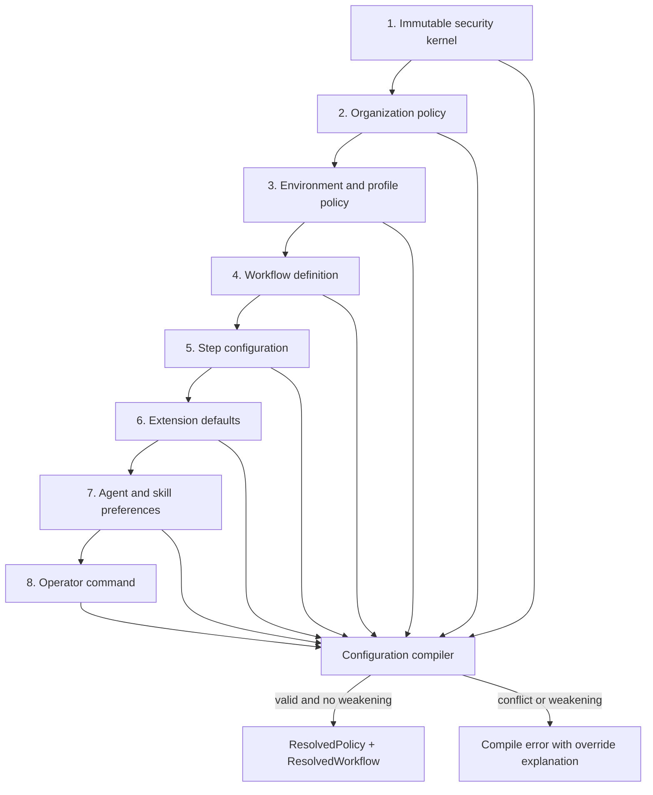
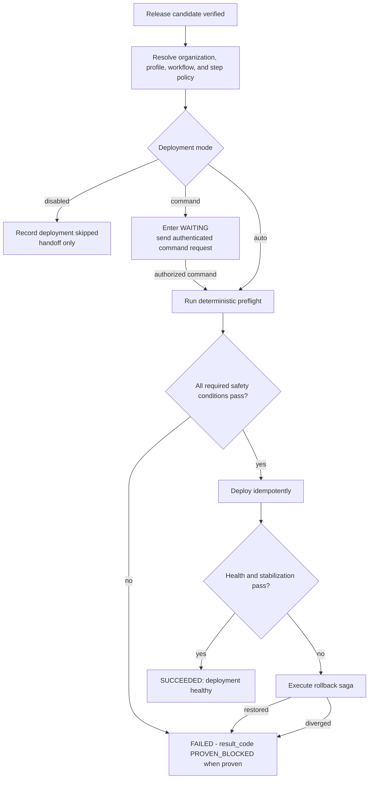

# Configuration, Policy Compilation, and Deployment Defaults

[← Back to Delivery Foundry master index](../../delivery_foundry.md) · [Migration map](../../docs/MIGRATION_MAP_V11_TO_V12.md)

Normative status: **Normative.** Compiler vs OPA responsibility split: see `../security/authorization-model.md`. The explicit personal production-auto grant lives in `../autonomy/personal-venture-profile.md`.


---

<!-- Relocated from V11: N6 Configuration and policy compilation (lines 679-780) -->

## N6. Configuration and policy compilation

### D-06 — Configuration compilation and precedence



### N6.1 Precedence

The compiler resolves configuration in this order:

```text
1. Immutable security kernel
2. Organization policy
3. Environment/profile policy
4. Workflow definition
5. Step configuration
6. Extension manifest defaults
7. Agent/skill preferences
8. Operator command
```

Lower layers MAY tighten restrictions. They MUST NOT weaken a higher layer.

Example:

```text
organization forbids Telegram
+ workflow requests Telegram
= compile error or approved fallback
```

### N6.2 Resolved policy artifact

```yaml
api_version: foundry.policy/v1
profile: team-atlassian
hash: sha256:...

data_classification: confidential

repositories:
  allowed:
    - acme-platform/*

tools:
  shell: task-scoped
  network: deny-by-default

notifications:
  allowed:
    - organization-chat
  telegram: denied

deployment:
  preview: auto
  staging: command
  production: command

budget:
  workflow_usd: 100
  task_usd: 5
```

The compiler explains every override and produces a machine-readable decision report.

### N6.3 Public/private boundary

Public core examples use fictional identifiers only.

Actual organization scenarios, service names, repository URLs, Jira projects, Confluence spaces, and user handles belong in:

```text
delivery-foundry-org-config/
```

Private-derived scenarios in the capability compendium are sanitized aliases and must not be copied back into public code as operational configuration.

---


---

<!-- Relocated from V11: N13 Safe deployment defaults (lines 1299-1364) -->

## N13. Safe deployment defaults

Global defaults are environment-specific:

```yaml
deployment:
  preview:
    mode: auto
  staging:
    mode: command
  production:
    mode: command
```

Production auto-deploy requires an explicit profile grant:

```yaml
production:
  mode: auto
  requires:
    - risk-class-eligible
    - rollback-rehearsed
    - error-budget-healthy
    - deployment-window-open
```

A general default can never bypass organization policy.

10x Implementation Branch Mode disables all deployment nodes.

### D-13 — Deployment-mode resolution



---


---

<!-- Relocated from V11: §3 Public profile taxonomy (lines 2380-2404) -->

## 3. Public profile taxonomy

Delivery Foundry should use environment-neutral profile names:

```text
personal
startup
team
organization
enterprise
regulated
```

Examples:

```text
personal-github
startup-gitlab
team-atlassian
enterprise-azure-devops
regulated-self-hosted
```

A profile describes integrations and policy. It never hardcodes a real organization's identity into the core project.


---

<!-- Relocated from V11: §5.11 Declarative and swappable workflow graph (lines 5311-5625) -->

## 5.11 Declarative and swappable workflow graph

Every loop is a versioned directed acyclic graph with optional bounded cycles for remediation and growth.

```yaml
api_version: foundry.workflow/v1
kind: Workflow

metadata:
  name: venture-product-delivery
  version: 1.0.0

defaults:
  mode: auto
  notify: all-events

steps:
  - id: discover
    uses: researcher.default

  - id: score
    uses: scorer.portfolio
    needs: [discover]

  - id: validate
    uses: validator.market
    needs: [score]

  - id: plan
    uses: planner.default
    needs: [validate]

  - id: build
    uses: executor.default
    needs: [plan]

  - id: review
    uses: reviewer.independent
    needs: [build]

  - id: verify
    uses: verifier.default
    needs: [review]

  - id: deploy
    uses: deployment.default
    needs: [verify]
    mode: auto
```

The graph declares **what** occurs. Profiles bind **which plugin** performs it.

### 5.11.1 Step execution modes

Every step supports:

| Mode | Behavior |
|---|---|
| `auto` | Start automatically when dependencies and policy gates pass |
| `command` | Prepare inputs, notify, and wait for an authorized command |
| `manual-trigger` | Operator starts the Foundry-managed step |
| `manual-execution` | Foundry exports a task packet; a human returns a result |
| `external` | Delegate to a registered external system |
| `shadow` | Run candidate but do not let it control workflow |
| `dry-run` | Compute proposed actions without side effects |
| `disabled` | Remove node from the active graph |

Default:

```yaml
defaults:
  mode: auto
```

Security, legal, spend, and profile policies may override `auto` with a stronger required gate.

### 5.11.2 Deployment mode

Deployment has the requested compact configuration:

```yaml
steps:
  deploy:
    mode: auto
```

or:

```yaml
steps:
  deploy:
    mode: command
    command:
      channel: telegram
      authorized_users:
        - opi
      accepted_commands:
        - "/deploy {{ workflow.id }}"
        - "/cancel {{ workflow.id }}"
      timeout: null
      reminders:
        - 30m
        - 4h
        - every: 24h
```

**Historical note:** Earlier brainstorming used `auto` as the generic deployment default. Part I (N13) defaults preview to `auto` and staging/production to `command` unless a profile explicitly authorizes more.

`auto` means:

```text
verification passed
→ deployment policy permits target
→ credentials and rollback are ready
→ preflight passes
→ send pre-deployment notification
→ deploy automatically
→ monitor
→ finish or rollback
```

It does not bypass immutable security, budget, data-classification, or legal policy.

`command` means:

```text
prepare release
→ enter WAITING_FOR_COMMAND
→ notify Telegram
→ wait for an authorized /deploy command
→ verify command signature, user, workflow, and nonce
→ deploy
```

No command timeout is required. The workflow remains scheduled and sends configured reminders.

### 5.11.3 Per-environment deployment

```yaml
deployment:
  preview:
    mode: auto

  staging:
    mode: auto

  production:
    mode: auto
```

Organization profiles may override only production:

```yaml
deployment:
  production:
    mode: command
```

### 5.11.4 Conditional inclusion and removal

```yaml
steps:
  market-validation:
    enabled_when:
      mode: venture

  jira-update:
    enabled_when:
      mode: engineering
```

Explicit removal:

```yaml
workflow:
  extends: venture-product-delivery
  remove:
    - discover
    - validate
    - product-selection
```

This creates a workflow that starts from an already approved product.

### 5.11.5 Step replacement

```yaml
workflow:
  extends: engineering-delivery

  replace:
    review:
      uses: organization-security-review
      mode: external
```

### 5.11.6 Standalone extraction

Every step is independently executable:

```bash
make step-run \
  STEP=planning \
  INPUT=SPEC.md \
  OUTPUT=docs/PLAN.md

make step-run \
  STEP=security-review \
  REPOSITORY=./service \
  BASE=main \
  HEAD=feature

make step-run \
  STEP=browser-verification \
  URL=https://preview.example.com
```

The same step can be:

- embedded in a complete loop;
- called through CLI;
- called through API;
- invoked from CI;
- exported for manual execution;
- delegated to an external system.

### 5.11.7 Manual task packet

```text
MANUAL-TASK-PACKET/
├── STEP-INPUT.json
├── README.md
├── artifacts/
├── acceptance.json
├── permissions.json
└── STEP-RESULT.schema.json
```

The returned result must validate against the same contract as an automatic plugin.

### 5.11.8 Step contract

```yaml
step:
  id: review

  contract:
    input: foundry.review.input/v1
    output: foundry.review.output/v1

  behavior:
    idempotent: true
    resumable: true
    cancellable: true

  side_effects:
    repository_write: false
    network: false
    secrets: false

  modes:
    - auto
    - command
    - manual-trigger
    - manual-execution
    - external
    - shadow
    - dry-run
    - disabled

  checkpoint:
    before: true
    after: true

  notification:
    lifecycle: all

  plugins:
    accepted_kinds:
      - ReviewerPlugin
```

### 5.11.9 Workflow composition

```yaml
workflow:
  includes:
    - foundry://workflows/context-gathering@1
    - foundry://workflows/spec-plan@2
    - foundry://workflows/build-review-verify@4
    - foundry://workflows/deploy-observe@3
```

Subflows have the same contracts and can be run independently.

### 5.11.10 Workflow migration

A running workflow never changes implementation silently.

```text
new workflows
→ use newest approved version

running workflows
→ retain pinned graph and plugins

explicit migration
→ checkpoint
→ verify compatibility
→ migrate
→ resume
```


---

<!-- Relocated from V11: §7 Dynamic target configuration (lines 7003-7168) -->

## 7. Dynamic target configuration

The system supports both interactive and deterministic configuration.

## 7.1 Interactive

```bash
make configure
```

Example menu:

```text
Select mode:
1) Venture
2) Engineering

Select source-control platform:
1) GitHub
2) GitLab Cloud
3) GitLab Self-Managed
4) Bitbucket Cloud
5) Bitbucket Data Center
6) Azure DevOps

Select work tracker:
1) Jira Cloud
2) Jira Data Center
3) GitHub Issues
4) GitLab Issues
5) Linear
6) None

Select documentation:
1) Confluence Cloud
2) Confluence Data Center
3) Repository Markdown
4) GitHub Wiki
5) GitLab Wiki
6) Notion
7) None

Select CI:
1) GitHub Actions
2) GitLab CI
3) Bitbucket Pipelines
4) Jenkins
5) Bamboo
6) Existing custom pipeline

Select notifications:
1) Telegram
2) Slack
3) Slack
4) Microsoft Teams
5) Email
6) CLI only

Select deployment:
1) None
2) Vercel
3) Cloudflare
4) AWS
5) GCP
6) Azure
7) Kubernetes
8) Existing custom deployment

Select branch delivery:
1) Pull request
2) Direct push to an existing shared branch
3) No remote write

Select deployment execution mode:
1) Auto — deploy when policy and verification pass
2) Command — wait for an authorized command
3) Disabled — workflow never deploys

Default for general profiles: Auto
Default for 10x direct-push profile: Disabled

Select notification granularity:
1) Every workflow step
2) Every step plus progress/checkpoints
3) Every low-level operation
4) Exceptions only

Default: Every step plus progress/checkpoints
```

The output is:

```text
profiles/generated/<profile-name>.yaml
```

## 7.2 Non-interactive

Preferred for repeatability:

```bash
make configure \
  PROFILE=personal-github \
  MODE=venture \
  SCM=github \
  TRACKER=github-issues \
  DOCS=repository \
  CI=github-actions \
  NOTIFY=telegram \
  DEPLOY=vercel \
  DEPLOY_MODE=auto \
  NOTIFY_GRANULARITY=step-progress
```

organization example:

```bash
make configure \
  PROFILE=team-atlassian \
  MODE=engineering \
  SCM=bitbucket-cloud \
  TRACKER=jira-cloud \
  DOCS=confluence-cloud \
  CI=bitbucket-pipelines \
  NOTIFY=slack \
  DEPLOY=custom \
  DEPLOY_MODE=command \
  NOTIFY_GRANULARITY=step-progress
```

10x direct-push example:

```bash
make configure \
  PROFILE=organization-10x-direct-push \
  MODE=plan-execution \
  WORKFLOW=ten-x-direct-push \
  SCM=bitbucket-cloud \
  NOTIFY=telegram \
  BRANCH_DELIVERY=direct-push \
  TARGET_BRANCH=10x-branch \
  PULL_REQUESTS=disabled \
  MERGE=disabled \
  DEPLOY=none \
  DEPLOY_MODE=disabled \
  NOTIFY_GRANULARITY=step-progress
```

## 7.3 Activate a profile

```bash
make profile-use PROFILE=personal-github
make profile-show
make doctor
```

The active profile should be stored locally:

```text
.foundry/active-profile
```

It must not silently switch while tasks are running.

---


---

<!-- Relocated from V11: §8 Profile schema (lines 7169-7427) -->

## 8. Profile schema

```yaml
api_version: foundry/v1
kind: DeliveryProfile

metadata:
  name: team-atlassian
  environment: organization
  owner: platform-team

mode: engineering

providers:
  scm:
    type: bitbucket-cloud
    base_url: https://api.bitbucket.org
    workspace: acme-platform

  tracker:
    type: jira-cloud
    base_url_env: JIRA_BASE_URL
    project_keys:
      - ENG
      - PLATFORM

  knowledge:
    type: confluence-cloud
    base_url_env: CONFLUENCE_BASE_URL
    spaces:
      - ENG

  ci:
    type: bitbucket-pipelines

  notifications:
    type: slack

  deployment:
    type: custom
    adapter: existing-organization-pipeline

workflow:
  defaults:
    mode: auto
    notify: all-events

  deployment:
    preview:
      mode: auto
    staging:
      mode: auto
    production:
      mode: command
      command:
        channel: slack
        timeout: null

agents:
  runtime: openhands # ADR-deferred optional adapter; see adr/ADR-001-openhands-9router.md
  primary:
    planning: claude-code
    implementation: codex
    frontend: cursor
    review: github-copilot
  fallback:
    enabled: false

security:
  data_classification: confidential
  public_web_research: false
  personal_notifications: false
  external_model_proxy: false
  local_workspace_root: /workspaces/acme-platform
  allowed_repository_patterns:
    - acme-platform/*
  denied_repository_patterns:
    - <personal-owner>/*

autonomy:
  create_branch: automatic
  push_branch: automatic
  create_pull_request: automatic
  merge_pull_request: human_required
  deploy_staging: profile_workflow
  deploy_production: profile_workflow
  update_jira: automatic
  update_confluence: review_required
```

Personal example:

```yaml
api_version: foundry/v1
kind: DeliveryProfile

metadata:
  name: personal-github
  environment: personal
  owner: <authorized-user>

mode: venture

providers:
  scm:
    type: github
    organization: acme-ventures

  tracker:
    type: github-issues

  knowledge:
    type: repository

  ci:
    type: github-actions

  notifications:
    type: telegram

  deployment:
    type: vercel

workflow:
  defaults:
    mode: auto
    notify: all-events

  deployment:
    preview:
      mode: auto
    staging:
      mode: auto
    production:
      mode: auto

  notifications:
    channel: telegram
    granularity: step-progress
    include_progress: true
    include_checkpoints: true
    include_retries: true
    include_waiting: true

    telegram:
      rate_mode: adaptive
      batching: true
      private_chat_messages_per_second: 0.80
      group_messages_per_minute: 15
      global_messages_per_second: 25
      coalesce_window: 3s
      maximum_events_per_batch: 20
      target_message_characters: 3500
      maximum_total_retry_attempts: null
      honor_retry_after: true
      paid_broadcast: false

agents:
  runtime: openhands # ADR-deferred optional adapter; see adr/ADR-001-openhands-9router.md
  primary:
    research: claude-code
    planning: claude-code
    implementation: codex
    frontend: cursor
    review: github-copilot
  fallback:
    enabled: true
    executor: opencode
    model_router: 9router # ADR-deferred optional adapter; see adr/ADR-001-openhands-9router.md

security:
  data_classification: personal
  public_web_research: true
  external_model_proxy: true
  local_workspace_root: /workspaces/personal
  allowed_repository_patterns:
    - <venture-owner>/*
    - <personal-owner>/*
  denied_repository_patterns:
    - acme-platform/*

autonomy:
  create_repository: automatic
  create_branch: automatic
  push_branch: automatic
  create_pull_request: automatic
  merge_pull_request: policy_based
  deploy_preview: profile_workflow
  deploy_production: profile_workflow
  spend_money: approval_required
```

---


## 8.1 LLM optimization profile

```yaml
llm_optimization:
  capability_discovery:
    enabled: true
    auto_enable_ga: false
    beta_requires_canary: true
    research_preview_requires_approval: true

  task_profiles:
    architecture:
      provider: anthropic
      reasoning:
        adaptive: true
        effort: xhigh
      orchestration_mode: true
      advisor:
        enabled: true
        max_uses: 2

    implementation:
      provider: native-subscription-first
      reasoning:
        effort: high
      structured_output: task-result/v1
      strict_tools: true

    bulk_research:
      provider: anthropic-api
      batch_when_possible: true
      web_search: true
      web_fetch: true
      dynamic_filtering: true
      citations: required

  context:
    prompt_caching: automatic
    default_cache_ttl: 5m
    long_agent_cache_ttl: 1h
    server_compaction: preferred
    context_editing: targeted
    headroom: experiment-only

  tooling:
    tool_search_threshold: 20
    programmatic_tool_calling: preferred-for-bulk
    mcp_default: deny
    files_api: allowed-by-classification

  managed_agents:
    enabled: false
    allow_profiles:
      - personal
      - startup

  hard_limits:
    cost_per_task_usd: 5
    max_turns: 30
    max_subagents: 10
    max_tool_calls: 100
```

