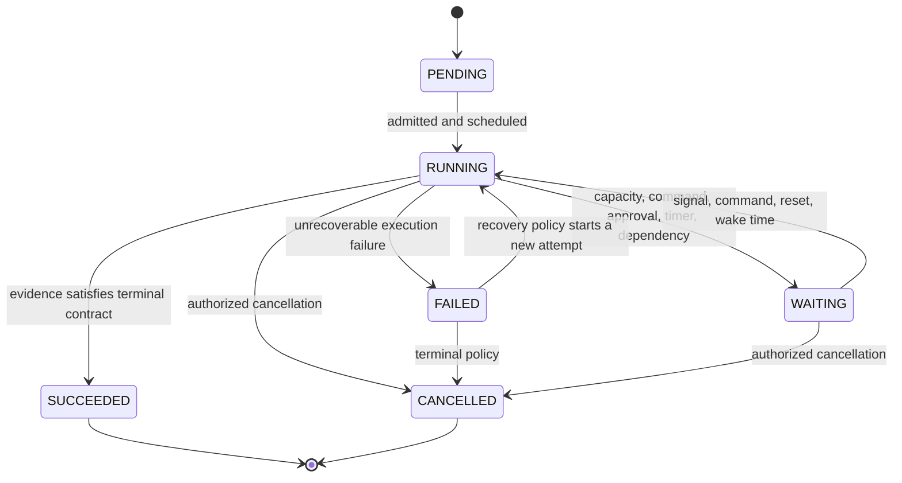
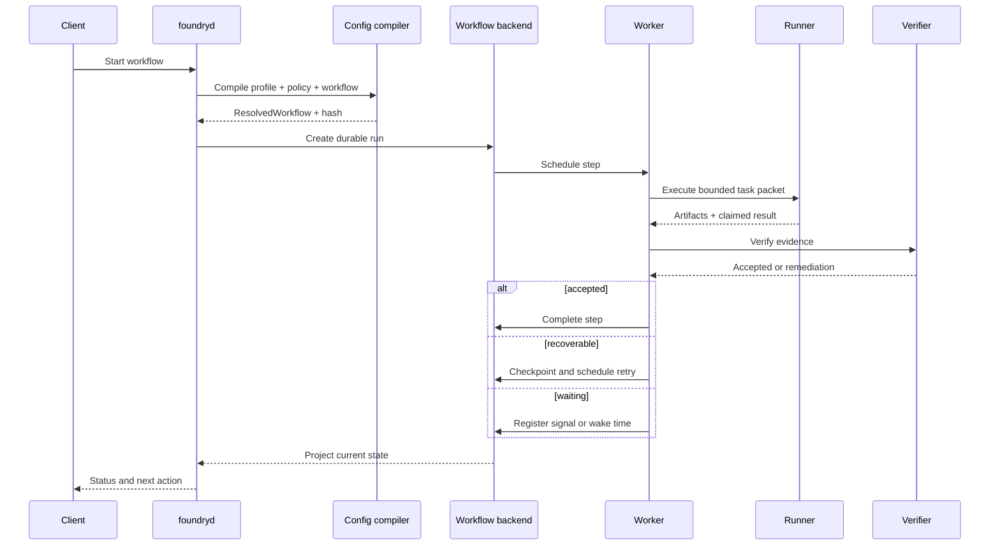

# Canonical State Model

[← Back to Delivery Foundry master index](../../delivery_foundry.md) · [Migration map](../../docs/MIGRATION_MAP_V11_TO_V12.md)

Normative status: **Normative.** There is exactly one workflow lifecycle. Introducing a second status enum fails documentation and architecture CI (fitness rule below).

## 1. Canonical lifecycle

```text
PENDING → RUNNING ⇄ WAITING → SUCCEEDED | FAILED | CANCELLED
```

All richer meaning lives in typed fields, never in new statuses:

```yaml
status: PENDING | RUNNING | WAITING | SUCCEEDED | FAILED | CANCELLED
phase: registry-controlled          # what work is happening
reason: registry-controlled         # why WAITING/FAILED
result_code: registry-controlled    # terminal outcome detail
wake_at: timestamp | null
next_action: string
checkpoint_id: string
```

## 2. Registries

**Phase registry (extensible via governance, not ad hoc):** intake, context-gathering, specification, planning, admission, implementation, verifying, reviewing, integrating, deploying, observing, improving, curating.

**Wait-reason registry:** provider-capacity, provider-outage, rate-reset, subscription-reset, human-approval, human-command, external-deployment, budget, security-hold, blocked-dependency, unforeseen-human-gate, retry-backoff.

**Failure-classification registry:** retryable, deterministic-failure, verification-failed, admission-rejected, policy-violation, no-progress, environment, security.

**Terminal result-code registry (initial):**

```text
PROVEN_BLOCKED                 on FAILED   — verified evidence the work is unsatisfiable as scoped
ADMISSION_REJECTED             on FAILED
ROLLED_BACK                    on FAILED
TEN_X_BRANCH_HANDOFF_READY     on SUCCEEDED — 10x stop boundary; not a failure
MISSION_TARGET_REACHED         on SUCCEEDED
MISSION_NO_VIABLE_CANDIDATE    on FAILED
MISSION_BUDGET_EXHAUSTED       on FAILED
MISSION_TERMINATED_BY_POLICY   on CANCELLED
MISSION_KILLED                 on CANCELLED
MISSION_MAINTENANCE_MODE       on SUCCEEDED
OPPORTUNITY_REJECTED           on SUCCEEDED — build nothing is a successful decision when evidence is weak (C23)
OPPORTUNITY_VALIDATION_REQUIRED on SUCCEEDED — one more bounded validation experiment; not a failure (C23)
OPPORTUNITY_VERDICT_MISSING    on FAILED   — no reproducible BUILD verdict exists (or it has expired) (C23)
OPPORTUNITY_VERDICT_UNREPRODUCIBLE on FAILED — a stored verdict cannot be re-derived from its own evidence (C23)
```

`TEN_X_BRANCHES_READY` exists **only** as a deprecated compatibility alias for `TEN_X_BRANCH_HANDOFF_READY` and MUST NOT appear in new configuration, code, diagrams, or documents.

## 3. SUPERSEDED — HISTORICAL LABEL MAPPING — DO NOT IMPLEMENT

The pre-V10 brainstorming used one large flat state enum. It is preserved here **only** as a translation table for older configurations and notifications. Implementing it violates the CI fitness rule.

| Historical label | Canonical representation |
|---|---|
| RECEIVED | status: PENDING, phase: intake |
| CONTEXT_GATHERING | status: RUNNING, phase: context-gathering |
| READY_FOR_SPEC / SPECIFYING | status: RUNNING, phase: specification |
| PLANNING | status: RUNNING, phase: planning |
| ADMITTING | status: RUNNING, phase: admission |
| BUILDING | status: RUNNING, phase: implementation |
| VERIFYING | status: RUNNING, phase: verifying |
| REVIEWING | status: RUNNING, phase: reviewing |
| INTEGRATING / PUSHING | status: RUNNING, phase: integrating |
| DEPLOYING | status: RUNNING, phase: deploying |
| OBSERVING | status: RUNNING, phase: observing |
| IMPROVING | status: RUNNING, phase: improving |
| WAITING_FOR_CAPACITY | status: WAITING, reason: provider-capacity |
| WAITING_FOR_RATE_RESET | status: WAITING, reason: rate-reset |
| WAITING_FOR_PROVIDER | status: WAITING, reason: provider-outage |
| WAITING_FOR_APPROVAL / COMMAND_WAIT | status: WAITING, reason: human-approval or human-command |
| WAITING_FOR_EXTERNAL_DEPLOYMENT | status: WAITING, reason: external-deployment |
| BUDGET_PAUSED | status: WAITING, reason: budget |
| SECURITY_PAUSED | status: WAITING, reason: security-hold |
| BLOCKED | status: WAITING, reason: blocked-dependency |
| RETRYABLE_FAILURE | status: FAILED, classification: retryable (recovery policy may re-run) |
| NO_PROGRESS | status: FAILED, classification: no-progress |
| ORPHANED | liveness-supervisor condition, not a status (see operations/disaster-recovery.md) |
| PROVEN_BLOCKED | status: FAILED, result_code: PROVEN_BLOCKED |
| TEN_X_BRANCHES_READY | status: SUCCEEDED, result_code: TEN_X_BRANCH_HANDOFF_READY (**never a failure state**) |
| COMPLETED | status: SUCCEEDED |
| CANCELLED | status: CANCELLED |
| ROLLED_BACK | status: FAILED, result_code: ROLLED_BACK |
| REJECTED | status: FAILED, result_code: ADMISSION_REJECTED |

Transition records use canonical fields:

```json
{
  "workflow_id": "uuid",
  "status": "RUNNING",
  "phase_from": "implementation",
  "phase_to": "verifying",
  "reason": "implementation completed",
  "actor": "executor-id",
  "profile": "profile-id",
  "evidence": ["commit-sha"],
  "checkpoint_id": "checkpoint-789",
  "attempt": 4,
  "next_action": "verify",
  "wake_at": null,
  "occurred_at": "timestamp"
}
```

## 4. CI fitness rules

- Introducing a second status enum anywhere (code, config schema, diagram, document) fails CI.
- A superseded historical label appearing outside this mapping table, the migration map, or the changelog fails documentation lint.
- Any diagram presenting a result_code or reason as a peer of the six statuses fails diagram lint.

The full normative workflow semantics (N5) follow.


---

<!-- Relocated from V11: N5 Workflow semantics (lines 536-678) -->

## N5. Workflow semantics

### D-05 — Workflow lifecycle





### N5.1 Immutable compiled workflow

Human-authored YAML is not executed directly.

```text
workflow source
+ profile
+ organization policy
+ bindings
+ extension manifests
        ↓
configuration compiler
        ↓
ResolvedWorkflow artifact
```

`ResolvedWorkflow` is immutable, schema-validated, hash-addressed, and pinned to the run.

### N5.2 Generic state model

The global lifecycle is intentionally small:

```text
PENDING
RUNNING
WAITING
SUCCEEDED
FAILED
CANCELLED
```

Meaning is expressed through typed fields:

```yaml
status: WAITING
phase: branch-integration
reason: provider-capacity
result_code: null
wake_at: 2026-07-18T16:00:15Z
```

Examples:

```yaml
status: SUCCEEDED
result_code: TEN_X_BRANCH_HANDOFF_READY
```

```yaml
status: WAITING
reason: external-deployment
```

`TEN_X_BRANCH_HANDOFF_READY` remains a backward-compatible alias for `TEN_X_BRANCH_HANDOFF_READY`; it is not a failure state.

### N5.3 Attempts and retries

A workflow lifetime MAY be unlimited.

A specific error and strategy MUST be bounded:

```text
workflow lifetime attempts → optionally unlimited
same request immediate retry → bounded
same error same strategy → bounded
request frequency → bounded
spend → bounded
```

Every retry decision records:

- classification;
- previous strategy;
- next strategy;
- attempt count;
- wake time;
- checkpoint;
- cost;
- evidence.

### N5.4 Workflow versioning

- New runs use the newest approved workflow version.
- Running runs retain their pinned compiled version.
- Migration requires checkpoint, compatibility validation, explicit policy, and an audit event.
- Activity code changes follow durable-workflow versioning rules.

---

