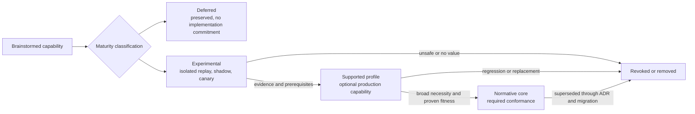

# Capability Maturity Matrix

[← Back to Delivery Foundry master index](../../delivery_foundry.md) · [Migration map](../../docs/MIGRATION_MAP_V11_TO_V12.md)

Normative status: **Normative.** V12 note: Track A (venture) maturity progresses in parallel with Track B (organization); Experimental status on venture capabilities no longer implies sequencing behind organization milestones (see D-29).

---

<!-- Relocated from V11: N18 Feature maturity matrix (lines 1719-1800) -->

## N18. Feature maturity matrix

Nothing from the brainstorming is removed. It is classified.

### D-18 — Capability maturity progression

### N18.1 Normative Core

- direct PLAN admission;
- durable workflow execution;
- one repository;
- workspace isolation;
- policy compiler;
- external-operation ledger;
- independent verification;
- API/CLI;
- transactional notifications;
- checkpoint/resume;
- extension registry;
- security TCB.

### N18.2 Supported Profiles after MVP

- organization Jira/Confluence/Bitbucket flow;
- multi-repository change sets;
- 10x Implementation Branch Mode;
- Telegram command mode and batching;
- provider-capacity scheduling;
- preview/staging deployment adapters;
- branch integrator.

### N18.3 Experimental

- venture portfolio loop;
- self-generated skills and agents;
- automatic internet extension discovery;
- memory promotion;
- adaptive provider routing;
- provider-specific compaction/caching optimization;
- Managed Agents;
- Superpowers methodology pack;
- Headroom;
- 9Router;
- MCP discovery;
- advisor models;
- automatic low-risk product growth.

### N18.4 Deferred

- global auto-promotion of capabilities;
- production auto-deploy as a generic default;
- every SCM/CI provider;
- paid Telegram broadcasts;
- autonomous legal/compliance decisions;
- unrestricted cross-profile learning;
- self-modification of policy or budget ceilings.

Deferred items remain in Part II as preserved design material.

---

