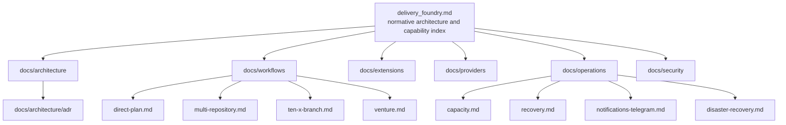

# Documentation Rules, CI Lint Gates, and Supersession Map

[← Back to Delivery Foundry master index](../../delivery_foundry.md) · [Migration map](../../docs/MIGRATION_MAP_V11_TO_V12.md)

Normative status: **Normative.**

## V12 lint gates (additions)

Documentation CI fails when: a second workflow status enum appears anywhere; a superseded historical state label appears outside the state-model mapping table, migration map, or changelog; the deprecated name `Forge` appears outside the migration map, changelog, or an explicit "Atlassian Forge" product reference; a duplicate Mermaid diagram ID is introduced; a contract is defined normatively in more than one document (single-source rule — other documents link, never redefine); provider feature facts appear outside `docs/providers/`.

The preserved documentation architecture (N20), supersession and compatibility map (N21), and documentation synchronization rules follow, now applied to the modular file set.


---

<!-- Relocated from V11: N20 Documentation architecture (lines 1930-2024) -->

## N20. Documentation architecture

This file remains the master blueprint, but implementation documentation must be split into maintainable homes:

```text
docs/
├── architecture/
│   ├── overview.md
│   ├── domain-model.md
│   ├── state-model.md
│   ├── security-tcb.md
│   └── adr/
├── workflows/
│   ├── direct-plan.md
│   ├── multi-repository.md
│   ├── ten-x-branch.md
│   └── venture.md
├── extensions/
│   ├── model.md
│   └── conformance.md
├── providers/
│   ├── anthropic.md
│   ├── openai.md
│   └── cursor.md
├── operations/
│   ├── capacity.md
│   ├── recovery.md
│   ├── notifications-telegram.md
│   └── disaster-recovery.md
└── security/
    ├── threat-model.md
    ├── prompt-injection.md
    └── supply-chain.md
```

Provider-specific facts and limits live in provider documents, not the core architecture.

### D-20 — Documentation architecture



Every process document must link back to its canonical contract and include its Mermaid happy path, wait/retry path, and failure/rollback path.

Recommended CI commands:

```bash
make docs-diagrams-lint
make docs-diagrams-render
make docs-diagrams-link-check
make docs-process-coverage
```

Expected coverage report:

```text
Registered workflows: 12
Workflow documents: 12
Happy-path diagrams: 12
Wait/retry diagrams: 12
Failure/rollback diagrams: 12
Broken Mermaid diagrams: 0
Unlinked process diagrams: 0
```

---


---

<!-- Relocated from V11: N21 Supersession and compatibility map (lines 2025-2044) -->

## N21. Supersession and compatibility map

| Earlier assumption | Normative rule |
|---|---|
| “Delivery Foundry is not another agent framework” | It is a delivery control plane orchestrating existing runtimes |
| Makefile is the only operator interface | API and CLI are canonical; Make is a wrapper |
| Separate plugin/capability registries | One extension registry |
| Large global workflow-state enum | Generic lifecycle plus typed phase/reason/result |
| Production deploy defaults to auto | Preview auto; staging and production command by default |
| `TEN_X_BRANCH_HANDOFF_READY` as state | Result alias for `TEN_X_BRANCH_HANDOFF_READY` |
| 10x branch readiness equals full 10x completion | It is a handoff milestone; release/QA is a separate workflow |
| Every task push is default | Atomic-group push is default; task push requires buildable invariant |
| Existing endpoint proves integration | Exact deployed revision provenance is required |
| Subscription CLI is automatically autonomous | Provider surface must declare execution class |
| Real organization examples in public core | Sanitize aliases; real configuration remains private |
| Multiple extension words with equal meaning | Unified taxonomy in N7 |
| Custom workflow engine implied | Temporal is the reference backend behind an interface |

---


---

<!-- Relocated from V11: §23 Documentation synchronization (lines 13010-13033) -->

## 23. Documentation synchronization

Documentation flow:

```text
SPEC and PLAN
→ repository Markdown
→ optional Confluence draft
→ implementation
→ diff-based documentation check
→ release documentation
```

Policies:

- Repository docs are the executable-source companion.
- Confluence is the organizational knowledge surface.
- The system should link rather than duplicate large documents when practical.
- Generated Confluence updates should preserve human-authored sections.
- Update pages by stable page ID, not title alone.
- Record the source commit and Jira key in page metadata.

---


---

<!-- Relocated from V11: §30 Official platform and security references (lines 13959-14090) -->

## 30. Official platform and security references

Telegram Bot notification references incorporated by this blueprint:

- Telegram Bot FAQ broadcasting and flood-control guidance:
  - https://core.telegram.org/bots/faq
- Telegram Bot API `sendMessage`, message text length, `ResponseParameters.retry_after`, and paid-broadcast option:
  - https://core.telegram.org/bots/api
- Telegram Bot API changelog:
  - https://core.telegram.org/bots/api-changelog

Provider capacity and limit references incorporated by this blueprint:

- Anthropic API rate limits and response headers:
  - https://platform.claude.com/docs/en/api/rate-limits
- Anthropic programmatic Rate Limits API:
  - https://platform.claude.com/docs/en/manage-claude/rate-limits-api
- Claude Code models, context, usage, limits, `/usage`, `/compact`, and reset behavior:
  - https://support.claude.com/en/articles/14552983-models-usage-and-limits-in-claude-code
  - https://support.claude.com/en/articles/11145838-use-claude-code-with-your-pro-or-max-plan
- OpenAI API rate-limit handling and exponential backoff:
  - https://help.openai.com/en/articles/6891753-what-are-the-best-practices-for-managing-my-rate-limits-in-the-api
  - https://help.openai.com/en/articles/5955604-how-can-i-solve-429-too-many-requests-errors
- OpenAI API rate-limit response headers:
  - https://platform.openai.com/docs/api-reference
- Codex subscription usage and credits:
  - https://help.openai.com/en/articles/11369540-using-codex-with-your-chatgpt-plan
  - https://help.openai.com/en/articles/12642688
- GitHub Copilot usage and temporary rate limits:
  - https://docs.github.com/en/copilot/concepts/usage-limits
- Cursor usage pools, included usage, and limit behavior:
  - https://docs.cursor.com/account/rate-limits/

Anthropic capability references incorporated by this blueprint:

- Features overview and model capability discovery:
  - https://platform.claude.com/docs/en/build-with-claude/overview
- Adaptive thinking and effort:
  - https://platform.claude.com/docs/en/build-with-claude/adaptive-thinking
  - https://platform.claude.com/docs/en/build-with-claude/effort
- Task budgets and fast mode:
  - https://platform.claude.com/docs/en/build-with-claude/task-budgets
  - https://platform.claude.com/docs/en/build-with-claude/fast-mode
- Structured outputs and strict tool use:
  - https://platform.claude.com/docs/en/build-with-claude/structured-outputs
  - https://platform.claude.com/docs/en/agents-and-tools/tool-use/strict-tool-use
- Prompt caching, cache diagnostics, compaction, context editing, and mid-conversation system messages:
  - https://platform.claude.com/docs/en/build-with-claude/prompt-caching
  - https://platform.claude.com/docs/en/build-with-claude/cache-diagnostics
  - https://platform.claude.com/docs/en/build-with-claude/compaction
  - https://platform.claude.com/docs/en/build-with-claude/context-editing
  - https://platform.claude.com/docs/en/build-with-claude/mid-conversation-system-messages
  - https://platform.claude.com/docs/en/build-with-claude/mid-conversation-effort-example
- Tool infrastructure:
  - https://platform.claude.com/docs/en/agents-and-tools/tool-use/tool-search-tool
  - https://platform.claude.com/docs/en/agents-and-tools/tool-use/programmatic-tool-calling
  - https://platform.claude.com/docs/en/agents-and-tools/tool-use/fine-grained-tool-streaming
  - https://platform.claude.com/docs/en/agents-and-tools/tool-use/tool-runner
  - https://platform.claude.com/docs/en/agents-and-tools/tool-use/advisor-tool
- Server tools, files, memory, skills, and MCP:
  - https://platform.claude.com/docs/en/agents-and-tools/tool-use/web-search-tool
  - https://platform.claude.com/docs/en/agents-and-tools/tool-use/web-fetch-tool
  - https://platform.claude.com/docs/en/agents-and-tools/tool-use/code-execution-tool
  - https://platform.claude.com/docs/en/agents-and-tools/tool-use/memory-tool
  - https://platform.claude.com/docs/en/build-with-claude/files
  - https://platform.claude.com/docs/en/build-with-claude/pdf-support
  - https://platform.claude.com/docs/en/agents-and-tools/agent-skills/overview
  - https://platform.claude.com/docs/en/build-with-claude/skills-guide
  - https://platform.claude.com/docs/en/agents-and-tools/mcp-connector
- Batch, token counting, and Managed Agents:
  - https://platform.claude.com/docs/en/build-with-claude/batch-processing
  - https://platform.claude.com/docs/en/build-with-claude/token-counting
  - https://platform.claude.com/docs/en/managed-agents/overview
  - https://platform.claude.com/docs/en/managed-agents/multi-agent

Superpowers methodology pack:

- Repository:
  - https://github.com/obra/superpowers
- License:
  - MIT
- Core methodology and supported harnesses:
  - https://github.com/obra/superpowers/blob/main/README.md
- Skill-writing methodology:
  - https://github.com/obra/superpowers/blob/main/skills/writing-skills/SKILL.md

Security foundations incorporated by this blueprint:

- OWASP LLM Prompt Injection Prevention Cheat Sheet:
  - https://cheatsheetseries.owasp.org/cheatsheets/LLM_Prompt_Injection_Prevention_Cheat_Sheet.html
- npm trusted publishing and provenance:
  - https://docs.npmjs.com/trusted-publishers/
  - https://docs.npmjs.com/generating-provenance-statements/
  - https://docs.npmjs.com/viewing-package-provenance/
- npm installation and lifecycle-script controls:
  - https://docs.npmjs.com/cli/commands/npm-ci/
  - https://docs.npmjs.com/cli/install/
  - https://docs.npmjs.com/cli/v11/commands/npm-install-scripts/
- GitHub dependency review, Dependabot, malware alerts, and secure Actions use:
  - https://docs.github.com/en/code-security/concepts/supply-chain-security/dependency-review
  - https://docs.github.com/en/code-security/tutorials/secure-your-dependencies/dependabot-quickstart
  - https://docs.github.com/en/code-security/concepts/supply-chain-security/malware-alerts
  - https://docs.github.com/en/actions/reference/security/secure-use
- OSV-Scanner:
  - https://google.github.io/osv-scanner/usage/
  - https://google.github.io/osv-scanner/supported-languages-and-lockfiles/

Provider references:

- GitHub repository webhooks and GitHub App webhooks:
  - https://docs.github.com/en/rest/repos/webhooks
  - https://docs.github.com/en/enterprise-cloud@latest/apps/creating-github-apps/registering-a-github-app/using-webhooks-with-github-apps
- GitHub Actions workflows:
  - https://docs.github.com/en/actions/concepts/workflows-and-actions/workflows
- GitLab webhooks and Projects API:
  - https://docs.gitlab.com/user/project/integrations/webhooks/
  - https://docs.gitlab.com/api/projects/
- Bitbucket Cloud webhooks, repository API, and Pipelines:
  - https://support.atlassian.com/bitbucket-cloud/docs/manage-webhooks/
  - https://developer.atlassian.com/cloud/bitbucket/rest/api-group-repositories/
  - https://support.atlassian.com/bitbucket-cloud/docs/bitbucket-pipelines-configuration-reference/
- Jira Cloud issues and webhooks:
  - https://developer.atlassian.com/cloud/jira/platform/rest/v3/api-group-issues/
  - https://developer.atlassian.com/cloud/jira/software/webhooks/
- Confluence Cloud REST API v2:
  - https://developer.atlassian.com/cloud/confluence/rest/v2/
  - https://developer.atlassian.com/cloud/confluence/rest/v2/api-group-page/
- Atlassian Forge:
  - https://developer.atlassian.com/platform/pec/

---

