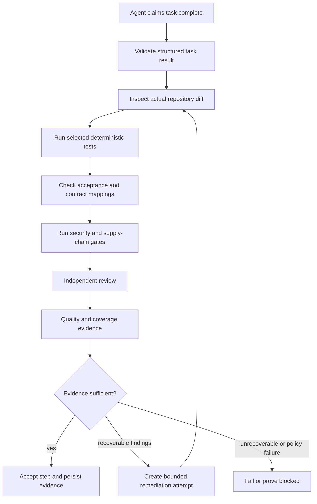
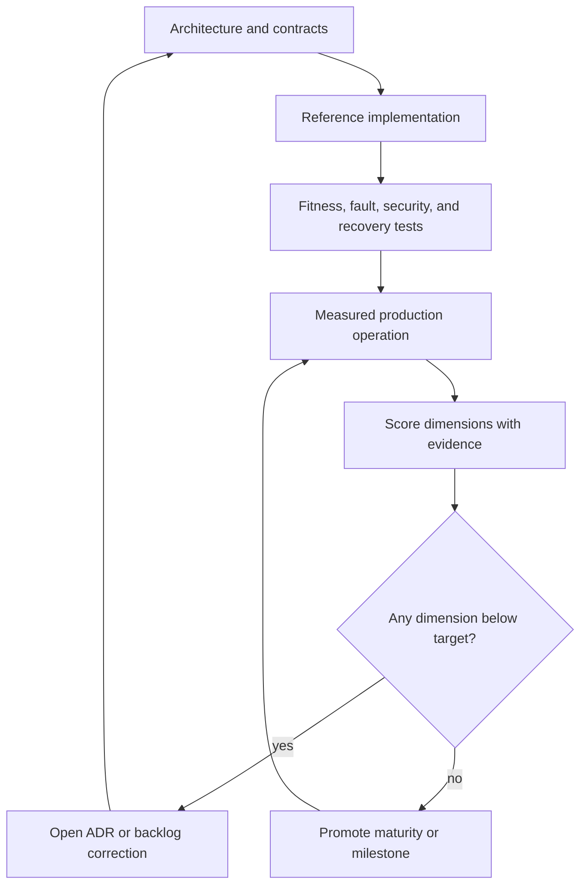

# Quality Rubric, Verification Strategy, and Definition of Done

[← Back to Delivery Foundry master index](../../delivery_foundry.md) · [Migration map](../../docs/MIGRATION_MAP_V11_TO_V12.md)

Normative status: **Normative.**

V12 note on scoring honesty: the V11 "10/10 across all dimensions" self-scorecard is retired. Dimensions are scored against evidence, scores differ by dimension, and deliberately accepted lower scores are stated as trade-offs. A permanent perfect score is a red flag, not a goal. The preserved verification strategy, scorecard criteria, and definition of done follow, with the scorecard reinterpreted under this rule.


---

<!-- Relocated from V11: N16 Verification and test strategy (lines 1529-1611) -->

## N16. Verification and test strategy

### N16.1 Kernel tests

- deterministic workflow replay;
- state transition property tests;
- duplicate event and idempotency tests;
- crash between every external-operation phase;
- lease expiration and fencing tests;
- scheduler restart with pending timers;
- provider 429/5xx/reset simulations;
- notification flood-control tests;
- cross-profile access adversarial tests;
- policy precedence tests;
- extension conformance;
- corrupted checkpoint recovery;
- multi-repository partial-application saga tests.

### D-16 — Verification and evidence pipeline



### N16.2 Architecture fitness functions

CI fails when:

- a second canonical state enum is introduced;
- a new extension type bypasses the unified registry;
- a profile weakens organization policy;
- a machine-consumed response lacks a schema;
- a side-effecting operation lacks idempotency/reconciliation metadata;
- a public example contains a known private identifier;
- a workflow has no terminal/result definition;
- a waiting state has no event, command, or wake time;
- a production deployment inherits `auto` without explicit authorization;
- an extension has no owner, tests, threat analysis, or rollback path;
- a registered workflow has no Mermaid happy-path diagram;
- a stateful workflow diagram introduces states outside the canonical lifecycle without using typed phase/reason/result fields;
- a process document has no wait/retry and failure/rollback visualization;
- a Mermaid diagram cannot be parsed by the documentation CI job.

### N16.3 AI-slop prevention gate

A new capability cannot enter the normative core until it has:

```text
problem statement
owner
interface
data model impact
security analysis
failure modes
test plan
operational metrics
rollback/removal plan
documentation home
proof it does not duplicate an existing concept
```

Ideas that fail this gate remain preserved as experimental or deferred.

---


---

<!-- Relocated from V11: N23 Solidity scorecard and exit criteria (lines 2087-2126) -->

## N23. Solidity scorecard and exit criteria

The design target is:

| Dimension | Design target | Evidence required |
|---|---:|---|
| Product vision | 10/10 | Clear users, entry paths, and non-goals |
| Core engineering principles | 10/10 | Enforced invariants and CI fitness functions |
| Security intent | 10/10 | TCB, policy integrity, adversarial tests |
| Architecture coherence | 10/10 | One model for state, config, extensions, and authority |
| Implementability | 10/10 | Concrete reference stack and staged vertical slices |
| Scope discipline | 10/10 | Maturity matrix and milestone gates |
| Operational completeness | 10/10 | SLO, DR, reconciliation, liveness, observability |
| Documentation maintainability | 10/10 | Normative core plus modular provider/workflow docs |
| MVP readiness | 10/10 | Milestone 1 executable with acceptance tests |
| Overall solidity | 10/10 target | All mandatory fitness functions pass in a real deployment |

The document now defines a coherent path to those scores. It does not claim that unimplemented software has already earned them.

### D-22 — Solidity feedback loop



---


---

<!-- Relocated from V11: §28 Definition of done (lines 13662-13877) -->

## 28. Definition of done

Delivery Foundry v1 is complete when:

### Portability

- A new machine can install it using Make.
- The active profile can be changed explicitly.
- Personal and work installations remain isolated.

### Personal flow

- Telegram mission is accepted.
- Ideas are researched and scored.
- One idea is selected.
- GitHub repository is created.
- Agents build a preview.
- CI passes.
- Production requires approval.

### Engineering flow

- Jira issue or an approved PLAN.md can be used as the entry point.
- Confluence context is gathered when required.
- Bitbucket repositories and exact working branches are identified.
- A spec and plan are produced when they are not already supplied.
- Agents create verified changes.
- The configured delivery boundary is honored:
  - pull request;
  - direct shared-branch push;
  - or no remote write.
- Jira and Confluence are updated when enabled.
- Merge and deployment follow the selected workflow rather than a hardcoded assumption.

### Security

- No cross-profile secrets, state, cache, workspace, or memory retrieval.
- No unapproved data egress.
- Every tool call passes the deterministic policy gateway.
- Every external write is auditable.
- Every webhook is verified and idempotent.
- Prompt-injection regression tests pass.
- External agents, skills, libraries, packages, and CI actions pass quarantine.
- Dependencies are locked, scanned, and provenance-checked where available.
- Install scripts are default-deny and explicitly approved.
- Sandboxes have no host home, Docker socket, cloud metadata, or default secrets.
- Kill switch, credential revocation, containment, and pause work.
- Provider permissions are least-privilege.
- Security rules cannot be modified by unattended agents.

### Capability evolution

- Capability gaps can be detected from repeated evidence.
- Existing approved capabilities are preferred over generation.
- Internet-discovered packages enter quarantine without execution.
- Generated agents and skills follow SPEC → PLAN → BUILD → REVIEW → VERIFY.
- Every promoted capability has provenance, checksums, fixtures, and rollback.
- The author cannot be the sole promotion authority.
- Revocation removes a capability from new tasks immediately.

### Self-healing

- Failures are classified before retry.
- Retries, provider fallback, and remediation are bounded.
- Circuit breakers stop repeated failure and cost loops.
- Product code, dependency state, capability state, memory, and deployments can be rolled back independently.
- Prompt injection, supply-chain alerts, data corruption, and unknown failures fail closed.

### Memory and learning

- Raw evidence is append-only.
- Durable memory retains source, trust, profile, confidence, and version.
- External content cannot write trusted memory directly.
- Contradictions and superseded memories are detectable.
- Secrets and prohibited data are never stored in memory.
- Learning changes are evaluated offline, shadowed, canaried, and reversible.
- Policy, budgets, approvals, and profile security cannot be learned away.

### Operations

- Backup and restore work.
- Updates are pinned and staged.
- Doctor and smoke tests pass.
- Same-error and same-strategy retries are bounded.
- Workflow lifetime may be unlimited, but every wait has a durable wake-up or event.
- No active workflow can silently disappear or remain unscheduled.


### Direct PLAN and multi-repository execution

- An existing executable `PLAN.md` can enter the system without running ideation or generating a replacement plan.
- Admission detects structural defects, repairs only safe orchestration issues, and requests commands for semantic ambiguity.
- Every task maps to exactly one repository or an explicit deterministic resolution rule.
- Repositories are resolved through the active profile and do not gain access merely because the plan names them.
- Mirrors, branches, and isolated worktrees can be recreated after process failure.
- Branch strategy is configurable and defaults to per-repository-group.
- Cross-repository contracts are frozen before parallel consumers proceed.
- Repository-local verification and cross-repository integration are both required.
- Linked PRs are represented by one durable change-set manifest.
- Merge, deployment, and rollback order are explicit and configurable.
- Provider/session interruption resumes the affected task rather than restarting the complete plan.
- Every admission, repository, workspace, task, integration, PR, merge, and deployment transition is notified.
- Completion requires accepted tasks, repository checks, integration, change-set policy, deployment mode, health, and persisted evidence.


### 10x shared-branch direct-push execution

- An approved `PLAN.md` can start the workflow without ideation, specification, or plan generation.
- Every listed repository confirms the exact existing 10x branch before implementation.
- Agents work in isolated local worktrees and do not create remote task branches.
- All remote writes pass through one serialized Branch Integrator per repository.
- Direct pushes use normal fast-forward updates; force push is forbidden.
- Remote drift triggers refresh, replay, and affected verification before retry.
- Every accepted task is pushed according to the configured cadence.
- Pull-request creation remains disabled throughout the workflow.
- Merge remains disabled throughout the workflow.
- Preview, staging, and production deployment remain disabled throughout the workflow.
- No-PR operation still includes focused review, wave review, final branch review, and quality evidence.
- Temporary configuration changes are restored or explicitly classified before readiness.
- Cross-repository validation uses local or already-existing approved endpoints without creating a deployment.
- The branch-based change set records base SHA, current SHA, accepted tasks, and push receipts for every repository.
- Final result is `SUCCEEDED` with `result_code: TEN_X_BRANCH_HANDOFF_READY`, never `MERGED`, `DEPLOYED`, or `SHIPPED`.
- A separate later workflow is required for PR, merge, staging, QA rollout, or production release.

### Plugin and workflow composability

- A new GitHub project can be integrated through a plugin manifest and adapter without modifying the kernel.
- Every plugin passes role-specific conformance, security, restart, and permission tests.
- Every running workflow pins exact workflow, step, plugin, policy, agent, and skill versions.
- A workflow step can be swapped, disabled, removed, executed manually, delegated externally, shadowed, or run standalone.
- Plugins cannot call other plugins directly or bypass workflow authority.
- Running workflows do not change plugin versions without an explicit checkpointed migration.
- Unknown or unsupported capabilities fail explicitly rather than degrading silently.

### Deployment modes

- `auto` is the default deployment mode.
- Auto deployment occurs only after verification, profile authorization, preflight, rollback readiness, and credential checks.
- `command` mode enters `WAITING_FOR_COMMAND` and accepts an authenticated Telegram command.
- Command mode has no mandatory timeout and remains scheduled with reminders.
- Preview, staging, and production may use different modes.
- Every deployment transition is notified and audited.
- Rollback remains automatic when deterministic health thresholds fail.

### Complete process notifications

- Every workflow node emits scheduled, started, progress, checkpoint, wait/retry, and terminal events.
- Plugin lifecycle, capacity, recovery, security, memory, and deployment processes emit events.
- Notifications are committed transactionally through a durable outbox.
- Failed notifications retry and eventually enter a visible dead-letter queue.
- Command-required steps confirm notification delivery before waiting.
- Telegram commands are authorized, nonce-bound, state-aware, and replay-protected.
- Organization-channel events are redacted according to data classification.
- Step-progress is the default granularity; operation-level tracing is available.
- Every Telegram-bound event is preserved even when multiple events are represented by one digest.
- Private-chat, group, and global token buckets use conservative configurable ceilings.
- Telegram messages remain below rendered text/caption limits.
- Progress uses bounded edits instead of creating unbounded new messages.
- Queue pressure dynamically increases batching and reduces noncritical message frequency.
- Telegram 429 responses honor `retry_after` before any retry.
- Missing `retry_after` uses configurable jittered exponential backoff.
- Unlimited total retry lifetime cannot cause an immediate or same-error hot loop.
- Notification retries, batches, block times, and receipts survive restarts.
- A command-required notification preempts progress traffic and requires a confirmed receipt.
- Telegram outages produce approved fallback alerts and a bounded recovery digest.

### Capacity and liveness

- Each provider adapter reports exact, observed, or unknown capacity with confidence.
- Unknown capacity is never interpreted as unlimited.
- API rate-limit headers and reset times are persisted.
- Subscription-limit reset windows are detected and scheduled when available.
- Tasks reserve estimated request, token, cost, context, and concurrency capacity before dispatch.
- Concurrency drains before provider exhaustion.
- Every meaningful milestone has a verified durable checkpoint.
- Context exhaustion triggers compaction or fresh-session rollover without losing accepted evidence.
- Provider exhaustion triggers wait, approved fallback, or batch conversion.
- Restarts use provider-neutral task packets and new fencing tokens.
- Every nonterminal workflow has a heartbeat, `wake_at`, event subscription, recovery lease, or human gate.
- The Liveness Supervisor repairs orphaned workflows.
- Repeated retries without verified progress trigger a strategy change.
- Total workflow attempts may be unlimited without creating an immediate retry hot loop.
- `COMPLETED` is never reported without acceptance and verification evidence.
- Unsatisfiable or permanently blocked work produces `PROVEN_BLOCKED`, not a false success.

### LLM capability optimization

- Provider/model capabilities are discovered programmatically or through pinned manifests.
- Unsupported request fields are never silently dropped.
- Every machine-consumed response uses a validated schema.
- Stable prompts and tool definitions achieve measured cache reuse.
- Long-running sessions survive compaction without losing approvals, security rules, blockers, or acceptance evidence.
- Context editing removes waste without removing authoritative state.
- Tool search loads only profile-approved tools.
- Programmatic tool calling reduces context and round trips without expanding permissions.
- Task budgets guide behavior while Foundry hard limits enforce cost.
- Batch processing is used for non-urgent bulk work.
- Fast mode is restricted to approved latency-sensitive tasks.
- Beta and research-preview capabilities pass replay and canary evaluation.
- LLM optimization can be rolled back independently of product code.

### Superpowers methodology pack

- The upstream source is pinned and license-recorded.
- Provider installations resolve to the approved source version.
- Foundry policy precedence is preserved.
- PEC remains the sole plan executor.
- Conflicting Superpowers execution skills are mapped or disabled.
- Brainstorming, TDD, systematic debugging, verification, review, worktree, and skill-writing workflows pass behavioral evaluations.


---


