# Preserved Brainstorming and Superseded Material

[← Back to Delivery Foundry master index](../../delivery_foundry.md) · [Migration map](../../docs/MIGRATION_MAP_V11_TO_V12.md)

This file preserves V11 material that is historical or superseded. Nothing here is executable guidance.

> **SUPERSEDED — DO NOT IMPLEMENT.** Sections below marked superseded are replaced by: the dual-track roadmap and Minimum Lovable Slices (root `delivery_foundry.md`), the canonical state model (`docs/architecture/state-model.md`), and the sizing rules (`docs/architecture/overview.md`). They are preserved for provenance and for the lessons embedded in them.


---

<!-- Relocated from V11: Part II preamble (lines 2127-2130) -->

# Part II — Preserved Capability Compendium

> **Informative:** The sections below preserve all prior brainstorming. They are not all required for the first implementation. Conflicts and deprecated assumptions are resolved by Part I.


---

<!-- Relocated from V11: §1 The decision (lines 2275-2363) -->

## 1. The decision

This project should be published as a public repository:

```text
github.com/<owner>/delivery-foundry
```

Recommended public repository properties:

- Apache-2.0 or MIT license.
- No embedded organization names.
- No secrets, internal URLs, or proprietary workflow assumptions.
- Example profiles use fictional organizations such as `acme-platform`.
- Provider adapters are optional and independently testable.
- Organization-specific configuration stays in separate private repositories.
- Public documentation distinguishes reusable core behavior from private policy overlays.


Create three foundational repositories:

```text
delivery-foundry/
delivery-foundry-product-template/
delivery-foundry-example-configs/
```

Each organization creates its own private configuration repository inside its approved SCM:

```text
delivery-foundry-org-config/
```

Generated products and engineering services remain separate repositories.

```text
Public project organization
├── delivery-foundry
├── delivery-foundry-product-template
├── delivery-foundry-example-configs
├── api-changelog-assistant
├── feedback-deduplicator
└── other products

Organization-controlled SCM workspace/project
├── delivery-foundry-org-config
├── platform-api-service
├── operations-dashboard
├── identity-settings-service
└── other organization services
```

Do not put personal and organization runtime state in the same installation.

Recommended physical separation:

```text
Personal runtime
- Personal VPS, PC, or Mac
- Personal GitHub
- Telegram
- Personal subscriptions and API keys
- Public internet research permitted
- 9Router fallback permitted

Organization runtime
- Organization-approved machine, VM, or runner
- Bitbucket, Jira, Confluence
- Organization-approved notification channel
- Organization-approved models only
- No personal credentials
- No personal Telegram unless explicitly approved
- No 9Router or external proxy unless security approves it
```

The core repository may be shared, but each runtime must have separate:

- secrets;
- state;
- workspaces;
- audit logs;
- model policies;
- network boundaries;
- notification channels;
- source-control credentials;
- billing accounts.

---


---

<!-- Relocated from V11: §2 Why the name Delivery Foundry (lines 2364-2379) -->

## 2. Why the name “Delivery Foundry”

“Factory Loop” describes the recurring behavior, but not the broader platform.

**Delivery Foundry** is more accurate:

- “Delivery” covers venture creation and engineering delivery.
- “Foundry” means inputs are transformed through repeatable, controlled processes.
- It does not imply that every task must be fully autonomous.
- It supports both product discovery and normal organization work.
- It emphasizes policies, tools, verification, and repeatability rather than agent hype.

The recurring automation inside Delivery Foundry is still called a **loop**.

---


---

<!-- Relocated from V11: §3A Operating modes (historical compendium) (lines 2405-2536) -->

## 3A. Operating modes (historical compendium)

### 3.1 Venture mode

Purpose:

```text
Discover opportunities
→ validate demand
→ select one idea
→ build
→ ship
→ measure
→ improve, pivot, or kill
```

Typical target profile:

```yaml
mode: venture
scm: github
tracker: github_issues
docs: repository
ci: github_actions
notifications: telegram
deployment: vercel
agent_runtime: openhands
model_routing: native_subscription_first
```

### 3.2 Engineering mode

Purpose:

```text
Read Jira work
→ gather Confluence context
→ inspect repositories
→ create spec and plan
→ implement
→ verify
→ open pull request
→ update work systems
→ wait for configured merge and deployment gates
```

Typical organization profile:

```yaml
mode: engineering
scm: bitbucket_cloud
tracker: jira_cloud
docs: confluence_cloud
ci: bitbucket_pipelines
notifications: organization_chat
deployment: existing_organization_pipeline
agent_runtime: openhands
model_routing: approved_native_agents_only
```

### 3.3 Direct PLAN execution mode

Purpose:

```text
Receive an approved PLAN.md
→ skip ideation and plan generation
→ admit the plan
→ resolve one or many repositories
→ execute dependency-aware tasks
→ verify
→ complete the configured delivery boundary
```

### 3.4 10x direct-push mode

Purpose:

```text
Receive an approved PLAN.md
→ use existing 10x branches in every repository
→ execute tasks in isolated local worktrees
→ serialize accepted commits into each shared 10x branch
→ verify branch readiness
→ stop
```

Explicitly excluded:

```text
no task branches on the remote
no pull requests
no merge to master/main
no staging deployment
no production deployment
```

Typical profile:

```yaml
mode: plan-execution
workflow: ten-x-direct-push
scm: bitbucket_cloud
notifications: telegram

branch_delivery:
  mode: direct-push
  target_branch: 10x-branch
  push_cadence: after-accepted-task

pull_requests:
  enabled: false

merge:
  enabled: false

deployment:
  preview:
    mode: disabled
  staging:
    mode: disabled
  production:
    mode: disabled

completion:
  result_code: TEN_X_BRANCH_HANDOFF_READY
```

The mode changes workflow behavior, but provider selection remains dynamic.

---


---

<!-- Relocated from V11: N19 Implementation roadmap (serialized M0–M7) (lines 1801-1929) -->

> **SUPERSEDED — DO NOT IMPLEMENT.** Replaced by: dual-track roadmap D-29 in delivery_foundry.md + sizing in docs/architecture/overview.md. Preserved for provenance and lessons.

## N19. Implementation roadmap

### D-19 — Milestone-gated implementation

```mermaid
flowchart LR
    M0[M0 Architecture skeleton]
    M1[M1 MVP vertical slice]
    M2[M2 Operational solidity]
    M3[M3 Organization slice]
    M4[M4 Multi-repository saga]
    M5[M5 10x branch handoff]
    M6[M6 Capability evolution]
    M7[M7 Venture loop]

    G0{Fitness gates pass?}
    G1{10 real tasks pass?}
    G2{Fault and security gates pass?}
    G3{Organization acceptance passes?}
    G4{Partial-failure saga passes?}
    G5{Branch drift and handoff pass?}
    G6{Shadow and canary pass?}

    M0 --> G0 -->|yes| M1
    G0 -->|no| M0
    M1 --> G1 -->|yes| M2
    G1 -->|no| M1
    M2 --> G2 -->|yes| M3
    G2 -->|no| M2
    M3 --> G3 -->|yes| M4
    G3 -->|no| M3
    M4 --> G4 -->|yes| M5
    G4 -->|no| M4
    M5 --> G5 -->|yes| M6
    G5 -->|no| M5
    M6 --> G6 -->|yes| M7
    G6 -->|no| M6
```



### Milestone 0 — Architecture skeleton

- repository layout;
- Go API/CLI;
- PostgreSQL schema;
- Temporal workflow;
- OPA policy integration;
- object-store artifact interface;
- rootless runner;
- OpenTelemetry;
- one fake provider adapter.

Exit:

```text
a deterministic demo workflow survives worker restart
and exposes complete state through the API
```

### Milestone 1 — MVP vertical slice

- PLAN admission;
- GitHub SCM;
- one repository;
- one executor;
- worktree;
- tests;
- PR;
- Telegram summary;
- checkpoint/resume.

Exit:

```text
ten real low-risk tasks complete with no lost state,
no duplicate PRs, and reproducible evidence
```

### Milestone 2 — Operational solidity

- fault injection;
- operation reconciliation;
- capacity handling;
- notification outbox;
- backup/restore;
- SLO dashboards;
- security evaluation.

### Milestone 3 — Organization slice

- Bitbucket or organization SCM;
- Jira;
- Confluence;
- organization identity/policy;
- command-based staging/production.

### Milestone 4 — Multi-repository

- contract artifacts;
- change-set saga;
- environment provenance;
- partial-failure reconciliation.

### Milestone 5 — 10x branch handoff

- shared-branch integrator;
- atomic groups;
- drift handling;
- branch CI/review;
- no-PR/no-deploy handoff.

### Milestone 6 — Capability evolution

- unified extension quarantine;
- shadow/canary;
- generated skill evaluation;
- memory curator.

### Milestone 7 — Venture loop

- opportunity discovery;
- validation;
- product generation;
- commercial feedback;
- bounded autonomous growth.

Features may advance only when prior milestone fitness functions pass.

---


---

<!-- Relocated from V11: §26 Rollout plan (lines 13288-13559) -->

> **SUPERSEDED — DO NOT IMPLEMENT.** Replaced by: dual-track roadmap D-29. Preserved for provenance and lessons.

## 26. Rollout plan

### Phase 0 — Security kernel

Build before autonomous execution:

- immutable policy kernel;
- profile and workspace isolation;
- tool gateway;
- secret broker;
- default-deny network egress;
- ephemeral sandbox;
- audit event store;
- prompt-injection fixtures;
- package quarantine;
- emergency pause and revocation.

Acceptance:

```text
A malicious prompt or package cannot reach secrets,
host files, another profile, or production authority.
```

### Phase 1 — Plugin kernel and workflow contracts

Build:

- plugin manifest and lifecycle;
- role-specific plugin contracts;
- plugin registry and immutable lock;
- conformance test harness;
- workflow and step schemas;
- declarative graph compiler;
- step execution modes;
- standalone step runner;
- plugin bindings and replacement;
- workflow version pinning and migration;
- durable notification outbox;
- Telegram command verification;
- all-step lifecycle notifications;
- hierarchical Telegram token buckets;
- adaptive event batching and message editing;
- rendered-length-safe message chunking;
- `retry_after`-aware durable retry;
- notification fallback and recovery digests.

Acceptance:

```text
A workflow can replace one executor, disable one node,
run one node manually, and switch deployment between auto
and Telegram command without changing kernel code.

A 1000-event Telegram load test stays below configured
private, group, and global ceilings while preserving every
event in the durable event store.
```

### Phase 2 — Core and profiles

Build:

- repository structure;
- Makefile;
- profile schema;
- profile selection;
- doctor;
- personal/work isolation.

No autonomous work yet.

Acceptance:

```text
One codebase can validate two profiles without sharing state.
```

### Phase 3 — Read-only adapters

Implement:

- GitHub read;
- Bitbucket read;
- Jira read;
- Confluence read;
- GitLab read.

Acceptance:

```text
The system can create a normalized context package from either environment.
```

### Phase 4 — Safe write adapters

Implement:

- create branch;
- push branch;
- create PR/MR;
- comment on work item;
- create draft documentation.

No merge or deployment.

Acceptance:

```text
One bounded task can reach a reviewable change request.
```

### Phase 5 — Agent execution

Connect:

- OpenHands;
- native subscriptions;
- Agent Skills;
- deterministic repository commands.

Acceptance:

```text
A task reaches a PR with tests and evidence without manual coding.
```

### Phase 6 — Direct PLAN and multi-repository workflow

Add:

- plan upload and classification;
- admission validator;
- safe structural plan repair;
- repository catalog and resolution;
- reusable repository mirrors;
- multi-repository workspace manager;
- branch/worktree strategies;
- cross-repository contract freezing;
- linked pull-request change sets;
- integration environments;
- merge and rollback ordering;
- Telegram `/run-plan` flow.

Acceptance:

```text
One uploaded PLAN.md spanning at least four repositories
reaches linked verified pull requests and an integration
environment without repeating ideation or planning.
```

### Phase 7 — 10x direct-push workflow

Add:

- shared initiative-branch profile;
- existing-branch admission;
- local-only task worktrees;
- deterministic Branch Integrator;
- serialized repository push queues;
- normal fast-forward push only;
- post-replay verification;
- branch-based change-set manifest;
- final branch review without PR;
- no-merge/no-deploy stop boundary;
- `TEN_X_BRANCH_HANDOFF_READY` handoff.

Acceptance:

```text
One approved PLAN.md updates four repositories through
their existing 10x branches, creates zero pull requests,
performs zero merges and deployments, survives remote
branch drift, and ends with a verified branch handoff.
```

### Phase 8 — Venture workflow

Add:

- opportunity discovery;
- validation;
- scoring;
- product template;
- preview deployment.

Acceptance:

```text
A mission reaches a validated preview product.
```

### Phase 9 — Organization workflow

Add:

- Jira transition rules;
- Confluence draft updates;
- multi-repository plans;
- Bitbucket Pipelines remediation.

Acceptance:

```text
A Jira task reaches linked Bitbucket PRs and documentation drafts.
```

### Phase 10 — LLM capability optimization

Add:

- Models/capability discovery;
- execution-envelope compiler;
- adaptive thinking and effort profiles;
- prompt caching and diagnostics;
- server compaction;
- targeted context editing;
- tool search;
- programmatic tool calling;
- structured outputs and strict tools;
- batch evaluations;
- advisor experiments;
- optional Managed Agents adapter;
- Superpowers methodology pack.

Acceptance:

```text
The same benchmark suite shows higher accepted output per dollar
without increasing security violations, retries, or escaped defects.
```

### Phase 11 — Capacity and liveness

Add:

- provider-capacity adapters;
- token/request/subscription/spend capacity registry;
- pre-dispatch token and cost estimation;
- reservations and capacity-aware concurrency;
- durable checkpoints;
- provider-neutral task packets;
- session rollover;
- reset-aware retry scheduler;
- provider failover;
- lease heartbeat and fencing tokens;
- Liveness Supervisor;
- no-progress detection;
- capacity-learning and forecasting.

Acceptance:

```text
A task survives a simulated context limit, 429, subscription reset,
worker crash, and provider outage without losing accepted progress
or becoming silently stalled.
```

### Phase 12 — Controlled autonomy

Allow profile-specific automation:

- personal low-risk auto-merge;
- preview deployment;
- routine documentation updates;
- bounded retries.

Keep organization merges and production deployments human-controlled unless formally approved.

---


---

<!-- Relocated from V11: §27 First implementation order (lines 13560-13661) -->

> **SUPERSEDED — DO NOT IMPLEMENT.** Replaced by: Shared Kernel Proof + two Minimum Lovable Slices (delivery_foundry.md). Preserved for provenance and lessons.

## 27. First implementation order

Build in this exact order:

1. Immutable security policy kernel.
2. Profile, workspace, state, cache, and memory namespace isolation.
3. Tool gateway with scoped, short-lived capability tokens.
4. Ephemeral sandbox with default-deny network egress and no host secrets.
5. Secret broker, log redaction, and credential revocation.
6. Append-only audit event store and evidence retention.
7. Prompt-injection firewall and regression fixtures.
8. Package, agent, and skill quarantine with provenance and checksum validation.
9. Root Makefile and modular `.mk` structure.
10. Profile schema.
11. `make configure`.
12. `make profile-use`.
13. Personal/organization isolation checks.
14. `make doctor`, `make security-check`, and `make smoke`.
15. Plugin manifest, registry, immutable lock, and role contracts.
16. Plugin quarantine, adapter generation, conformance, shadow, canary, activation, and revocation.
17. Declarative workflow graph, subflows, and version pinning.
18. Step modes: auto, command, manual-trigger, manual-execution, external, shadow, dry-run, and disabled.
19. Standalone step CLI/API and manual task-packet import/export.
20. Profile plugin bindings and workflow replacement/removal rules.
21. Durable notification outbox, delivery receipts, retry, and dead-letter handling.
22. Every-step lifecycle event emission and Telegram editable/threaded progress messages.
23. Signed and replay-protected Telegram command handler.
24. Config-driven deployment with default auto and optional command mode.
25. Telegram hierarchical rate limiter for bot, chat type, chat, and priority lane.
26. Telegram event coalescing, step-message editing, digest construction, and safe text chunking.
27. Telegram 429 `retry_after` handling with durable blocked-until scheduling.
28. Telegram dynamic throughput calibration, queue-pressure adaptation, and learned-state expiry.
29. Telegram fallback channels, bounded recovery digest, load tests, and flood-control simulations.
30. GitHub SCM adapter.
31. Bitbucket Cloud SCM adapter.
32. Jira Cloud tracker adapter.
33. Confluence Cloud knowledge adapter.
34. GitHub Actions CI adapter.
35. Bitbucket Pipelines CI adapter.
36. Telegram personal notification adapter.
37. Organization notification adapter.
38. OpenHands executor adapter.
39. Claude, Codex, Cursor, Copilot, and OpenCode native wrappers.
40. Canonical agent, skill, and capability catalogs.
41. Durable memory event store and memory curator.
42. Recovery manager, circuit breakers, and rollback assets.
43. Product template.
44. Direct PLAN upload, classification, and immutable artifact storage.
45. PLAN admission schema, validator, safe repair engine, and admission report.
46. Repository manifest, catalog, allowlist-aware resolver, and missing-repository proposals.
47. Reusable read-only repository mirrors and multi-repository Workspace Manager.
48. Configurable branch/worktree strategies with leases and ownership.
49. Cross-repository contract freeze, integration manifest, and integration environment.
50. Linked pull-request change-set manifest with merge and rollback ordering.
51. Telegram `/run-plan`, `/add-repository`, and direct-plan status commands.
52. Direct-plan restart/resume and multi-repository completion tests.
53. Engineering intake workflow.
54. 10x direct-push profile and workflow schema.
55. Existing shared-branch admission and repository mapping.
56. Local-only task worktrees with no remote task branches.
57. Branch Integrator, per-repository push queues, leases, and drift handling.
58. Direct-push receipt, branch-based change-set, and branch-head checkpointing.
59. Final branch review, configuration-drift guard, and TEN_X_BRANCH_HANDOFF_READY handoff.
60. Real four-repository 10x scenario and no-PR/no-merge/no-deploy regression tests.
61. Venture discovery workflow.
62. Capability discovery, generation, evaluation, and promotion loop.
63. LLM capability registry and provider capability discovery.
64. Execution-envelope compiler with token, cost, latency, and retention policy.
65. Anthropic adaptive-thinking, effort, task-budget, and structured-output adapter.
66. Prompt caching, cache diagnostics, server compaction, and context-editing adapter.
67. Tool search and programmatic-tool-calling adapter.
68. Batch, advisor, Files, Skills API, MCP, and optional Managed Agents support.
69. LLM capability replay, shadow, canary, promotion, and rollback loop.
70. Superpowers methodology-pack importer, conflict resolver, and evaluation suite.
71. Capacity Broker and provider-capacity snapshot schema.
72. Token/request/cost estimator and capacity reservation ledger.
73. Durable scheduler with wake times and event subscriptions.
74. Checkpoint artifact store and provider-neutral task packets.
75. Task leases, heartbeats, stale-worker detection, and fencing tokens.
76. Session compaction, fresh-session rollover, and cross-provider restart.
77. Reset-aware retry policies for API and subscription limits.
78. Liveness Supervisor, orphan repair, and no-progress detection.
79. Capacity forecasting, adaptive concurrency, and learned fallback ordering.
80. Preview and release adapters.
81. Shadow/canary learning and adaptive routing.

Do not implement every provider before the first workflow works.

Initial supported matrix:

```text
Personal:
GitHub + GitHub Issues + repository docs + GitHub Actions + Telegram

organization:
Bitbucket Cloud + Jira Cloud + Confluence Cloud + Bitbucket Pipelines
```

Add GitLab and other providers only after both paths pass real smoke tests.

---


---

<!-- Relocated from V11: §20 Workflow state (flat 46-state enum) (lines 11545-11624) -->

> **SUPERSEDED — DO NOT IMPLEMENT.** Replaced by: canonical state model + historical mapping (docs/architecture/state-model.md). Preserved for provenance and lessons.

## 20. Workflow state

Use one normalized state model.

```text
RECEIVED
CONTEXT_GATHERING
READY_FOR_SPEC
SPECIFYING
WAITING_FOR_CLARIFICATION
PLANNING
READY_TO_BUILD
BUILDING
VERIFYING
REVIEWING
CHANGE_REQUEST_OPEN
CI_RUNNING
CHANGE_SET_INTEGRATING
BRANCH_PUSH_QUEUED
BRANCH_PUSH_INTEGRATING
BRANCH_READINESS_REVIEW
INTEGRATION_RUNNING
CHECKPOINTING
WAITING_FOR_COMMAND
COMMAND_RECEIVED
COMMAND_REJECTED
WAITING_FOR_CAPACITY
WAITING_FOR_RATE_RESET
WAITING_FOR_SUBSCRIPTION_RESET
WAITING_FOR_PROVIDER_RECOVERY
SCHEDULED_RETRY
SESSION_ROLLOVER
PROVIDER_FAILOVER
RESUMING
WAITING_FOR_HUMAN
READY_TO_SHIP
DEPLOYING
OBSERVING
COMPLETED
```

Failure states:

```text
RETRYABLE_FAILURE
BLOCKED
BUDGET_PAUSED
SECURITY_PAUSED
NO_PROGRESS
ORPHANED
PROVEN_BLOCKED
TEN_X_BRANCH_HANDOFF_READY
WAITING_FOR_EXTERNAL_DEPLOYMENT
CANCELLED
ROLLED_BACK
REJECTED
```

Every transition records:

```json
{
  "workflow_id": "uuid",
  "from": "BUILDING",
  "to": "VERIFYING",
  "reason": "implementation completed",
  "actor": "codex",
  "profile": "team-atlassian",
  "evidence": ["commit-sha"],
  "checkpoint_id": "checkpoint-789",
  "attempt": 4,
  "next_action": "verify",
  "wake_at": null,
  "occurred_at": "timestamp"
}
```

---


