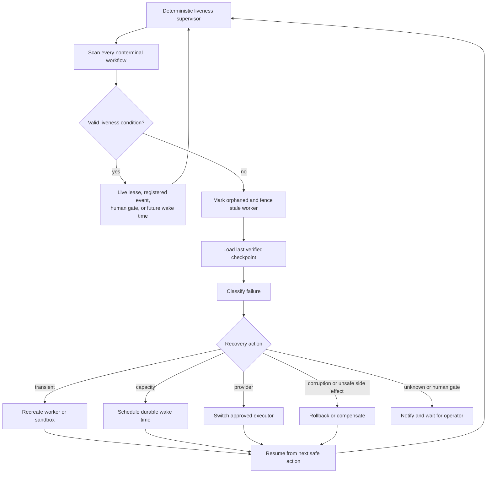
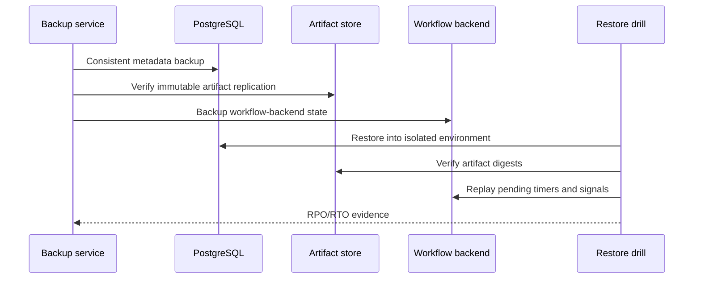

# Observability, SLOs, Alerts, and Platform Success Metrics

[← Back to Delivery Foundry master index](../../delivery_foundry.md) · [Migration map](../../docs/MIGRATION_MAP_V11_TO_V12.md)

Normative status: **Normative.** Every SLO ships with: metric name; type; labels; recording rule; threshold; alert; owner; runbook; dashboard. An SLO without an alert and runbook does not exist.

## 1. Metric catalog (minimum)

| Metric | Type | Alert threshold owner-defined | Notes |
|---|---|---|---|
| workflow_completion_rate | ratio | yes | per profile, per workflow class |
| evidence_rejection_rate | ratio | yes | verifier honesty signal |
| retry_rate | ratio | yes | per failure classification |
| human_intervention_rate | ratio | yes | per mission cycle and per shipped change |
| mean_time_to_recover | duration | yes | from failure to RUNNING |
| provider_waiting_time | duration | yes | per provider |
| projection_lag | duration | yes | Temporal → PostgreSQL (see data-consistency) |
| external_operation_divergence | count | yes | saga reconciler findings |
| duplicate_side_effect_prevented | count | informational | idempotency proof |
| queue_depth | gauge | yes | per queue, bounded |
| tenant_fairness | distribution | yes | starvation detection |
| runner_saturation | gauge | yes | pool utilization |
| cost_per_task / cost_per_mission_cycle | currency | yes | from cost ledger |
| auto_admission_rate | ratio | informational | autonomy KPI |
| auto_deployment_rate | ratio | informational | autonomy KPI |
| auto_promotion_rollback_rate | ratio | yes | drift governance signal |
| mission_target_attainment | ratio | informational | portfolio KPI |
| time_to_first_revenue | duration | informational | venture KPI |
| unattended_runtime_median | duration | informational | autonomy KPI |

## 2. Payload limits

Workflow-history payloads have hard limits (Temporal payload limit is on the order of low single-digit MB). **Large artifacts — evidence bundles, diffs, screenshots, checkpoints — MUST live in object storage and be referenced by digest from workflow history, never embedded.** Violations fail CI conformance tests.


---

<!-- Relocated from V11: N15 Observability, SLOs, disaster recovery (lines 1450-1528) -->

## N15. Observability, SLOs, and disaster recovery

### N15.1 Initial SLO targets

| SLO | Target |
|---|---:|
| Accepted workflow event durability | No acknowledged event loss |
| Control-plane API availability | 99.9% monthly target |
| Orphan detection | ≤ 5 minutes |
| Durable command acknowledgement | ≤ 10 seconds under healthy dependencies |
| P0/P1 notification dispatch | 99% ≤ 60 seconds, excluding provider flood waits |
| Checkpoint recovery point | Last completed activity or explicit safe point |
| Workflow-status explanation | 100% of nonterminal runs expose next action |

These are targets to validate, not marketing guarantees.

### D-15 — Liveness, recovery, and disaster recovery





### N15.2 Recovery objectives

```text
Metadata RPO: committed transaction
Artifact RPO: last acknowledged digest
Control-plane RTO: 30 minutes
Runner loss: recreate from checkpoint
Provider loss: wait, reroute, or prove blocked
```

Backups must be restored in scheduled drills. A backup that has not been restored is not accepted evidence.

---

