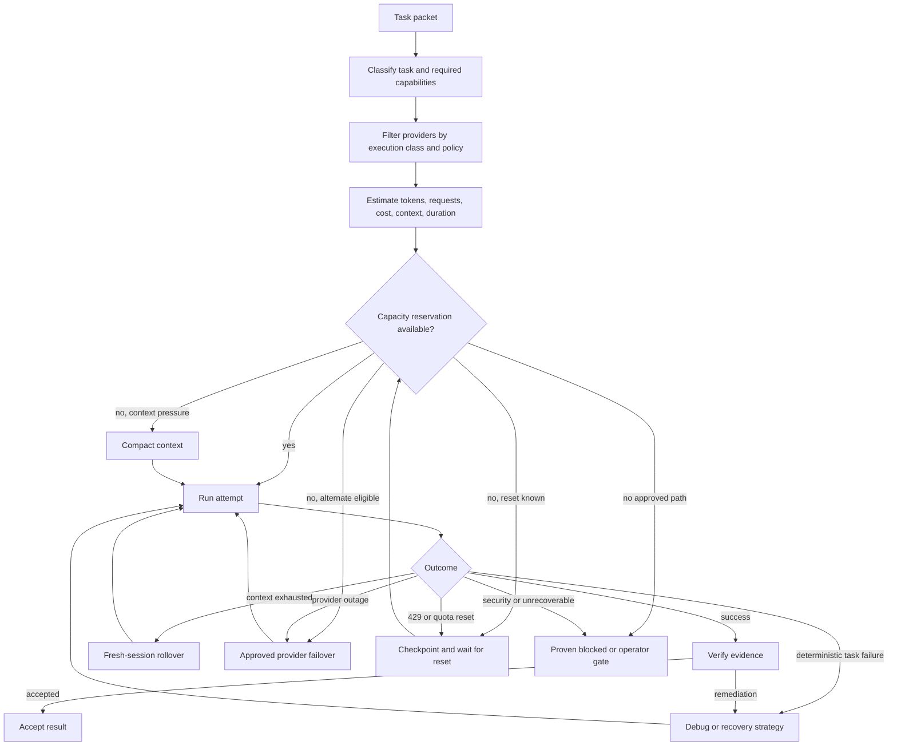

# Provider Execution Classes and Abstraction Contracts

[← Back to Delivery Foundry master index](../../delivery_foundry.md) · [Migration map](../../docs/MIGRATION_MAP_V11_TO_V12.md)

Normative status: **Normative.**


---

<!-- Relocated from V11: N11 Provider execution classes (lines 1157-1228) -->

## N11. Provider execution classes

Each provider surface is classified before use:

| Class | Meaning |
|---|---|
| `api-unattended` | Supported programmatic API with stable authentication |
| `cli-unattended` | Supported noninteractive CLI suitable for automation |
| `subscription-attended` | Interactive or opaque subscription surface requiring operator presence |
| `managed-session` | Provider-hosted durable agent session |
| `local-runtime` | Self-hosted model/runtime |
| `unsupported` | Not authorized for automation |

A human-usable CLI is not automatically an unattended executor.

### D-11 — Provider capacity, retry, rollover, and failover



Provider adapters declare:

- execution class;
- authentication mechanism;
- retention;
- capacity visibility;
- restart semantics;
- structured-output support;
- tool support;
- policy eligibility;
- fallback compatibility.

Native provider features remain optional execution optimizations, not kernel requirements.

---


---

<!-- Relocated from V11: §5.7 LLM Capability Optimization Layer (lines 3992-4148) -->

## 5.7 LLM Capability Optimization Layer

Delivery Foundry should use modern LLM capabilities aggressively, but not indiscriminately.

The correct objective is:

```text
maximum accepted delivery value
────────────────────────────────
cost + latency + retries + risk
```

It is not:

```text
enable every feature on every request
```

Some capabilities reduce cost, some increase cost for quality or speed, some overlap, and some are beta or research-preview features. Delivery Foundry therefore needs a capability planner that selects the right combination per task.

### 5.7.1 Capability-planning flow

```text
bounded task
    ↓
task classifier
    ↓
profile security and retention policy
    ↓
provider/model capability discovery
    ↓
execution-envelope compiler
    ↓
token and cost estimate
    ↓
run
    ↓
quality, cost, latency, and security telemetry
    ↓
optimization loop
```

The execution envelope controls:

```text
provider and model
reasoning mode
effort
task budget
speed
context strategy
cache strategy
tool-discovery strategy
tool-execution strategy
output schema
memory access
skills
MCP servers
parallelism
batch versus synchronous execution
fallback
```

Model-router options such as 9Router are ADR-deferred pluggable externals, not core requirements; see
`../architecture/adr/ADR-001-openhands-9router.md`.

### 5.7.2 Do not hardcode model assumptions

Provider capabilities change faster than the Foundry workflow.

The registry must be refreshed from:

1. Provider model/capability APIs where available.
2. Pinned provider documentation manifests.
3. Foundry compatibility tests.
4. Profile allowlists.
5. Recorded production evidence.

Example capability record:

```yaml
provider: anthropic
model: discovered-at-runtime
feature: server-side-compaction

availability: beta
beta_header: compact-2026-01-12
zdr_eligible: true

constraints:
  profile_allow:
    - personal
    - startup
    - team
  profile_human_approval:
    - enterprise
  profile_deny:
    - regulated-zdr-unsupported

interactions:
  preferred_with:
    - prompt-caching
    - task-budgets
  overlaps_with:
    - client-summary
    - external-context-compressor

telemetry:
  quality_delta: null
  cost_delta: null
  latency_delta: null

last_verified_at: 2026-07-18T00:00:00Z
```

Feature changes are staged as configuration changes. Discovery never automatically enables a new beta feature globally.

### 5.7.3 Availability policy

```yaml
availability_policy:
  ga:
    personal: canary-then-auto
    organization: approved-provider-policy
    regulated: explicit-allowlist

  beta:
    personal: shadow-then-canary
    organization: human-approval
    regulated: disabled-by-default

  research_preview:
    personal: explicit-experiment
    organization: disabled-by-default
    regulated: forbidden

  deprecated:
    action: migrate

  retired:
    action: block
```

### 5.7.4 Task profiles

| Task | Reasoning | Context | Tools | Execution |
|---|---|---|---|---|
| Trivial mechanical task | Low effort; thinking may be disabled | Small context | Direct tools | Synchronous |
| Research and validation | Medium/high adaptive thinking | Cached mission + dynamic web results | Web search/fetch + code execution | Parallel or batch |
| Architecture and planning | High/xhigh adaptive thinking | Cached policies, spec, repository map | Advisor where useful; tool search | Orchestration mode |
| Implementation | Medium/high adaptive thinking | Cache stable repo instructions; compact long loops | Strict tools, editor, test tools | Isolated task |
| Code review | High/xhigh | Diff-first; references on demand | Tool search; structured findings | Independent reviewer |
| Incident response | High/xhigh + optional fast mode | Minimal trusted incident context | Strict approved tools | Synchronous, bounded |
| Large offline evaluation | Model/effort selected by experiment | Fixed cached evaluation set | Minimal tools | Message Batch |
| Capability generation | High | Skill references + failure fixtures | Code execution and eval harness | SPEC → PLAN → canary |

The profile is the default. The optimizer may adapt within policy based on evidence.

---


---

<!-- Relocated from V11: §6–6.7 Provider abstraction contracts (lines 6750-7002) -->

## 6. Provider abstraction

A provider is an adapter implementing a contract.

Do not put GitHub, GitLab, or Bitbucket logic directly inside workflows.

## 6.1 SCM contract

Every SCM adapter should support as much of this interface as the provider permits:

```yaml
interface: scm
version: 1

operations:
  - repository.list
  - repository.get
  - repository.create
  - repository.clone_url
  - branch.create
  - branch.delete
  - change_request.create
  - change_request.get
  - change_request.comment
  - change_request.approve
  - change_request.merge
  - change_request.checks
  - commit.status
  - webhook.install
  - webhook.verify
  - webhook.replay
```

Provider terminology is normalized:

```text
GitHub pull request
GitLab merge request
Bitbucket pull request
```

Inside Delivery Foundry, all are represented as:

```text
change_request
```

## 6.2 Tracker contract

```yaml
interface: tracker
version: 1

operations:
  - work_item.search
  - work_item.get
  - work_item.create
  - work_item.update
  - work_item.comment
  - work_item.transition
  - work_item.link
  - work_item.attach
  - work_item.children
  - workflow.transitions
```

Normalized model:

```text
Jira issue
GitHub issue
GitLab issue
Linear issue
```

All become:

```text
work_item
```

## 6.3 Knowledge contract

```yaml
interface: knowledge
version: 1

operations:
  - document.search
  - document.get
  - document.create
  - document.update
  - document.comment
  - document.attach
  - space.list
  - hierarchy.children
```

Confluence pages, repository Markdown, wikis, and Notion pages become normalized `documents`.

## 6.4 CI contract

```yaml
interface: ci
version: 1

operations:
  - pipeline.trigger
  - pipeline.get
  - pipeline.cancel
  - pipeline.retry
  - pipeline.logs
  - pipeline.artifacts
  - check.list
```

## 6.5 Notification contract

```yaml
interface: notification
version: 1

operations:
  - message.send
  - message.update
  - message.thread
  - message.acknowledge
  - approval.request
  - approval.resolve
  - command.receive
  - command.verify
  - alert.send
  - digest.send
  - delivery.status
  - delivery.retry
```

## 6.6 Deployment contract

```yaml
interface: deployment
version: 1

operations:
  - environment.list
  - release.prepare
  - release.preflight
  - preview.create
  - release.deploy
  - release.status
  - release.verify
  - release.rollback
  - logs.get
  - health.get

required_behavior:
  - idempotent_deploy
  - cancellable_before_commit
  - observable
  - rollback_capable
```

Adapters may report unsupported operations. The workflow must fall back to a human gate rather than pretending the operation succeeded.

---


## 6.7 LLM capability contract

Every LLM provider adapter exposes normalized capability metadata and execution controls.

```yaml
interface: llm
version: 1

operations:
  - model.list
  - model.capabilities
  - token.count
  - message.execute
  - message.stream
  - batch.submit
  - batch.status
  - cache.diagnostics
  - skill.deploy
  - skill.version
  - managed_agent.create
  - managed_agent.session

capabilities:
  - reasoning.adaptive
  - reasoning.effort
  - reasoning.task_budget
  - latency.fast_mode
  - output.structured
  - output.citations
  - tools.strict
  - tools.search
  - tools.programmatic
  - tools.parallel
  - context.prompt_cache
  - context.compaction
  - context.editing
  - context.mid_conversation_system
  - memory.persistent
  - files.upload
  - mcp.remote
```

Unsupported features are explicit. The dispatcher must never simulate support by silently dropping provider-specific fields.

An execution envelope:

```yaml
task_id: TASK-014
provider: anthropic
model: auto-compatible

reasoning:
  mode: adaptive
  effort: high
  task_budget_tokens: 80000

latency:
  speed: standard

context:
  prompt_cache: automatic
  cache_ttl: 5m
  compaction: enabled
  context_editing: stale-tool-results
  token_limit_soft_percent: 70

tools:
  strict: true
  search: enabled
  programmatic_calls: enabled
  max_calls: 50

output:
  schema: task-result/v1

execution:
  max_turns: 20
  timeout: 30m
  hard_cost_usd: 5

security:
  profile: personal-github
  data_classification: personal
```


---

<!-- Relocated from V11: §11 Adapter selection (lines 7891-7928) -->

## 11. Adapter selection

The active profile resolves provider commands.

Example:

```text
SCM=github
→ adapters/scm/github/adapter.mk

SCM=bitbucket-cloud
→ adapters/scm/bitbucket-cloud/adapter.mk
```

The root Makefile includes the selected adapter:

```makefile
ACTIVE_PROFILE ?= $(shell cat .foundry/active-profile 2>/dev/null)
SCM_PROVIDER := $(shell yq '.providers.scm.type' profiles/generated/$(ACTIVE_PROFILE).yaml)

-include adapters/scm/$(SCM_PROVIDER)/adapter.mk
```

Each adapter exports normalized targets:

```makefile
scm-repo-list:
scm-repo-create:
scm-branch-create:
scm-change-request-create:
scm-change-request-status:
scm-change-request-comment:
```

Workflows call normalized targets, never provider-specific targets.

---


---

<!-- Relocated from V11: §18 Model-routing policy (lines 10623-10647) -->

## 18. Model-routing policy

### Personal

```text
Native subscription first
→ Claude Code / Codex / Cursor / Copilot
→ OpenCode
→ 9Router API fallback
```

ADR-001 defers 9Router as an optional pluggable external; the current fallback requirement is satisfied in-allowlist
unless a future profile explicitly approves such an adapter (`../architecture/adr/ADR-001-openhands-9router.md`).

### Organization

```text
Organization-approved native agents only
→ approved enterprise API if available
→ pause
```

Do not enable 9Router, Headroom, free providers, or personal accounts for organization data merely because they are technically available.

ADR-001 leaves the 9Router organization-data prohibition unchanged
(`../architecture/adr/ADR-001-openhands-9router.md`).

Provider selection is a security decision, not only a cost decision.

---

