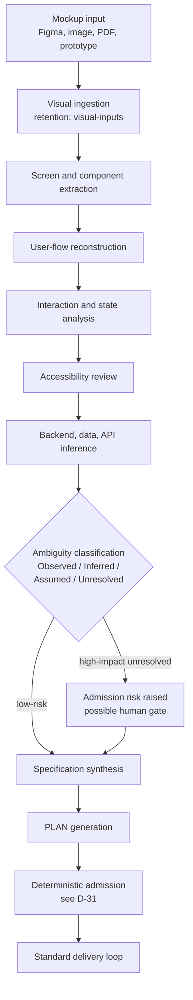

# Mockup-to-Delivery Workflow

[← Back to Delivery Foundry master index](../../delivery_foundry.md) · [Migration map](../../docs/MIGRATION_MAP_V11_TO_V12.md)

Normative status: **Normative.** Mockup is a first-class entry, equal to mission, requirement, specification, and approved PLAN.md. A mockup is evidence of intent — never a complete requirement.

## 1. Accepted inputs

Figma URL; screenshot; image set; PDF; HTML prototype; wireframe; recorded interaction; design-system reference.

## 2. Pipeline

```text
mockup
→ visual artifact ingestion (stored under visual-inputs retention class)
→ screen and component extraction
→ user-flow reconstruction
→ interaction and state analysis
→ accessibility review
→ backend, data, and API inference
→ ambiguity classification
→ specification synthesis
→ PLAN generation
→ admission (deterministic classifier — same as every plan)
→ standard delivery loop
```

## 3. Ambiguity labeling (mandatory)

Every extracted requirement carries exactly one label:

```text
Observed    — visibly present in the mockup
Inferred    — strongly implied by convention (labeled with the convention)
Assumed     — chosen by policy default (recorded as an assumption)
Unresolved  — semantically important and not derivable
```

Low-risk Inferred/Assumed items may be resolved by profile policy. High-impact Unresolved semantics enter the admission risk computation and, where they exceed the envelope, the human-gate process. Pixels never silently become requirements.

## 4. Specification completeness

The synthesized specification MUST cover, at minimum: loading, empty, error, and validation states; permissions; authentication; persistence; APIs; responsive behaviour; accessibility; analytics; billing (if any); failure handling; non-functional requirements. Items a mockup cannot show are exactly where the labeling discipline applies.

## D-28 — Mockup entry flow



This entry path is additive: D-17's existing entries (mission, requirement, PLAN.md) are unchanged, with specification and mockup added alongside them.
