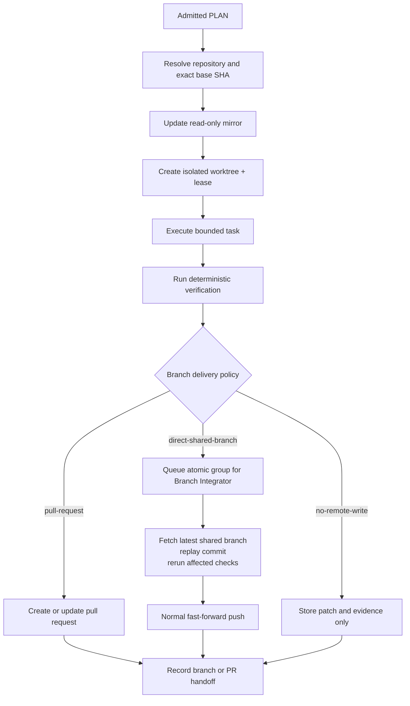

# Multi-Repository Orchestration

[← Back to Delivery Foundry master index](../../delivery_foundry.md) · [Migration map](../../docs/MIGRATION_MAP_V11_TO_V12.md)

Normative status: **Normative workflow.**


---

<!-- Relocated from V11: N10 Repository and workspace model (lines 1063-1156) -->

## N10. Repository and workspace model

### N10.1 Mirrors and worktrees

- The runner maintains read-only repository mirrors.
- Each bounded task receives an isolated worktree.
- A worktree has one lease owner and fencing token.
- Agent sandboxes do not receive direct push credentials.
- SCM writes are performed by a kernel-controlled integration activity.

### D-10 — Repository, workspace, and branch delivery



### N10.2 Branch delivery policies

```text
pull-request
direct-shared-branch
no-remote-write
```

The workflow binds one policy explicitly.

### N10.3 10x implementation branch mode

The accurate name is:

```text
10x Implementation Branch Mode
```

It is a branch-build and handoff milestone, not the entire QA/release lifecycle.

Default direct-push cadence:

```yaml
push_cadence: after-atomic-group
```

`after-accepted-task` is permitted only when:

```yaml
intermediate_branch_invariant: buildable-and-testable
```

The terminal result is:

```text
TEN_X_BRANCH_HANDOFF_READY
```

A later workflow handles PR review, merge, staging, full QA, and rollout.

### N10.4 Environment evidence provenance

Integration evidence must prove the environment revision:

```yaml
expected_revisions:
  api: abc123
  web: def456

observed_revisions:
  api: abc123
  web: def456
```

If revision provenance is unavailable, the result is `UNVERIFIED_ENVIRONMENT_EVIDENCE`, not passed integration.

---


---

<!-- Relocated from V11: §15 Organization engineering workflow (lines 10240-10555) -->

## 15. Organization engineering workflow: step by step

This workflow may start from Jira/requirements or directly from an already approved `PLAN.md`. When a plan is supplied, the Jira/Confluence discovery and plan-generation nodes may be skipped while admission, repository resolution, execution, review, verification, change-set, and delivery remain active.

Every intake, context read, planning action, branch, agent task, test, PR, CI transition, documentation update, merge, deployment, wait, retry, and blocker emits a notification event. The active profile decides which channel receives redacted content.

### Step 1 — Use a separate work installation

```bash
make profile-use PROFILE=team-atlassian
make doctor
```

The doctor must reject:

- personal GitHub tokens;
- personal Telegram;
- personal workspaces;
- external model proxies not approved;
- repositories outside the organization allowlist;
- public research if disabled;
- production deployment credentials where not required.

### Step 2 — Intake a Jira issue

Input examples:

```text
/acme-platform ENG-1234
```

or:

```bash
make workflow-start \
  WORK_ITEM=ENG-1234 \
  WORKFLOW=engineering-delivery
```

The Jira adapter reads:

- summary;
- description;
- acceptance criteria;
- linked issues;
- parent epic;
- comments;
- attachments;
- current status;
- assignee;
- labels;
- component;
- sprint.

### Step 3 — Gather Confluence context

The Confluence adapter searches configured spaces using:

- Jira key;
- feature name;
- RFC title;
- service name;
- product area.

The system creates a context manifest:

```yaml
work_item: ENG-1234

documents:
  - title: Entitlement Management RFC
    source: confluence
    id: "123456"
    relevance: high

repositories:
  - operations-dashboard
  - platform-api-service
  - identity-settings-service

constraints:
  - existing authentication standard
  - backward compatibility
  - no new infrastructure
```

### Step 4 — Inspect Bitbucket repositories

> **Implementation note (Task 131):** the bullets below describe the target
> organization workflow; they are **not** implemented today. Branch-restriction
> checks, open-PR listing, and Pipelines observation are absent from
> `internal/scm/read` and `internal/scm/write`; PR APIs are forbidden for the
> 10x path (Constitution C15, `internal/scm/write/doc.go`).

The Bitbucket adapter:

- resolves repositories;
- clones only allowed repositories;
- checks default branches;
- checks branch restrictions *(not implemented)*;
- obtains open pull requests *(not implemented; PR APIs forbidden on 10x path)*;
- checks pipeline configuration *(not implemented)*;
- maps task numbers to branches.

### Step 5 — Create engineering brief

The planning agent produces:

```text
ENGINEERING_BRIEF.md
SPEC.md
PLAN.md
RISK.md
TEST_STRATEGY.md
```

The brief must include:

- requirement summary;
- ambiguities;
- assumptions;
- impacted services;
- API changes;
- data changes;
- rollout;
- rollback;
- QA strategy;
- observability;
- security;
- dependencies;
- task sequence.

### Step 6 — Human ambiguity gate

The system sends only bounded questions.

Example:

```text
ENG-1234 needs clarification.

Question:
Should duplicate workspace entitlements return the existing license
or return HTTP 409?

A. Return existing license
B. Return 409
C. Other

Default action: pause
```

### Step 7 — Update Jira with the plan

The Jira adapter posts:

- plan summary;
- affected repositories;
- acceptance criteria;
- risk;
- test approach;
- link to generated artifacts.

It may create subtasks only when the profile permits it.

### Step 8 — Optionally update Confluence

The agent can draft:

- RFC;
- ADR;
- implementation plan;
- test strategy;
- release notes.

For organization mode, publishing should generally be review-required.

### Step 9 — Create branches

Naming policy example:

```text
feature/ENG-1234-entitlement-management
```

One isolated worktree per repository and task.

### Step 10 — Implement

Agents work only inside allowed repositories and paths.

Example routing:

```text
Backend service → Codex
Frontend dashboard → Cursor
Cross-service architecture → Claude Code
Review → Copilot plus Claude
```

### Step 11 — Verify locally

Repository-specific Make targets remain authoritative.

If a legacy repository has no standard Makefile, Delivery Foundry uses a repository adapter manifest:

```yaml
repository: platform-api-service

commands:
  bootstrap: go mod download
  lint: golangci-lint run
  test_unit: go test ./...
  build: go build ./...
  verify: make lint && make test
```

The long-term goal is to standardize repository Make targets, not maintain endless custom prompts.

### Step 12 — Push and open Bitbucket pull request

> **Implementation note (Task 131):** PR creation is **not** implemented in
> `internal/scm/write` (Constitution C15 / Task 27 boundary). The 10x workflow
> records a `pull-request` policy value but does not exercise it (Task 140).

The adapter:

- pushes the branch;
- creates the pull request *(not implemented)*;
- uses task number and assignee naming rules;
- links Jira;
- adds verification evidence;
- requests reviewers;
- records pipeline state.

### Step 13 — Observe Bitbucket Pipelines

> **Implementation note (Task 131):** Pipelines observation and automated PR
> updates are **not** implemented in the current adapters.

On failure:

```text
pipeline failure
→ collect failed step and logs
→ classify deterministic vs ambiguous
→ retry bounded remediation
→ update PR
```

### Step 14 — Review

Mandatory review layers:

- deterministic tests;
- independent AI review;
- security review where required;
- human review;
- QA review for product behavior.

The system never auto-merges in the initial Organization profile.

### Step 15 — Update Jira

After PR creation:

- add PR links;
- add test evidence;
- update task status if permitted;
- record blockers;
- summarize remaining human actions.

### Step 16 — Update Confluence

After approved architectural changes:

- update RFC;
- add ADR;
- update API contract;
- update operational documentation.

### Step 17 — Merge and delivery

Merge and deployment are workflow-node modes rather than hardcoded assumptions.

Example conservative organization profile:

```yaml
steps:
  merge:
    mode: command

deployment:
  staging:
    mode: auto
  production:
    mode: command
```

Example autonomous profile:

```yaml
steps:
  merge:
    mode: auto

deployment:
  staging:
    mode: auto
  production:
    mode: auto
```

Every merge and deployment transition is notified. `auto` still requires repository policy, CI, security, rollback readiness, and profile authorization to pass.

### Step 18 — Close the loop

After delivery:

- summarize actual changes;
- compare plan vs result;
- record failed assumptions;
- update repository skills;
- update Confluence lessons;
- update Jira resolution evidence;
- calculate lead time and rework.

---

